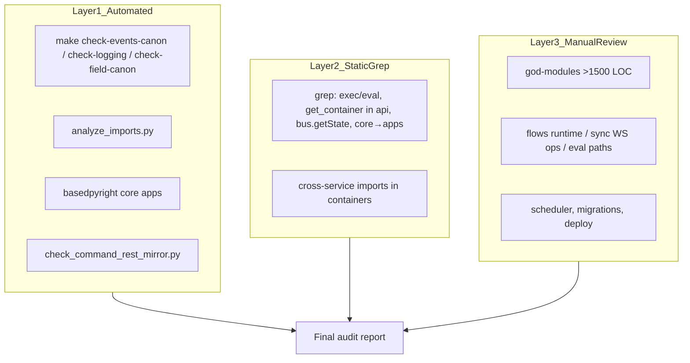

<!-- 859acef3-adfc-40c3-8604-5a1d31975a10 -->
---
todos:
  - id: "run-remaining-checks"
    content: "Прогнать basedpyright, check-logging, check-field-canon и зафиксировать результаты"
    status: pending
  - id: "manual-p0-p1-review"
    content: "Ручной review P0/P1: playwright_interactor, code_tool, integrations, scheduler/flows/frontend containers, flows operator WS"
    status: pending
  - id: "infra-tests-pass"
    content: "Проверить deploy/helm и tests/ на testing.mdc и migrations инварианты"
    status: pending
  - id: "write-audit-report"
    content: "Собрать финальный markdown-отчёт по структуре (executive summary, матрица, таблица, CI map, appendix)"
    status: pending
isProject: true
---
# Архитектурный аудит всего проекта Humanitec

## Цель и границы

**Цель:** выявить **грубые** архитектурные ошибки (нарушения задокументированных инвариантов платформы, security/coupling, «обход системы»), а не стиль или мелкие smell.

**Итоговый артефакт:** один отчёт (markdown) с таблицей находок: категория, severity, пути, краткое описание, ссылка на правило из [`.cursor/rules/`](.cursor/rules/), рекомендация (без реализации).

**Вне scope (по вашему выбору):** правки кода, новые CI-скрипты, рефакторинг.

---

## Методология (3 слоя)

| Слой | Что покрывает | Статус |
|------|---------------|--------|
| 1. CI / скрипты | Канон UI, events, REST-mirror, i18n, voice, logging | Частично прогнан (`check-events-canon` **падает** — см. ниже) |
| 2. Статический grep | Антипаттерны по всему `core/` + `apps/` | Выполнен по ключевым паттернам |
| 3. Ручной review | Крупные модули, runtime, границы сервисов | Точечно; в отчёте — список файлов для углубления |

**Дополнительно для полноты отчёта** (ещё не прогонялось в этой сессии, включить в финальный документ):
- `uv run basedpyright core apps` (типизация как индикатор «дыр» в контрактах)
- `make check-logging`, `make check-field-canon`
- `uv run python analyze_imports.py` (уже: **1** локальный импорт)
- Обход `deploy/helm/`, `tests/` на нарушения testing.mdc (моки не-MockLLM)
- Inventory миграций: один physical URL → несколько Alembic-деревьев ([`migrations.mdc`](.cursor/rules/migrations.mdc))

---

## Сводка: что уже найдено

### Критично (P0) — security / zero-guess

| # | Нарушение | Где | Правило |
|---|-----------|-----|---------|
| 1 | **In-process `exec` пользовательского кода** в browser runtime | [`apps/browser/engine/playwright_interactor.py`](apps/browser/engine/playwright_interactor.py) (~263) | [`eval.mdc`](.cursor/rules/eval.mdc) — только isolated runners |
| 2 | **`exec` в CodeTool** при тестовом пути без container | [`apps/flows/src/tools/code_tool.py`](apps/flows/src/tools/code_tool.py) (~329) | То же; prod должен идти только через `RemoteCodeRunner` |
| 3 | **Silent skip OAuth resume** вместо fail-fast | [`core/api/integrations.py`](core/api/integrations.py) `_resume_flow` (~197–214): `return` + `.get(..., "default")` | [`main.mdc`](.cursor/rules/main.mdc) — zero-fallback |

**Чисто по LLM:** прямых импортов LangChain/OpenAI в `apps/` и `core/` **не найдено** — канон `get_llm()` соблюдён.

**Локальные импорты:** `analyze_imports.py` → **1** нарушение: [`apps/flows/tools/files.py`](apps/flows/tools/files.py) (`import re` внутри функции). Ожидание канона: **0**.

---

### Высокий приоритет (P1) — границы сервисов и DI

| # | Нарушение | Где | Комментарий |
|---|-----------|-----|-------------|
| 4 | **Cross-service container coupling** | [`apps/frontend/container.py`](apps/frontend/container.py) → `FlowRepository` из flows; [`apps/flows/src/container.py`](apps/flows/src/container.py) → `get_scheduler_container()`; [`apps/scheduler/container.py`](apps/scheduler/container.py) импортирует **все** worker brokers | Осознанный composition root vs «service locator между apps» — зафиксировать в отчёте как **архитектурный долг** |
| 5 | **`get_voice_container()` в HTTP API** вместо `ContainerDep` | [`apps/voice/api/health.py`](apps/voice/api/health.py), [`apps/voice/api/session.py`](apps/voice/api/session.py) | [`architecture.mdc`](.cursor/rules/architecture.mdc) — исключение только для WS; health — кандидат на `ContainerDep` |
| 6 | **Silent `except ImportError` → None** для browser MCP tools | [`apps/flows/src/tools/registry.py`](apps/flows/src/tools/registry.py) (~26–37) | Нарушение zero-fallback |
| 7 | **Flows operator: WS без единого `op_*` реестра** | [`apps/flows/src/realtime/command_router.py`](apps/flows/src/realtime/command_router.py) vs [`apps/flows/src/api/v1/operator.py`](apps/flows/src/api/v1/operator.py) | REST-зеркало есть, но не эталон sync (`operations.py` + один handler) |
| 8 | **CI gap: REST-mirror только по JS-фабрикам** | [`scripts/check_command_rest_mirror.py`](scripts/check_command_rest_mirror.py) | Python `register_ws_command_handler` (sync, flows) **не** сканируется — риск новой WS-команды без HTTP |

**Чисто:** `core/` **не** импортирует `apps/` в runtime (только docstring/строки в sanitize). `get_*_container()` в `apps/*/api/**` — только voice (2 файла).

---

### Средний приоритет (P2) — канон данных, frontend, поддерживаемость

**Backend / data layer**

| # | Тема | Пример |
|---|------|--------|
| 9 | Пагинация вне `CursorPage`/`OffsetPage` | [`apps/sync/api/calls.py`](apps/sync/api/calls.py) — `response_model=list[CallRecordingRead]` |
| 10 | Ad-hoc list models | `IntegrationsListResponse`, pronunciation rules API — дубли `ListResponse[T]` |
| 11 | **REST-шторм flows → CRM** | [`apps/flows/tools/lara_crm.py`](apps/flows/tools/lara_crm.py) (9+ `ServiceClient`) — допустимо без CRM DB, но узкое место |
| 12 | **Мёртвые TaskIQ tasks** в flows_worker | `invoke_llm`, `execute_tool`, `execute_node` — `.kiq()` только в тестах; prod — `process_flow_task` |
| 13 | **God-modules** (сложность сопровождения) | `channels/base.py` (~1762), `sync/realtime/operations.py` (~2713), `core/clients/llm/factory.py` (~2433), `capability_gateway/.../registry.py` (~2080) |

**Frontend** ([`frontend.mdc`](.cursor/rules/frontend.mdc), [`ui_factories.mdc`](.cursor/rules/ui_factories.mdc))

| # | Тема | Масштаб |
|---|------|---------|
| 14 | **`this.bus.getState()` в apps UI** | ~15 файлов (frontend landing/products, crm pages) — обход `this.select()` |
| 15 | **`useEvent(CoreEvents.*)` в pages/components** | ~14 файлов (crm, sync, office, flows editor) |
| 16 | **Сырой `user_id` в UI** | tracing-page, sync call overlay, office catalog-members |
| 17 | **Fallbacks в reducer** | [`apps/flows/ui/events/resources/chat.resource.js`](apps/flows/ui/events/resources/chat.resource.js) — **ломает** `make check-ui-canon` сейчас |

**Межсервисный httpx:** peer-to-peer обхода `ServiceClient` **нет**; `httpx.AsyncClient` — capability gateway (user URL), browser CDP, test sample.

---

### Низкий приоритет / информационно

- Class-body import в [`apps/flows/src/channels/base.py`](apps/flows/src/channels/base.py) (`ChannelType`) — не попадает в `analyze_imports`, но нарушает «импорты в начале файла»
- `core/clients/llm/factory.py` — `getattr(state, "mock", None)` как компромисс без импорта `apps.flows.src.mock` ([`architecture.mdc`](.cursor/rules/architecture.mdc) known issue)
- Push vs command naming — **в целом ок** (разные `entity`); push↔command collision в CI **soft**
- Legacy store/services/AppEvents в UI — **не найдено**

---

## Что соблюдено хорошо (для баланса отчёта)

- **Граница `core` ↔ `apps`:** runtime-импортов apps из core нет
- **LLM:** единая фабрика, без LangChain в коде сервисов
- **In-process eval в prod flows tools:** основной путь — `RemoteCodeRunner` + code-runner-*
- **Sync WS+REST:** эталон [`apps/sync/realtime/command_router.py`](apps/sync/realtime/command_router.py) + [`operations.py`](apps/sync/realtime/operations.py)
- **Repository-first** для shared namespace, frontend→flows DB read, sync/crm/office/rag shared KV
- **WS→HTTP fallback в UI:** в [`ws.effect.js`](core/frontend/static/lib/events/effects/ws.effect.js) явно запрещён
- **Автоматический контур CI:** `check-events-canon` агрегирует UI/events/i18n/voice/rag (см. [`Makefile`](Makefile) ~147)

---

## Структура финального отчёта (deliverable)

1. **Executive summary** (1 страница): P0 count, top-3 риска, общая оценка зрелости
2. **Матрица по доменам:** flows, sync, crm, frontend, voice, browser, capability_gateway, scheduler, infra
3. **Таблица находок** (ID, severity, file:line, rule, recommendation)
4. **CI coverage map:** что ловится / что нет (на базе [`scripts/check_*.sh`](scripts/) и [`scripts/check_*.py`](scripts/))
5. **Архитектурный долг (known compromises)** из rules + подтверждение в коде
6. **Appendix:** команды для воспроизведения (`make check-events-canon`, `analyze_imports.py`, grep-паттерны)

---

## Порядок завершения исследования (без правок)

1. Прогнать оставшиеся readonly-checks (`basedpyright`, `check-logging`, `check-field-canon`) и зафиксировать exit codes
2. Дочитать вручную P0/P1 файлы (playwright_interactor, code_tool, integrations, scheduler container, flows operator)
3. Пройти `tests/` и `deploy/` на testing/infra инварианты
4. Собрать единый markdown-отчёт по структуре выше
5. В конце — heatmap «severity × service» для roadmap (информационно, без задач на fix)

---

## Текущий статус CI (важно для отчёта)

`make check-events-canon` **не проходит** из-за fallbacks в [`chat.resource.js`](apps/flows/ui/events/resources/chat.resource.js) (п.17 `check_ui_canon.sh`). Это не «дыра CI», а **реальное нарушение канона** в текущей ветке.
