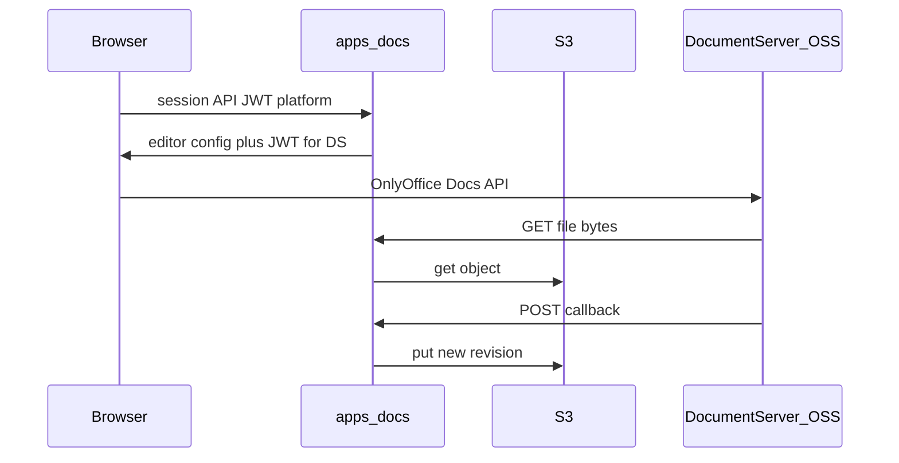

# План: сервис документов на полностью open-source движке

## 1. Почему не Univer как единственный путь

Клиентские пакеты Univer (Apache-2.0) не закрывают сценарий **совместного редактирования в реальном времени** без **Univer Pro Server** и коммерческой лицензии. Для требования **полностью открытый движок** (self-host без Pro) Univer в текущей модели продукта **не подходит** как замена Google Docs/Sheets.

## 2. Допустимые полностью OSS движки (выбор)

| Движок                            | Лицензия (ядро) | Документы + таблицы + презентации | Интеграция                                                                                                                 |
| --------------------------------- | --------------- | --------------------------------- | -------------------------------------------------------------------------------------------------------------------------- |
| **OnlyOffice Document Server CE** | AGPL-3.0        | Да                                | Нативно: `document.url`, `callbackUrl`, [JWT](https://api.onlyoffice.com/docs/docs-api/get-started/how-it-works/security/) |
| **Collabora Online (CODE)**       | AGPL-3.0        | Да (LibreOffice)                  | [WOPI](https://sdk.collaboraonline.com/) — ваш хост реализует CheckFileInfo / GetFile / PutFile                            |

**Рекомендация по умолчанию:** **OnlyOffice Document Server Community Edition** — меньше протокольной поверхности для первого релиза (один контейнер, привычный callback).

**Альтернатива:** **Collabora CODE**, если критична максимальная совместимость с поведением LibreOffice или уже стандартизирован WOPI в инфраструктуре.

**AGPL:** при размещении редактора как сетевого сервиса действуют обязательства AGPL (в т.ч. предложение исходников пользователям сети). Это не «закрытая лицензия», но юридически отличается от MIT; зафиксировать внутреннее решение компании.

Исключено из этого плана: **Univer Pro**, закрытые ветки OnlyOffice Enterprise (не обязательны для базового редактирования в CE).

## 3. Архитектура платформы

- `**apps/docs**`: метаданные документов (`company_id`, `document_id`, `storage_key`, ревизия, `document key` для кэша DS), ACL, выдача конфигурации редактора, приём callback.
- **Хранилище**: существующий S3 и паттерн из [core/files](core/files/api.py) или выделенный префикс `docs/{company_id}/...`.
- **Межсервисно**: только [ServiceClient](core/clients/service_client.py) с контекстом.

Критический инвариант: URL, по которому **Document Server** скачивает файл, должен быть **доступен с сервера DS** (внутренний URL или presigned, согласованный с сетью K8s).

## 4. OnlyOffice CE — контракт

- Включить JWT в конфиге DS; секрет хранить в секретах платформы, совпадает с подписью конфига на клиенте ([security](https://api.onlyoffice.com/docs/docs-api/get-started/how-it-works/security/)).
- [Callback handler](https://api.onlyoffice.com/docs/docs-api/usage-api/callback-handler/): сохранение файла, обновление ревизии, смена `key` при необходимости.
- Режимы `edit` / `view`, пользователь в `editorConfig.user`.

## 5. Collabora CODE — если выбран WOPI

- Реализовать WOPI host в `apps/docs` (маршруты по спецификации Microsoft WOPI + требования Collabora).
- Отдельная прокси-настройка (часто NGINX) — заложить в [infrastructure](.cursor/rules/infrastructure.mdc) / compose.

## 6. Публичный API `apps/docs` (черновик)

- `POST /docs/api/v1/documents` — создать из шаблона (пустой docx/xlsx/pptx в S3).
- `GET /docs/api/v1/documents/{id}` — метаданные.
- `POST /docs/api/v1/documents/{id}/sessions` — конфиг для редактора + JWT.
- Внутренние: `GET .../internal/.../content` (авторизация для DS), при OnlyOffice — единый callback path.

Доступ: проверка `company_id` и явных прав; иначе `raise`.

## 7. Фронтенд

- Страница в `apps/frontend/ui/`: подключение [Docs API](https://api.onlyoffice.com/docs/docs-api/get-started/basic-concepts/), инициализация из `sessions`.
- Канон: [frontend.mdc](.cursor/rules/frontend.mdc), i18n ru/en, `make check-i18n`.

## 8. Конфигурация

- [core/config/models.py](core/config/models.py): `docs_service_url`, порт **8007**, URL публичного DS для браузера, URL внутреннего для health, `document_server_jwt_secret` (или путь к секрету).
- [scripts/run.py](scripts/run.py), [apps/app_runtime_targets.py](apps/app_runtime_targets.py), при необходимости [dev_inter_service_proxy.py](core/middleware/dev_inter_service_proxy.py).

## 9. Фазы

1. **POC:** контейнер OnlyOffice CE + статический файл в S3 + минимальный FastAPI download + callback + HTML с редактором.
2. **Сервис `apps/docs`:** БД, ACL, полный REST, интеграция с контекстом auth.
3. **Продукт:** UI в frontend, webhooks в Redis/flows по сохранению, квоты.

## 10. Правила репозитория

- Добавить `.cursor/rules/office.mdc` (сервис `docs`, движок OnlyOffice CE или Collabora CODE, AGPL-оговорка).
- Обновить [main.mdc](.cursor/rules/main.mdc) (строка сервиса docs, порт).
- Обновить [configuration.mdc](.cursor/rules/configuration.mdc) для новых ENV.

## 11. Тестирование

- Юнит: подпись JWT, права, смена ключа документа.
- Интеграция с живым DS — пометка `slow` / отдельный job ([testing.mdc](.cursor/rules/testing.mdc)).

---

Итог: **полностью открытый** сценарий коллаборативного офиса для платформы — **OnlyOffice Document Server CE** (приоритет) или **Collabora CODE**; платформенный слой `**apps/docs`** без зависимости от Univer Pro.