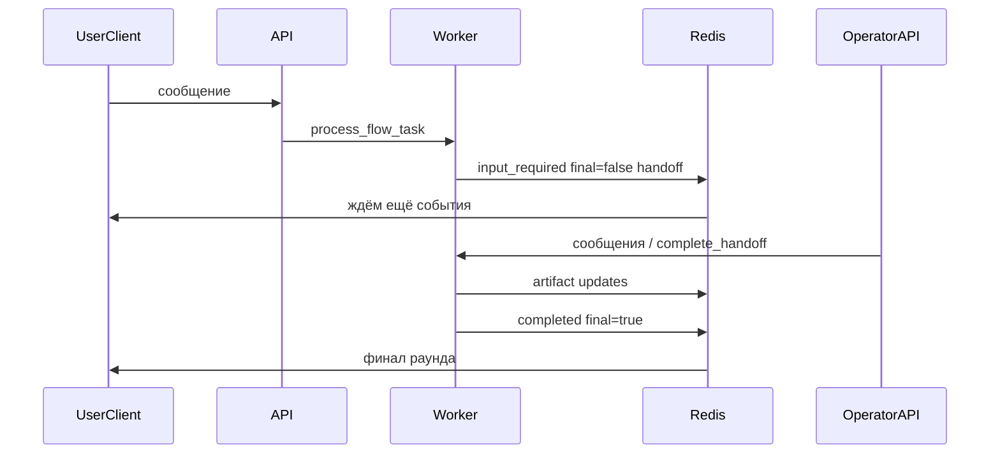

# План: операторские очереди, нода `hitl_node`, рабочее место специалиста

## 1. Цели и границы

**Цели**

- Персистентные **очереди** и **задачи оператора**, привязанные к реальным диалогам (`session_id`, `flow_id`, `task_id` A2A).
- Тип ноды на графе `**hitl_node`** (строка в JSON: `"hitl_node"`), настраиваемый в UI редактора flows.
- Интерфейс оператора: **назначение очередей**, **канбан**, карточка задачи, **панель диалога** справа, перехват ответов пользователю.
- При срабатывании handoff **не обрывать пользовательский SSE-поток преждевременно**: до завершения перехвата оператором допускаются промежуточные события; финальное завершение раунда — после resume flow.
- Сообщения оператора в `ExecutionState.messages` с **явными metadata** (`источник: оператор`, `queue_id`, `operator_user_id`), чтобы LLM продолжал ReAct предсказуемо; при простом сценарии «вопрос — ответ оператора» — **один tool result** в вызов `hitl_operator_task` / эквивалент ноды.
- Пользовательские названия в продукте: **без заголовка «HITL Центр»** (например «Задачи поддержки», «Очередь обращений» — финальные строки в i18n).

**Вне скоупа первой итерации (можно запланировать фазой 2)**

- SLA, эскалации между очередями, аудит всех полей CRM.
- Мобильное приложение оператора.

---

## 2. Текущая база (уже в коде)

| Компонент                     | Файл / место                                                                                                                                                                                                                                         |
| ----------------------------- | ---------------------------------------------------------------------------------------------------------------------------------------------------------------------------------------------------------------------------------------------------- |
| Типизированное тело interrupt | `[core/state/interrupt.py](core/state/interrupt.py)` — `OperatorTaskInterrupt` (`question`, `task_title`, `assignee_queue`)                                                                                                                          |
| Тул агента                    | `[apps/flows/tools/agent_session_tools.py](apps/flows/tools/agent_session_tools.py)` — `hitl_operator_task` → `FlowInterrupt`                                                                                                                        |
| Публикация interrupt          | `[apps/flows/src/streaming/base.py](apps/flows/src/streaming/base.py)` — `emit_interrupt`, сейчас `final=True`                                                                                                                                       |
| Завершение подписки на стрим  | `[apps/flows/src/streaming/subscriber.py](apps/flows/src/streaming/subscriber.py)` — `TERMINAL_STATES` включает `input-required` → **подписка закрывается сразу**                                                                                    |
| Embed / чат                   | `[core/frontend/static/lib/embed-chat/embed-stream-handler.js](core/frontend/static/lib/embed-chat/embed-stream-handler.js)`, `[platform-embed-chat.js](core/frontend/static/lib/embed-chat/platform-embed-chat.js)` — уже различают `operator_task` |

**Пробелы:** нет таблиц очередей/задач, нет API оператора, нет `hitl_node`, нет многофазного SSE для длинного handoff.

---

## 3. Канон имени ноды

- В конфиге: `"type": "hitl_node"`.
- В Python: `NodeType.HITL_NODE` со значением `**hitl_node`** в `[apps/flows/src/models/enums.py](apps/flows/src/models/enums.py)`.
- В UI канвы: внутренний тип `hitl_node`, **отображаемое имя** — ключ i18n (например `flows.node.hitl_node.label`), не обязательно содержащее «HITL».

---

## 4. Доменная модель и БД

**Таблицы (сервис flows, своё дерево Alembic)**

1. `**operator_queue`**: `id` (uuid), `company_id`, `name`, `slug` (уникален в пределах компании), `created_at`, опционально `description`.
2. `**operator_queue_member**`: `queue_id`, `user_id`, `role` (минимум `agent`; при необходимости `lead`), уникальная пара `(queue_id, user_id)`.
3. `**operator_task**`: `id`, `company_id`, `queue_id`, `status` (enum: `open`, `claimed`, `user_dialog`, `awaiting_agent`, `completed`, `cancelled`), `session_id`, `flow_id`, `skill_id`, `a2a_task_id`, `context_id`, `interrupt_snapshot` (JSONB), `claimed_by_user_id`, `correlation_id` (идемпотентность / связь с `InterruptData`), временные метки.

**Правила Zero-Guess**

- Строка `assignee_queue` в interrupt — либо `slug` очереди, либо зарезервированный синтаксис; при отсутствии очереди для компании → `**ValueError`**, задача не создаётся «в никуда».
- Все запросы API отфильтрованы по `company_id` из контекста.

---

## 5. OperatorHandoffService (единая логика)

Один модуль сервиса (например `[apps/flows/src/services/operator_handoff_service.py](apps/flows/src/services/operator_handoff_service.py)`):

- `create_handoff(state, *, question, task_title, assignee_queue, correlation_id?)` — резолв очереди, создание строки `operator_task`, возврат данных для `FlowInterrupt` / `InterruptData`.
- `append_operator_user_message` / `append_operator_assistant_to_user` — по политике продукта (что уходит в канал пользователя vs что только в state).
- `complete_handoff(task_id, operator_user_id, resolution: HandoffResolution)` — где `HandoffResolution` — либо структура для **tool result**, либо флаг «все сообщения уже в messages».

Тул `**hitl_operator_task`** и рантайм-нода `**hitl_node**` вызывают только этот сервис (без копипасты условий interrupt).

---

## 6. Нода `hitl_node`

**Конфиг (через `NodeConfig` / расширение)**

- Источник очереди: `queue_slug` или `queue_id` (одно обязательно).
- Шаблоны через `input_mapping` / поля ноды: `task_title`, `user_facing_message` (аналог `question`).
- `**handoff_mode`**: `tool_result` | `message_thread`  
  - `tool_result`: после перехвата в messages минимально, итог — один structured ответ в tool result для ReAct.  
  - `message_thread`: реплики оператора ↔ пользователь попадают в `state.messages` как сегмент диалога с metadata, затем сигнал завершения handoff.

**Рантайм**

- Новый класс в `[apps/flows/src/runtime/nodes.py](apps/flows/src/runtime/nodes.py)`, регистрация в фабрике нод.
- Выполнение: вызов `OperatorHandoffService.create_handoff`, затем тот же механизм прерывания, что и у тула (общий путь `InterruptManager`).

**Валидация графа**

- `FlowValidator`: поля очереди заданы, очередь существует (или валидация отложена до runtime — выбрать одно правило и зафиксировать в `flows_logic.mdc`).

---

## 7. Стриминг и SSE (многофазный handoff)

**Проблема:** сейчас `input_required` + `final=True` → `[is_final_event](apps/flows/src/streaming/subscriber.py)` завершает цикл, клиент считает задачу «закрытой».

**Целевое поведение для `kind: operator_task`**

1. Первое событие: `TaskState.input_required`, `**final=False**`, в `metadata` флаг вида `platform_handoff_continue: true` и полный `platform_interrupt`.
2. Пока оператор пишет пользователю: события `**artifact-update**` (или `status-update` с нефинальным состоянием) — текст/статусы для embed и platform-chat.
3. После `complete_handoff` и повторного `process_flow_task` (resume): `**completed**`, `final=True`.

**Изменения**

- `[BaseEmitter.emit_interrupt](apps/flows/src/streaming/base.py)` — ветка для operator: не ставить `final=True` на первом шаге (или ввести отдельный метод `emit_operator_handoff_pending`).
- `[is_final_event](apps/flows/src/streaming/subscriber.py)` — для `input-required` с `handoff_continue` не считать терминальным.
- `[BaseChannel.process_task](apps/flows/src/channels/base.py)` — согласовать, кто публикует фазы после создания задачи (worker остаётся источником правды).

**Клиенты**

- Обновить обработчики так, чтобы не сбрасывать UI при первом `input_required`, если пришёл флаг продолжения; дождаться финального `completed` для текущего пользовательского сообщения.

---

## 8. API оператора (REST)

Префикс, например: `/flows/api/v1/operator/...` (уточнить единый стиль с существующим `api/v1`).

- `GET/POST /queues`, `PATCH /queues/{id}`, `POST /queues/{id}/members`.
- `GET /tasks?queue_id=&status=` — лента для канбана.
- `PATCH /tasks/{id}` — смена статуса (колонка).
- `POST /tasks/{id}/claim` — взять в работу.
- `POST /tasks/{id}/messages` — сообщение конечному пользователю (через существующий канал: тот же `session_id` / channel adapter).
- `POST /tasks/{id}/complete` — завершить handoff, триггер resume с payload.

Все ручки — **async**, контекст `company_id`, проверка членства в очереди для операций с задачей.

---

## 9. UI рабочего места оператора

- Размещение: по канону `[frontend.mdc](.cursor/rules/frontend.mdc)` — отдельная страница в `apps/flows/ui` или общий frontend shell (решение зафиксировать при реализации).
- **Заголовок страницы** — i18n ключ без подстроки «HITL».
- Канбан: колонки = статусы `operator_task`; drag-and-drop опционально во второй фазе.
- Клик по карточке → правая панель: полный диалог (чтение из API, бэкенд агрегирует `state.messages` или сохранённые события handoff).
- Действия: взять задачу, ответить пользователю, завершить и вернуть агенту.

---

## 10. Resume и восприятие LLM

- **Простой сценарий:** один structured JSON в tool result вызова `hitl_operator_task` / ноды `hitl_node` — LLM получает как обычный результат tool.
- **Диалог с перехватом:** в `state.messages` добавляются сообщения с `metadata` (например `platform_message_source: operator`, `operator_queue_id`, `operator_user_id`); роль для контента, видимого пользователю как «ответ поддержки», согласовать с политикой чата (часто `assistant` с дискриминатором в metadata, чтобы не ломать фильтры `messages_filter`).

---

## 11. Тестирование

- Следовать `[testing.mdc](.cursor/rules/testing.mdc)`: реальные PostgreSQL, Redis, TaskIQ worker; **MockLLM** — единственный допустимый мок LLM; не мокать репозитории и Redis.
- Сценарии:
  - создание очереди и участника → вызов flow с `hitl_operator_task` или граф с `hitl_node` → строка в `operator_task`;
  - API claim + сообщение + complete → обновление state / следующий ответ агента;
  - e2e на Redis stream: **более одного** события до `completed` при operator handoff.

---

## 12. Порядок внедрения (фазы)

| Фаза | Содержание                                                                                                          |
| ---- | ------------------------------------------------------------------------------------------------------------------- |
| A    | Миграции, репозитории, `OperatorHandoffService`, связка с `hitl_operator_task`, API очередей и задач (минимум), ACL |
| B    | Стриминг: нефинальный handoff + правки subscriber/emitter + клиенты embed/platform                                  |
| C    | Resume из API complete, запись messages / tool result                                                               |
| D    | `NodeType.HITL_NODE` / класс ноды `hitl_node`, валидатор, UI редактор                                               |
| E    | Страница оператора (канбан + панель), i18n заголовков и ноды                                                        |
| F    | example_react + интеграционные тесты; обновление `.cursor/rules`                                                    |

---

## 13. Документация в репозитории

После реализации обновить минимум:

- `[flows_logic.mdc](.cursor/rules/flows_logic.mdc)` — тип ноды `hitl_node`, interrupt, resume.
- `[streaming.mdc](.cursor/rules/streaming.mdc)` — многофазный operator handoff, `final`, metadata.
- `[tools.mdc](.cursor/rules/tools.mdc)` — связь `hitl_operator_task` с сервисом и очередями.
- `[frontend.mdc](.cursor/rules/frontend.mdc)` — страница оператора, i18n.

---

План заменяет предыдущую короткую версию целиком; точка входа для исполнения — этот файл и чеклист `todos` в frontmatter.