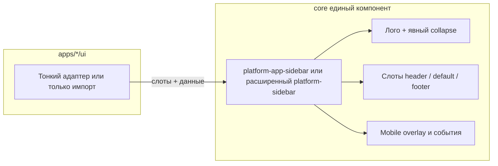

# План: централизация сайдбара и единый компонент

## Цель (обязательная)

- **Один канонический компонент сайдбара платформы в `core/frontend`**, а не набор похожих реализаций в каждом сервисе.
- **Вся кастомизация** (разные шапки, списки навигации, футеры с пользователем и уведомлениями) **переносится в этот центральный слой и рефакторится** так, чтобы не дублировать оболочку, состояние `collapsed` / mobile, кнопку сворачивания и общие стили.
- Сервисы (`apps/*/ui`) после рефакторинга **не содержат полноценных «своих» сайдбаров**: только подключение единого компонента и передача **контента через слоты и/или узкий конфиг** (без копипасты `platform-sidebar` + одних и тех же lifecycle-хуков).

## Текущее состояние (от чего уходим)

- `[platform-sidebar.js](core/frontend/static/lib/components/layout/platform-sidebar.js)` — общий контейнер, но **нет видимой кнопки collapse** (toggle только с клика по логотипу; стили `.collapse-btn` в `[sidebar.styles.js](core/frontend/static/lib/styles/shared/sidebar.styles.js)` не подключены к DOM).
- Параллельно живут тяжёлые обёртки: `frontend-sidebar`, `crm-sidebar`, `sync-sidebar`, `flows-sidebar`, `rag-sidebar`, `office-sidebar` — дублируют `collapsed` / `mobileOpen` / `closeMobile`, `@collapse-change`, блоки `:host([collapsed])` и свою вёрстку.

## Целевая архитектура

- **Единый компонент** отвечает за: ширину, анимацию, `collapsed`, mobile drawer, **явную кнопку свернуть/развернуть** (a11y, i18n `shell.sidebar.`*), события `collapse-change` / `mobile-change`, согласование с `platform-user` (`:host-context(platform-sidebar[collapsed])` сохраняем или переносим на тот же тег).
- **Сервисная логика** остаётся в `apps` (store, API, навигация), но **DOM и общие стили навигационных паттернов** выносятся в core: либо в сам компонент, либо в переиспользуемые подкомпоненты/стили в `@platform/lib/styles/shared/`, чтобы не плодить шесть копий одного и того же.

## Этапы работ

1. **Спецификация API**
  Зафиксировать слоты (`header`, основной контент, `footer`), обязательные/опциональные атрибуты (`logo-src`, `logo-text`, `base-url` для версии деплоя и т.д.), правило: кто рендерит `platform-user` / `platform-notification-manager` / `platform-deployment-version` (центрально с слотами `user-toolbar` и т.п.).
2. **Реализация в core**
  - Ввести явный collapse UI в едином компоненте; по продуктовому решению убрать или оставить вторичный toggle с логотипа (предпочтительно **только кнопка**, логотип без скрытого toggle).  
  - Собрать общий каркас, в который переносится повторяющаяся структура из сервисов.
3. **Миграция сервисов**
  Для каждого: `frontend`, `crm`, `sync`, `flows`, `rag`, `office` — перенести уникальную разметку в слоты/подкомпоненты core, **удалить** дублирующую оболочку и мёртвый boilerplate (`toggleCollapse` на обёртках, где он не нужен).  
   Выровнять `office-sidebar` с остальными по прокидыванию `collapsed` / mobile, если это ещё не в центральном компоненте.
4. **Правила и проверки**
  Обновить `[.cursor/rules/frontend.mdc](.cursor/rules/frontend.mdc)`: канон — **один** сайдбар shell, новые SPA подключают только его.  
   `make check-ui-canon`, `make check-i18n`, при необходимости точечно `report_ui_i18n_gaps.py`.

## Риски и как снимать

- **Sync/CRM — большой объём DOM:** перенос идёт итерациями (сначала общий каркас + collapse, затем перенос секций в именованные слоты или внутренние partials в core), без «if service === sync» в одном файле — предпочтительно **композиция слотов** и маленькие core-модули по смыслу (например `sidebar-nav-item` уже в core).
- **Регрессии mobile:** сохранить контракт `platform-sidebar-open`, `platform-sidebar-mobile-change`, поведение `platform-island`.

## Итог

Минимальная «только кнопка в platform-sidebar» **недостаточна по требованию заказчика**: нужна **полная централизация** — **единый компонент** и **рефакторинг** с переносом кастомизации из сервисов в core, с тонкими остатками в `apps`.