# Целевая архитектура: Browser-Native Research + High-Throughput Crawler

Документ описывает отдельный проект (не fork `crawl4ai`), который решает две близкие задачи на общем браузерном ядре:

1. **LLM Browser Agent** — глубокая интерактивная работа LLM в браузере.
2. **High-Throughput Crawler** — массовый сбор релевантного контента для RAG (без обязательного участия LLM в обходе).

---

## 1) Цели и ограничения

### 1.1 Функциональные цели

- Дать LLM возможность быстро и глубоко работать с вебом через Playwright/CDP.
- Дать краулеру возможность массово и устойчиво обходить сайты, находить релевантный контент и складывать его в RAG-пайплайн.
- Поддержать общий слой: браузеры, прокси, антибот, кэш, мониторинг, артефакты запусков.

### 1.2 Нефункциональные цели

- **Throughput**: высокая параллельность URL-обхода.
- **Resource-aware**: динамическое управление параллелизмом по RAM/CPU.
- **Context efficiency**: LLM получает снапшоты/диффы DOM вместо полного контента при возможности.
- **Session continuity**: два режима состояния браузера — warm (живой) и restore (восстановляемый).

### 1.3 Базовые технологические вводные

- Браузер: `lightpanda` (CDP) + `Playwright`; fallback на Chromium.
- Стелс: `playwright_stealth` + кастомные init scripts.
- Кэш и координация: Redis.
- Эмбеддинги: `bge-m3`.
- Векторы/документы/метаданные: PostgreSQL (включая vector extension).

---

## 2) Архитектурные bounded contexts

1. **Control Plane**
  - Оркестрация запусков, scheduling, лимиты ресурсов, policies.
2. **Browser Runtime**
  - CDP-пул, контексты, сессии, прокси, stealth/evasion, артефакты интеракций.
3. **Discovery & Crawl**
  - Поиск seed URL, frontier management, BFS/DFS/priority crawling, visited/cache.
4. **Extraction & Normalization**
  - Очистка HTML, извлечение текста/ссылок/метаданных, markdown/snapshot.
5. **RAG Ingestion**
  - Chunking, embedding, upsert в Postgres vector store.
6. **Agent Interaction**
  - Исполнение Playwright-кода, обратная связь LLM по diff/snapshot/screenshot.
7. **Observability & Artifacts**
  - Логи, метрики, trace run, воспроизводимые артефакты.

---

## 3) Общая схема модулей

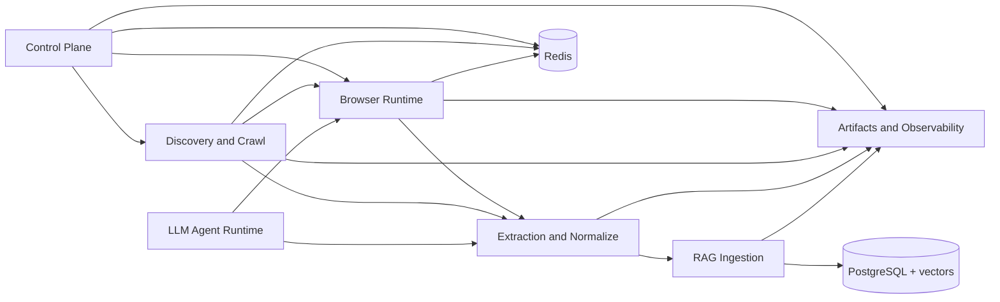


---

## 4) Ключевые абстракции и контракты

Ниже интерфейсы на уровне домена (не привязаны к конкретному фреймворку DI):

```python
from dataclasses import dataclass
from typing import Protocol, AsyncIterator, Optional, Literal, Any

SessionMode = Literal["warm", "restore"]
ExecutionMode = Literal["llm_agent", "crawler"]
AntiBotTier = Literal["white", "aggressive"]

@dataclass
class ResourceLimits:
    max_ram_mb: int
    max_cpu_percent: int
    max_concurrency: int
    min_concurrency: int

@dataclass
class BrowserSessionSpec:
    session_id: str
    mode: SessionMode
    shared_storage_key: Optional[str]  # cookies/localStorage/sessionStorage bucket
    proxy_pool: str
    anti_bot_tier: AntiBotTier
    ttl_sec: int

@dataclass
class CrawlTask:
    run_id: str
    url: str
    depth: int
    parent_url: Optional[str]
    priority: float
    execution_mode: ExecutionMode

@dataclass
class PageArtifact:
    url: str
    final_url: str
    status_code: Optional[int]
    html_raw: Optional[str]
    html_clean: Optional[str]
    markdown: Optional[str]
    dom_snapshot: Optional[str]
    dom_diff: Optional[str]
    screenshot_path: Optional[str]
    pdf_path: Optional[str]
    links_internal: list[str]
    links_external: list[str]
    anti_bot_signals: dict[str, Any]

class BrowserRuntime(Protocol):
    async def acquire_page(self, spec: BrowserSessionSpec) -> tuple[Any, Any]: ...
    async def release_page(self, page: Any) -> None: ...
    async def persist_session_state(self, session_id: str) -> str: ...  # returns state key
    async def restore_session_state(self, session_id: str, state_key: str) -> None: ...

class FrontierManager(Protocol):
    async def push(self, task: CrawlTask) -> None: ...
    async def pop(self) -> Optional[CrawlTask]: ...
    async def mark_visited(self, url_norm: str, run_id: str) -> None: ...
    async def is_visited(self, url_norm: str, run_id: str) -> bool: ...

class ExtractionPipeline(Protocol):
    async def extract(self, url: str, html: str, *, lite: bool) -> PageArtifact: ...

class RAGSink(Protocol):
    async def upsert_document(self, artifact: PageArtifact, *, embed_model: str) -> str: ...

class AgentExecutor(Protocol):
    async def run_playwright_code(self, code: str, session_id: str) -> PageArtifact: ...
```

### Контракт запуска

- `RunRequest`:
  - `mode`: `llm_agent | crawler`
  - `resource_limits`
  - `session_mode`
  - `anti_bot_tier`
  - `search_providers` (по умолчанию `duckduckgo`)
  - `max_depth`, `max_pages`
  - `ingestion_policy` (`full`, `lite`, `pdf_only`, `html_only`)
- `RunResult`:
  - `run_id`
  - `stats` (pages, success rate, avg latency, retries, blocks)
  - `artifacts_manifest_path`
  - `rag_document_ids`

---

## 5) Browser Runtime (общий для LLM и краулера)

### 5.1 Обязательные компоненты

- **CDPConnectionPool**: пул подключений к `lightpanda/chromium`.
- **ContextFactory**: создание/реюз контекстов с опциями (proxy, stealth, headers).
- **SessionStateStore**:
  - cookies
  - localStorage/sessionStorage snapshot
  - optional storage_state blob
- **PageLeaseManager**:
  - выдача/возврат страниц
  - refcount контекстов
  - TTL-сборка зависших сессий

### accessibility

### 5.2 Режимы состояния

1. **Warm mode**
  - Держим контекст/страницу открытыми.
  - Минимальная латентность для LLM-интеракций.
2. **Restore mode**
  - Сохраняем session state и закрываем runtime-ресурсы.
  - При восстановлении поднимаем контекст и применяем состояние.
  - Компромисс latency vs RAM/CPU.

### 5.3 Shared-context политика

- Разделяем storage между браузерами только по `shared_storage_key`.
- Внутри одного `run_id` разрешаем общий storage между LLM и crawler при явном флаге.
- Между разными run по умолчанию изоляция.

---

## 6) Антибот слой: white + aggressive

### 6.1 AntiBotPolicyEngine

Вход: signals (challenge page, 403/429, JS challenge markers, latency spikes, repeated redirects).  
Выход: action plan.

### 6.2 Белые стратегии

- Пер-доменный rate limiting.
- Умная ротация прокси/UA.
- Stealth init scripts.
- Human-like pacing (джиттер, scroll/mouse heuristics).
- Retry/backoff по домену.

### 6.3 Агрессивные стратегии (опционально через policy)

- Более частая ротация identity (IP+UA+session).
- Специализированные challenge-handlers через плагинный интерфейс.
- Динамическая деградация режима рендеринга (lite/headful/headless).

### 6.4 Контракт плагина

```python
class AntiBotPlugin(Protocol):
    async def detect(self, page: Any, response_meta: dict) -> dict: ...
    async def mitigate(self, page: Any, context: dict) -> bool: ...  # success/fail
```

---

## 7) Discovery & Crawl слой

### 7.1 SearchProviderManager

- Источники seed-URL: сначала DuckDuckGo, далее расширяемо.
- Контракт:
  - `search(query, limit, locale) -> list[SearchHit]`

### 7.2 Frontier

- Priority queue: `(score, depth, ts, url_norm)`.
- Redis-backed visited set + per-run bloom/set.
- Поддержка BFS/DFS/hybrid (scored DFS/BFS).

### 7.3 Scheduler

- Pull из frontier.
- Проверка limits (RAM/CPU/domain pressure).
- Передача задач в Browser Runtime.

### 7.4 Dynamic concurrency controller

- Цели:
  - держать RAM/CPU < заданных лимитов
  - не терять throughput
- Алгоритм:
  - если RAM/CPU высоко -> step down concurrency
  - если стабильно низко -> step up
  - при memory pressure: запрет на выдачу новых тяжелых задач, только drain активных

---

## 8) Extraction/Normalization для RAG и LLM

### 8.1 Pipeline steps

1. Input classifier: html/pdf/binary.
2. HTML clean: remove noise/attrs/boilerplate.
3. Link extraction + normalization.
4. Content projection:
  - `cleaned_html`
  - `markdown`
  - `snapshot` (структурированный срез DOM)
5. Chunking profile:
  - `rag_chunks` (для embeddings)
  - `llm_snapshot_chunks` (для контекста агента)

### 8.2 Snapshot-first для LLM

- Для интерактивного режима LLM получает:
  - краткий snapshot страницы (title, headings, actionable nodes, key text zones)
  - DOM diff относительно предыдущего шага
  - screenshot только как fallback/подтверждение визуального состояния
- Это снижает токены и ускоряет цикл.

### 8.3 Lite режим

- Без полного браузерного рендера, где возможно:
  - прямой HTTP fetch HTML
  - PDF fetch/parse
- Полезно для массовой индексации документов.

---

## 9) RAG ingestion и ранжирование

### 9.1 Текущий ingestion

- Chunker -> embed (`bge-m3`) -> upsert в PostgreSQL.
- Храним:
  - `document_id`, `url`, `chunk_id`, `text`, `embedding`, `metadata`, `crawl_run_id`.

### 9.2 Будущий re-ranking модуль

- Отдельный `RerankerService` после retrieval.
- Контракт:
  - `rerank(query, candidates) -> ranked_candidates`
- Должен поддерживать:
  - fast lexical prefilter + dense rerank
  - опциональный cross-encoder для top-K.

---

## 10) Артефакты запусков (обязательно)

На каждый run:

- `manifest.json`
- `events.ndjson` (шаги crawler/agent)
- `pages/<hash>/`
  - `raw.html`, `clean.html`, `snapshot.json`, `dom.diff`, `screen.png`, `doc.pdf`
- `network/har/` (опционально)
- `session/` (state blobs)

Минимальный `manifest.json`:

```json
{
  "run_id": "uuid",
  "mode": "crawler",
  "started_at": "iso-ts",
  "finished_at": "iso-ts",
  "limits": {"ram_mb": 8192, "cpu_percent": 75},
  "stats": {"pages_total": 1200, "success": 1090, "blocked": 87},
  "artifacts_root": "s3://... or local path"
}
```

---

## 11) Общая sequence-диаграмма

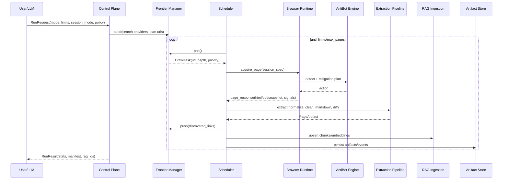


---

## 12) Минимальная структура проекта

```text
src/
  control_plane/
    run_controller.py
    policies.py
  browser_runtime/
    cdp_pool.py
    context_factory.py
    session_store.py
    page_lease_manager.py
    anti_bot/
      engine.py
      plugins/
  discovery/
    search_provider_manager.py
    frontier.py
    url_scoring.py
  scheduler/
    dispatcher.py
    resource_controller.py
  extraction/
    html_cleaner.py
    link_extractor.py
    snapshot_builder.py
    markdown_renderer.py
    chunker.py
  ingestion/
    embedder_bge_m3.py
    pg_vector_store.py
    reranker.py
  agent_runtime/
    playwright_code_executor.py
    feedback_diff_protocol.py
  artifacts/
    writer.py
    schemas.py
  observability/
    metrics.py
    tracing.py
```

---

## 13) Точечный реюз из текущего репозитория (без “велосипедов”)

Ниже конкретные методы, которые полезно переиспользовать как идеи/контракты.

### Браузер и сессии

1. `crawl4ai/browser_adapter.py` → `BrowserAdapter.evaluate(page, expression, arg=None)`
  - **Вход**: page, JS expression, optional arg.
  - **Выход**: результат JS.
  - **Зачем**: единая абстракция для Playwright/Patchright.
2. `crawl4ai/browser_adapter.py` → `StealthAdapter.apply_stealth(page)`
  - **Вход**: page.
  - **Выход**: side-effect на page.
  - **Зачем**: стартовая stealth-интеграция.
3. `crawl4ai/browser_adapter.py` → `UndetectedAdapter.retrieve_console_messages(page)`
  - **Вход**: page.
  - **Выход**: list console/error сообщений.
  - **Зачем**: обратная связь для LLM и диагностики run.
4. `crawl4ai/browser_manager.py` → `BrowserManager.get_page(crawlerRunConfig)`
  - **Вход**: run config (session_id, proxy, flags).
  - **Выход**: `(page, context)`.
  - **Зачем**: реюз паттерна session reuse + context refcount + lock от гонок.
5. `crawl4ai/browser_manager.py` → `BrowserManager.release_page_with_context(page)`
  - **Вход**: page.
  - **Выход**: None.
  - **Зачем**: корректное освобождение страницы и lifecycle контекстов.
6. `crawl4ai/browser_manager.py` → `BrowserManager.kill_session(session_id)`
  - **Вход**: session_id.
  - **Выход**: None.
  - **Зачем**: принудительное завершение зависших/устаревших сессий.

### Параллелизм и лимиты ресурсов

1. `crawl4ai/async_dispatcher.py` → `RateLimiter.wait_if_needed(url)` / `RateLimiter.update_delay(url, status_code)`
  - **Вход**: url, status code.
  - **Выход**: delay decision / continue flag.
  - **Зачем**: per-domain backoff и анти-бан политика.
2. `crawl4ai/async_dispatcher.py` → `MemoryAdaptiveDispatcher._memory_monitor_task()`
  - **Вход**: внутренние thresholds.
  - **Выход**: обновление memory pressure state.
  - **Зачем**: база для динамического concurrency control по RAM.
3. `crawl4ai/async_dispatcher.py` → `MemoryAdaptiveDispatcher.run_urls_stream(...)`
  - **Вход**: urls, crawler, config.
  - **Выход**: stream `CrawlerTaskResult`.
  - **Зачем**: потоковый режим для быстрого раннего результата.

### Обход графа ссылок

1. `crawl4ai/deep_crawling/dfs_strategy.py` → `DFSDeepCrawlStrategy._arun_stream(...)`
  - **Вход**: start_url, crawler, config.
    - **Выход**: async stream `CrawlResult`.
    - **Зачем**: эталон DFS-stream обхода с resume/cancel state.
2. `crawl4ai/deep_crawling/dfs_strategy.py` → `DFSDeepCrawlStrategy.link_discovery(...)`
  - **Вход**: текущий `CrawlResult`, depth state.
    - **Выход**: next URLs.
    - **Зачем**: выделенный контракт discovery, удобно расширять scoring.

### Очистка HTML и извлечение

1. `crawl4ai/content_scraping_strategy.py` → `LXMLWebScrapingStrategy._scrap(...)`
  - **Вход**: url, html, фильтры.
    - **Выход**: cleaned_html + media + links + metadata.
    - **Зачем**: производительный baseline для extraction.
2. `crawl4ai/content_scraping_strategy.py` → `remove_empty_elements_fast(...)`
  - **Вход**: lxml root, threshold.
    - **Выход**: очищенный root.
    - **Зачем**: агрессивная чистка шумных узлов для RAG.
3. `crawl4ai/content_scraping_strategy.py` → `remove_unwanted_attributes_fast(...)`
  - **Вход**: root, important attrs.
    - **Выход**: root с уменьшенным шумом атрибутов.
    - **Зачем**: компактный HTML для markdown/snapshot.
4. `crawl4ai/content_scraping_strategy.py` → `process_image(...)`
  - **Вход**: image element + контекст.
    - **Выход**: отфильтрованные image variants с score.
    - **Зачем**: отсечь иконки/мусор, оставить полезные media.

### Утилиты для RAG/нормализации/robots

1. `crawl4ai/utils.py` → `chunk_documents(...)` и `merge_chunks(...)`
  - **Вход**: тексты, target token size/overlap.
    - **Выход**: генератор/список чанков.
    - **Зачем**: быстрый старт chunking профилей.
2. `crawl4ai/utils.py` → `preprocess_html_for_schema(...)`
  - **Вход**: html, thresholds.
    - **Выход**: fit_html.
    - **Зачем**: компактный HTML-представитель для LLM/extraction.
3. `crawl4ai/utils.py` → `quick_extract_links(...)`
  - **Вход**: html, base_url.
    - **Выход**: internal/external links.
    - **Зачем**: prefetch/lite-discovery на высокой скорости.
4. `crawl4ai/utils.py` → `efficient_normalize_url_for_deep_crawl(...)`
  - **Вход**: href, base_url.
    - **Выход**: нормализованный URL.
    - **Зачем**: critical-path дедуп ссылок.
5. `crawl4ai/utils.py` → `RobotsParser.can_fetch(url, user_agent='*')`
  - **Вход**: url, user-agent.
    - **Выход**: bool.
    - **Зачем**: встроенный robots gate + кэш правил.

---

## 14) Что важно не переносить 1:1

- Монолитный менеджер браузера: в новом проекте лучше разделить на `CDPPool`, `SessionStore`, `ContextFactory`, `PageLease`.
- Сильная связанность extraction/crawl: выделить строго отдельный pipeline слой.
- Размытые config-объекты: ввести отдельные контракты `RunRequest`, `BrowserSessionSpec`, `IngestionPolicy`.

---

## 15) Пошаговый порядок реализации (коротко)

1. **MVP runtime**: browser pool + session warm/restore + page lease.
2. **Crawler core**: frontier + visited/cache + DFS/BFS + memory-aware scheduler.
3. **Extraction**: clean html + markdown + snapshot/diff + pdf/html lite path.
4. **Visibility Tree для LLM budget**: отдельный пайплайн фильтров `visibility + interactivity + semantic`, который отдаёт в контекст только полезные ноды текущего viewport.
5. **RAG ingestion**: chunk -> bge-m3 -> pgvector.
6. **Agent runtime**: execute generated Playwright code + structured feedback.
7. **Anti-bot engine**: signals + policy tiers + plugin chain.
8. **Artifacts/observability**: mandatory manifest/events/pages.

---

## 16) Детальный формат выходной информации и каналы передачи

Ниже описан canonical output, который одинаково применим к режиму `crawler` и `llm_agent`.

### 16.1 Слои выходных данных

1. **Событийный слой (stream)** — для UI/оркестратора в реальном времени.
2. **Операционный слой (API response)** — итог запуска или шага.
3. **Артефактный слой (файлы/blob)** — тяжелые payload (HTML, скриншоты, PDF, HAR).
4. **Индексный слой (PostgreSQL)** — нормализованные данные для retrieval/RAG.

### 16.2 Event stream (`events.ndjson`)

Каждая строка — атомарное событие pipeline.

```json
{"ts":"2026-04-23T12:00:00Z","run_id":"r1","type":"TASK_DEQUEUED","task_id":"t9","url":"https://example.com","depth":2}
{"ts":"2026-04-23T12:00:01Z","run_id":"r1","type":"BROWSER_ACQUIRED","task_id":"t9","session_id":"s3","proxy_id":"p-rot-17"}
{"ts":"2026-04-23T12:00:02Z","run_id":"r1","type":"FETCH_DONE","task_id":"t9","status_code":200,"final_url":"https://example.com/a"}
{"ts":"2026-04-23T12:00:02Z","run_id":"r1","type":"EXTRACT_DONE","task_id":"t9","artifact_id":"a-19","links_internal":43}
{"ts":"2026-04-23T12:00:03Z","run_id":"r1","type":"INGEST_DONE","task_id":"t9","document_ids":["d1","d2","d3"]}
```

Назначение:

- быстрый прогресс;
- дебаг scheduler/anti-bot;
- реплей run для воспроизведения проблем.

### 16.3 `RunResult` (операционный ответ)

```json
{
  "run_id": "r1",
  "mode": "crawler",
  "status": "completed_with_warnings",
  "started_at": "2026-04-23T12:00:00Z",
  "finished_at": "2026-04-23T12:12:44Z",
  "stats": {
    "tasks_total": 400,
    "tasks_success": 351,
    "tasks_failed": 49,
    "blocked_count": 27,
    "avg_latency_ms": 1422,
    "peak_ram_mb": 7340,
    "peak_cpu_percent": 81
  },
  "artifacts_manifest_path": "file:///runs/r1/manifest.json",
  "rag_document_ids": ["doc_101", "doc_102"],
  "warnings": ["domain_limit_reached:example.org"]
}
```

### 16.4 `PageArtifact` (ключевая единица результата)

`PageArtifact` не обязательно возвращается целиком в API-ответе (из-за размера); в response передается `artifact_ref`, а большие поля лежат в blob/file-store.

Минимальные обязательные поля:

- identity: `run_id`, `task_id`, `url`, `final_url`, `content_hash`;
- fetch: `status_code`, `headers`, `timings`, `proxy_id`;
- extraction: `html_clean_ref`, `markdown_ref`, `snapshot_ref`, `dom_diff_ref`;
- graph: `internal_links`, `external_links`, `discovered_urls`;
- quality: `content_score`, `boilerplate_ratio`, `is_relevant`;
- anti-bot: `signals`, `mitigations_applied`;
- rag: `chunk_ids`, `document_ids`.

---

## 17) Интерфейсы взаимодействия с браузером (под реализацию)

Ниже более практичный контракт, чем общий `BrowserRuntime`.

```python
from dataclasses import dataclass
from typing import Any, Optional, Literal

PageMode = Literal["interactive", "crawl", "lite"]

@dataclass
class BrowserAcquireRequest:
    run_id: str
    task_id: str
    session_id: str
    page_mode: PageMode
    shared_storage_key: Optional[str]
    proxy_policy: str
    anti_bot_tier: str
    timeout_ms: int

@dataclass
class BrowserAcquireResult:
    page: Any
    context: Any
    browser_id: str
    proxy_id: Optional[str]
    cold_start: bool

@dataclass
class BrowserFetchRequest:
    url: str
    wait_policy: str  # domcontentloaded | networkidle | selector:<css>
    screenshot: bool
    snapshot: bool
    capture_pdf: bool

@dataclass
class BrowserFetchResult:
    final_url: str
    status_code: Optional[int]
    response_headers: dict[str, str]
    html: Optional[str]
    screenshot_ref: Optional[str]
    pdf_ref: Optional[str]
    snapshot_ref: Optional[str]
    anti_bot_signals: dict

class BrowserInteractor(Protocol):
    async def acquire(self, req: BrowserAcquireRequest) -> BrowserAcquireResult: ...
    async def fetch(self, page: Any, req: BrowserFetchRequest) -> BrowserFetchResult: ...
    async def exec_code(self, page: Any, code: str, *, timeout_ms: int) -> dict: ...
    async def save_state(self, context: Any, shared_storage_key: str) -> str: ...
    async def restore_state(self, context: Any, state_key: str) -> None: ...
    async def release(self, page: Any) -> None: ...
```

### 17.1 Идея

- `acquire/fetch/exec/release` — минимальный атомарный API браузерного слоя.
- LLM и crawler используют **одинаковый** контракт, различается только `page_mode` и политики.
- Это убирает дублирование и позволяет единообразно логировать шаги и ошибки.

### 17.2 Особенности

- `BrowserFetchResult` всегда несет `anti_bot_signals`, даже при успешной загрузке.
- `exec_code` должен возвращать нормализованный envelope:
  - `ok: bool`, `stdout`, `console_events`, `dom_diff_ref`, `error`.
- `save_state/restore_state` — обязательны для `restore` режима и long-running agent loops.

### 17.3 Backward-compatible Browser Control API (browser-use / agent-browser)

Чтобы не привязываться к одному движку, поверх `BrowserInteractor` нужен адаптерный слой с неизменным внешним контрактом.

- `PlaywrightAdapter` — прямой Playwright API.
- `BrowserUseAdapter` — интеграция с `browser_use/dom/service.py`, `browser_use/dom/serializer/serializer.py` и legacy JS builder `browser_use/dom/buildDomTree.js`.
- `AgentBrowserAdapter` (agent-browser/agentic-browser) — интеграция через `src/transport/control-api.ts`, `src/session/session-manager.ts`, `src/session/browser-controller.ts`.

Минимальный совместимый интерфейс:

```python
@dataclass
class BrowserControlFeatures:
    supports_js_injection_dom_tree: bool
    supports_cdp_dom_snapshot: bool
    supports_cdp_event_listeners: bool
    supports_ax_tree: bool
    supports_selector_map: bool

class BrowserControlAdapter(Protocol):
    async def start(self, req: BrowserAcquireRequest) -> BrowserAcquireResult: ...
    async def navigate(self, page: Any, req: BrowserFetchRequest) -> BrowserFetchResult: ...
    async def run_action(self, page: Any, code: str, *, timeout_ms: int) -> dict: ...
    async def get_visibility_tree(self, page: Any, *, budget: int) -> dict: ...
    async def get_accessibility_tree(self, page: Any) -> dict: ...
    async def get_dom_event_listeners(self, page: Any) -> dict: ...
    async def stop(self, page: Any) -> None: ...
    def features(self) -> BrowserControlFeatures: ...
```

Правило совместимости:

- orchestration-слой работает только с `BrowserControlAdapter`;
- конкретный backend (`browser-use`, `agent-browser`, Playwright-only) выбирается через factory/config;
- если backend не поддерживает часть функций (например listeners через CDP), это отражается в `features()`, но не ломает API.

---

## 18) Главный loop: LLM Browser Agent

### 18.1 Цель loop

Вместо передачи полного HTML на каждый шаг LLM получает компактный state:

- page snapshot;
- diff от предыдущего состояния;
- selected console/network signals;
- опционально screenshot.

### 18.2 Шаги цикла

1. **Plan step**
  - LLM получает `AgentStepInput` и выдает `AgentAction` (Playwright code).
2. **Execute step**
  - `AgentExecutor` выполняет код в sandbox.
3. **Observe step**
  - Снимается `new_snapshot`.
  - Считается `dom_diff = diff(prev_snapshot, new_snapshot)`.
4. **Compress step**
  - `LLMContextCompressor` собирает компактный `AgentStepOutput`.
5. **Decide next**
  - Если цель достигнута -> `finish`.
  - Иначе следующий iteration.

### 18.3 Контракты шага агента

```python
@dataclass
class AgentStepInput:
    run_id: str
    step_index: int
    objective: str
    previous_action: Optional[str]
    dom_snapshot_ref: Optional[str]
    dom_diff_ref: Optional[str]
    key_text_blocks: list[str]
    errors: list[str]

@dataclass
class AgentAction:
    rationale: str
    playwright_code: str
    expected_outcome: str
    fallback_action: Optional[str]

@dataclass
class AgentStepOutput:
    step_index: int
    action_ok: bool
    dom_diff_ref: Optional[str]
    screenshot_ref: Optional[str]
    extracted_facts: list[str]
    next_hint: str
```

### 18.4 Очистка контекста для LLM (LLM cleanup)

`LLMContextCompressor` делает:

- drop boilerplate nodes (menus, repeated nav/footer blocks);
- сохраняет только изменившиеся DOM-узлы + ближайший полезный контекст;
- ограничивает текстовые блоки по budget токенов;
- дедуплицирует повторяющиеся фрагменты между шагами;
- превращает noisy ошибки в краткие категории (`TIMEOUT`, `NAV_BLOCKED`, `SELECTOR_NOT_FOUND`).

Результат: LLM видит не страницу целиком, а **короткое состояние + delta**.

---

## 19) Детальный loop: High-Throughput Crawler

### 19.1 Crawler tick (одна итерация)

1. `Frontier.pop()` -> `CrawlTask`.
2. Проверка `VisitedStore` (url_norm + run scope).
3. Проверка budget (`max_pages`, `domain_quota`, `resource_limits`).
4. `BrowserInteractor.acquire()`.
5. `BrowserInteractor.fetch()` или lite-fetch по policy.
6. `ExtractionPipeline.extract()`.
7. `RelevanceGate.score()` (что идет в RAG, что только в cache/artifacts).
8. `LinkDiscovery.extract_links()` + normalization + dedup.
9. `Frontier.push(new_tasks)` с depth/priority.
10. `RAGSink.upsert_document()` для релевантных.
11. `ArtifactWriter.persist(...)`.
12. `BrowserInteractor.release()`.

### 19.2 Почему такой loop

- Каждая итерация полностью трассируема.
- Отдельный `RelevanceGate` экономит embedding budget.
- Frontier обновляется сразу после extraction, поэтому crawl быстро расширяет полезный граф.

### 19.3 Псевдокод цикла

```python
while not stop_condition:
    task = await frontier.pop()
    if not task:
        await sleep(idle_backoff)
        continue

    if await visited.is_visited(task.url_norm, task.run_id):
        continue
    await visited.mark(task.url_norm, task.run_id)

    if not budget.allow(task):
        continue

    lease = await browser.acquire(task.to_acquire_request())
    try:
        fetch_result = await browser.fetch(lease.page, task.to_fetch_request())
        artifact = await extraction.extract(task.url, fetch_result.html, lite=task.lite)
        artifact = enrich_with_fetch(artifact, fetch_result, task)

        if relevance.is_relevant(artifact):
            doc_ids = await rag.upsert_document(artifact, embed_model="bge-m3")
            artifact.document_ids = doc_ids

        for link in artifact.discovered_urls:
            if policy.allow_link(link, task.depth + 1):
                await frontier.push(make_child_task(task, link))

        await artifacts.persist(artifact)
        await events.emit("TASK_DONE", task=task.task_id, ok=True)
    except Exception as exc:
        await retry_or_deadletter(task, exc)
    finally:
        await browser.release(lease.page)
```

---

## 20) Работа с HTML diff и snapshot

### 20.1 Snapshot model

Снапшот — не raw DOM, а нормализованное представление:

- `node_id`
- `tag`
- `role`/`aria`
- `text_compact`
- `attributes_whitelist`
- `children_ids`
- `is_interactive`

### 20.2 Diff model

Поддерживаем 4 операции:

- `ADD_NODE`
- `REMOVE_NODE`
- `UPDATE_TEXT`
- `UPDATE_ATTR`

Пример:

```json
{
  "page_id": "p1",
  "from_snapshot": "s10",
  "to_snapshot": "s11",
  "ops": [
    {"op":"UPDATE_TEXT","node_id":"n45","old":"Loading...","new":"Results 124"},
    {"op":"ADD_NODE","parent_id":"n90","node":{"id":"n201","tag":"a","text":"Next page"}}
  ]
}
```

### 20.3 Где diff критичен

- в agent loop (минимум токенов);
- в мониторинге flaky сценариев (видно, что реально изменилось);
- в дедупе страниц (если diff почти пустой, не эмбеддить повторно).

### 20.4 Visibility Tree и экономия токенов (почему `accessibility_tree` недостаточно)

Для LLM-цикла нужен не “весь DOM” и не “весь AX tree”, а компактное **дерево видимости** с actionable-элементами текущего viewport.

#### Базовые фильтры (выполняются в странице или через CDP)

1. **Visibility check**
  Отсекаем скрытые/нулевые/вне viewport элементы:
  - `display:none`, `visibility:hidden`, `opacity:0`;
  - `getBoundingClientRect().width/height == 0`;
  - координаты за пределами видимой области.
2. **Interactivity check**
  Оставляем только то, с чем агент может действовать:
  - интерактивные теги (`a`, `button`, `input`, `select`, `textarea`, `details`);
  - интерактивные role (`button`, `link`, `checkbox`, `tab`, `menuitem`);
  - признаки кликабельности/tab focus;
  - при наличии CDP: `DOMDebugger.getEventListeners` для JS-слушателей, не видимых в raw HTML.
3. **Semantic check**
  Удаляем узлы без смысла для LLM:
  - текст/семантика из `innerText`, `aria-label`, `alt`, `title`;
  - если семантики нет, узел не попадает в LLM-контекст.

#### Почему одного `Playwright page.accessibility.snapshot()` недостаточно

- AX tree не гарантирует полноту интерактивности: framework listeners часто не отражены без CDP-проверки listeners.
- AX tree может быть избыточным по токенам: много служебных узлов, которые не участвуют в выборе следующего действия.
- AX tree сам по себе не даёт устойчивого `selector_map` для action replay.
- Для step-by-step agent loop нужен стабильный diff по node-id/selector, а не только role/name уровень.

#### Практическая опора на модули

- `browser_use/dom/buildDomTree.js` — исторический JS builder фильтруемого DOM дерева;
- `browser_use/dom/service.py` — сборка DOM state и интеграция evaluate/CDP;
- `browser_use/dom/serializer/serializer.py` — сериализация и сжатие дерева под token budget;
- `browser_use/browser/dom_watchdog.py` — цикл получения состояния DOM/AX для agent-step;
- `agent-browser` (`agentic-browser`) `src/session/browser-controller.ts`, `src/session/session-manager.ts`, `src/transport/control-api.ts` — CDP-ориентированный путь команд и structured state.

Итог: в архитектуре `visibility_tree` — основной источник для LLM prompt, `accessibility_tree` — дополнительный сигнал (a11y/fallback), но не единственный слой контекста.

---

## 21) Потоки данных между модулями (end-to-end)

### 21.1 Crawler flow

`SearchProviderManager -> Frontier -> Scheduler -> BrowserInteractor -> ExtractionPipeline -> RelevanceGate -> RAGSink + ArtifactWriter -> Frontier`

Особенность: после extraction всегда есть fan-out:

- в индекс (если релевантно),
- в artifacts (всегда),
- обратно в frontier (новые ссылки).

### 21.2 Agent flow

`PlannerLLM -> AgentExecutor(exec_code) -> SnapshotBuilder -> DiffEngine -> LLMContextCompressor -> PlannerLLM`

Особенность: loop строится по замкнутому циклу состояния, а не по полным документам.

### 21.3 Общие shared сервисы

- `PolicyEngine` — единая точка решений (robots, domain allow/deny, anti-bot tier).
- `ResourceController` — динамика concurrency для обоих режимов.
- `SessionStateStore` — перенос контекста между crawler и LLM в рамках общего `shared_storage_key`.

---

## 22) Взаимодействующие модули: идея, поведение, особенности

### 22.1 `RunController` (control plane)

- **Идея**: единая state machine run (`CREATED -> RUNNING -> DRAINING -> DONE/FAILED`).
- **Поведение**: стартует воркеры, следит за лимитами, завершает run.
- **Особенность**: deterministic stop-condition (чтобы run был воспроизводим).

### 22.2 `Scheduler + ResourceController`

- **Идея**: не просто очередь, а адаптивный диспетчер.
- **Поведение**: изменяет `effective_concurrency` по RAM/CPU и pressure сигналам.
- **Особенность**: умеет понижать concurrency только для тяжелых задач (например рендер JS), оставляя lite-задачи.

### 22.3 `FrontierManager`

- **Идея**: URL-граф как управляемый приоритетный процесс.
- **Поведение**: dedup, depth control, domain quotas, fairness.
- **Особенность**: гибрид BFS/DFS/scored traversal без смены внешнего API.

### 22.4 `BrowserInteractor`

- **Идея**: тонкая абстракция над Playwright/CDP для двух режимов.
- **Поведение**: acquire/fetch/exec/release/state.
- **Особенность**: одинаковый envelope ошибок и telemetry для crawler и LLM.

### 22.5 `ExtractionPipeline`

- **Идея**: отделить сетевой fetch от контентной обработки.
- **Поведение**: чистит HTML, извлекает текст/ссылки, строит markdown/snapshot.
- **Особенность**: multi-profile output (`rag_profile`, `agent_profile`) из одного HTML.

### 22.6 `DiffEngine`

- **Идея**: считать полезное изменение, а не “сырой diff строки HTML”.
- **Поведение**: сравнивает normalized snapshots.
- **Особенность**: сохраняет diff как самостоятельный артефакт для LLM и отладки.

### 22.7 `RelevanceGate`

- **Идея**: ранний фильтр перед embeddings.
- **Поведение**: score по эвристикам/модели, решает `index | skip | defer`.
- **Особенность**: резко снижает стоимость ingestion на широком crawl.

### 22.8 `RAGSink`

- **Идея**: единый контракт записи в индекс.
- **Поведение**: chunk -> embed -> upsert -> вернуть document IDs.
- **Особенность**: versioned schema чанков для последующего reindex.

### 22.9 `ArtifactWriter`

- **Идея**: immutable след каждого run.
- **Поведение**: кладет manifest, events, page artifacts, snapshots, diffs.
- **Особенность**: позволяет post-mortem и регрессионные сравнения без повторного crawl.

---

## 23) Расширенный набор архитектурных схем

Ниже набор схем, покрывающих большинство ключевых модулей и их связи.

### 23.1 Компонентная карта (верхний уровень)

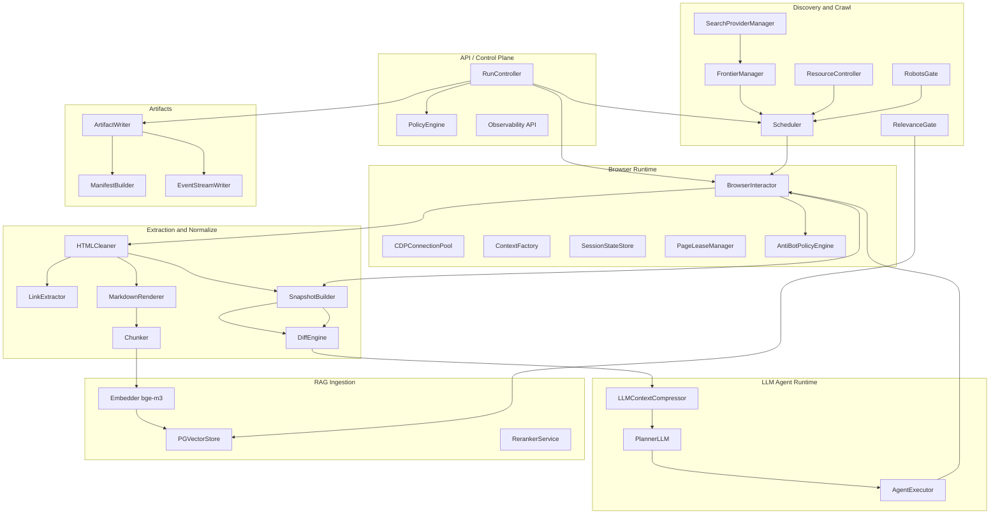


### 23.2 Deployment/containers схема

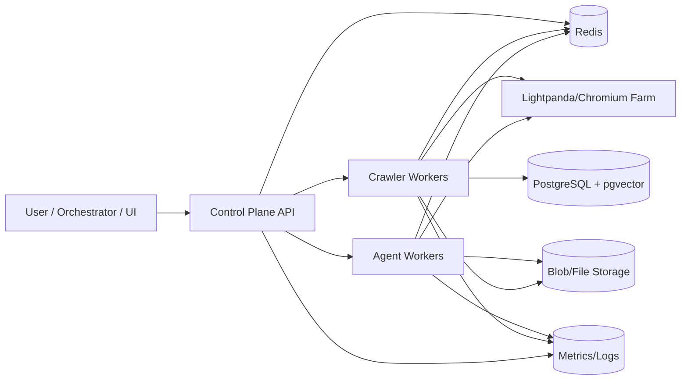


### 23.3 Последовательность crawler-цикла (детально)

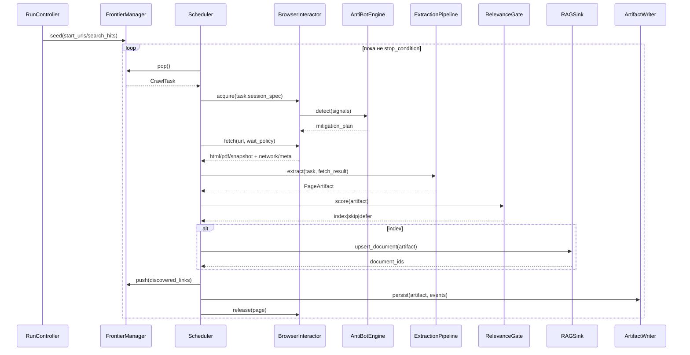


### 23.4 Последовательность agent-loop (snapshot/diff-first)

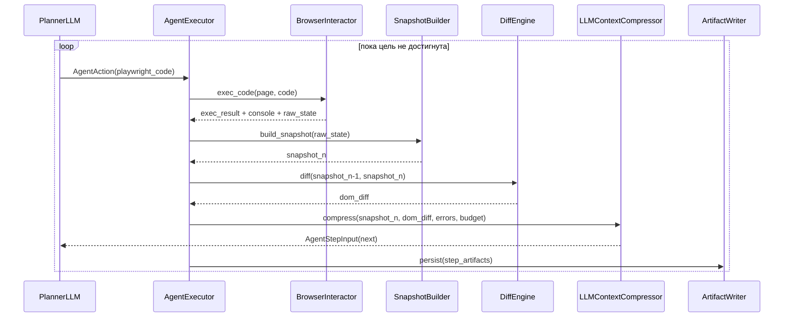


### 23.5 State machine запуска (`run`)

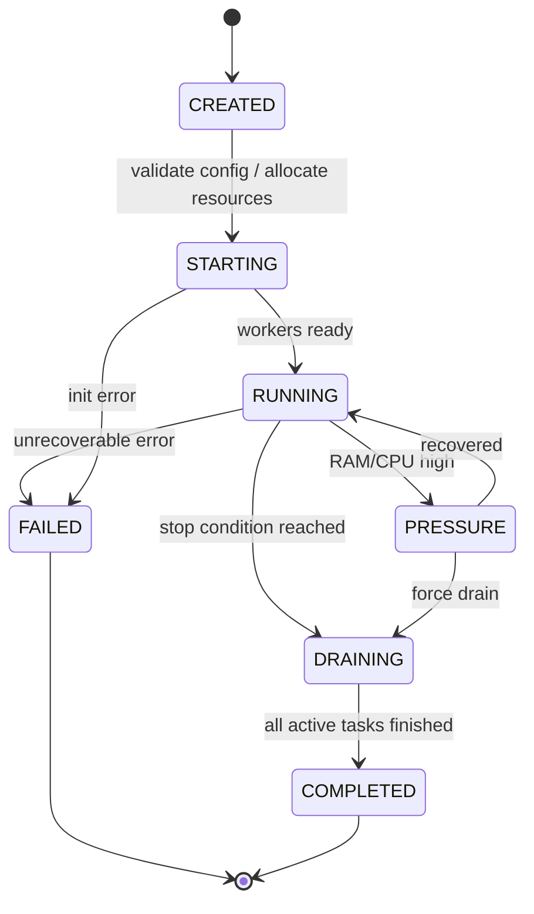


### 23.6 State machine браузерной сессии (`warm/restore`)

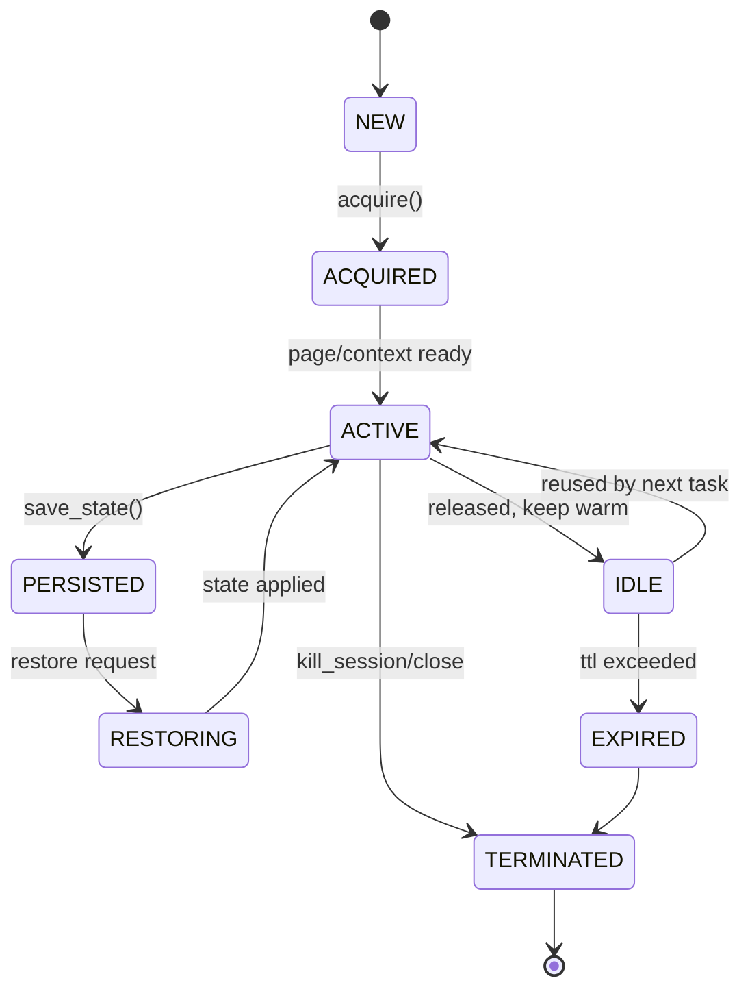


### 23.7 Data lineage: от URL до RAG-документа

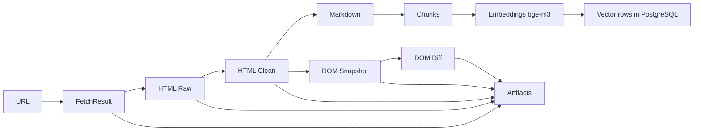


### 23.8 Матрица взаимодействия модулей (кто кому зависимость)

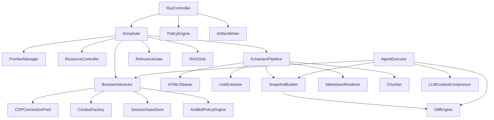


### 23.9 Ошибки и точки обработки (fault map)

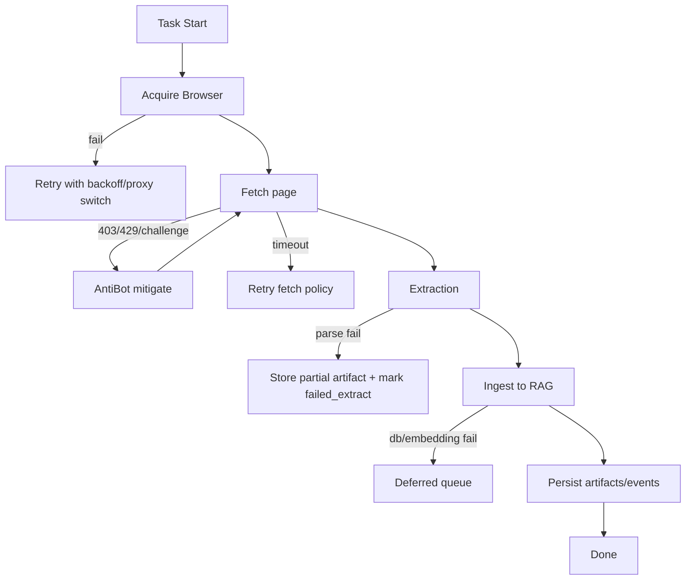


---

## 24) Конечный этап: rerank, остановка deep search и работа LLM по RAG

Этот раздел описывает, что делать **после массового сбора**, как получить устойчивый ответ LLM и не утонуть в “все хранить в векторке”.

### 24.1 Многоступенчатый rerank конечных чанков

Рекомендуемый pipeline ранжирования (каскад):

1. **Candidate generation (дешевый recall)**
  - dense retrieval (`bge-m3`) top-200;
  - optional BM25/topical filter top-200;
  - объединение + dedup по `canonical_url + content_hash`.
2. **Light rerank (средняя цена)**
  - feature-based scoring:
    - cosine score,
    - свежесть,
    - trust/domain quality,
    - близость к query intent,
    - section-priority (`h1/h2`, intro, conclusion).
  - срез до top-40.
3. **Heavy rerank (дорогой, точный)**
  - cross-encoder/Large reranker на top-40 -> top-8..12.
4. **Answer-set shaping**
  - diversity constraint (max 2-3 чанка с одного URL);
  - anti-redundancy (MMR-like);
  - цитируемость (chunk должен иметь source anchor).

Контракт:

```python
@dataclass
class RetrievedChunk:
    chunk_id: str
    document_id: str
    url: str
    text: str
    dense_score: float
    sparse_score: float | None
    metadata: dict

@dataclass
class RankedChunk:
    chunk: RetrievedChunk
    final_score: float
    reasons: list[str]  # explainability for debugging

class RerankerService(Protocol):
    async def rerank(
        self,
        query: str,
        candidates: list[RetrievedChunk],
        *,
        top_k: int,
        profile: str  # fast | balanced | quality
    ) -> list[RankedChunk]: ...
```

### 24.2 Практика: профили rerank

- `fast`: dense top-80 -> lightweight rerank -> top-8.
- `balanced`: dense+sparse top-200 -> lightweight -> cross-encoder -> top-10.
- `quality`: balanced + intent-specific rerank + uncertainty re-check.

---

## 25) Как deep search должен останавливаться

Остановка не должна быть только по `max_depth`/`max_pages`. Нужна комбинация сигналов.

### 25.1 Hard stop (обязательные)

- `max_depth`, `max_pages`, `max_runtime_sec`;
- `resource_limit_hit` (RAM/CPU выше критического порога дольше `T`);
- `budget_exhausted` (лимит embedding/rerank/LLM токенов).

### 25.2 Soft stop (качество/полезность)

- **Marginal gain stop**: прирост релевантных чанков за окно `N` итераций < `epsilon`.
- **Novelty stop**: доля новых уникальных facts/URLs падает ниже порога.
- **Answer confidence stop**: LLM evaluator оценивает, что evidence достаточно.
- **Domain saturation stop**: домен “выжат” (новые страницы почти дубли).

### 25.3 Stop policy контракт

```python
@dataclass
class StopSignals:
    pages_crawled: int
    elapsed_sec: float
    peak_ram_mb: int
    avg_relevance_gain: float
    novelty_ratio: float
    blocked_ratio: float
    answer_confidence: float | None

class StopPolicy(Protocol):
    def should_stop(self, s: StopSignals) -> tuple[bool, str]: ...
```

### 25.4 Передовая практика

- Использовать **двухфазную остановку**:
  1. `candidate stop` (soft),
  2. `verification pass` (короткий добор 1-2 слоя ссылок),
  затем окончательный stop.

Это снижает риск “остановились слишком рано”.

---

## 26) Как LLM работает с итогом по RAG после deep search

### 26.1 Ответный цикл (post-search QA loop)

1. `Query understanding`: декомпозиция вопроса на подзапросы.
2. `Retrieve`: для каждого подзапроса получить кандидаты.
3. `Rerank`: собрать общий top evidence set.
4. `Synthesis draft`: черновой ответ + список claim-ов.
5. `Grounding check`: каждый claim должен иметь минимум 1-2 источника.
6. `Gap detection`: какие части вопроса не покрыты evidence.
7. `Optional follow-up crawl`: только по gap-областям.
8. `Final answer`: ответ + citations + confidence + open risks.

### 26.2 Контракт evidence-пакета для LLM

```python
@dataclass
class EvidenceItem:
    chunk_id: str
    url: str
    title: str
    snippet: str
    score: float
    published_at: str | None
    citation_anchor: str  # section/xpath/paragraph id

@dataclass
class EvidencePack:
    query: str
    items: list[EvidenceItem]
    retrieval_profile: str
    generated_at: str
```

### 26.3 Что отдавать LLM в prompt

- только top evidence set (обычно 8-15 чанков);
- короткий map покрытия вопроса;
- список конфликтующих источников;
- явный формат ответа (claim -> citation).

Не передавать LLM:

- полные HTML страниц;
- десятки почти одинаковых чанков;
- raw логи сети.

---

## 27) Варианты кроме “хранить все в RAG” и компромиссы

### 27.1 Tiered storage (рекомендуется)

1. **Hot**: только релевантные/свежие чанки в vector DB.
2. **Warm**: чистый markdown/snapshot в object storage.
3. **Cold**: raw html/pdf/har в архиве.

Плюсы: дешевле, быстрее retrieval.  
Минусы: нужна политика promotion/demotion.

### 27.2 RAG only on demand

- Векторизовать только то, что прошло relevance gate.
- Остальное хранить как артефакты и догружать при необходимости.

Плюсы: экономия embedding-стоимости.  
Минусы: медленнее при неожиданных follow-up вопросах.

### 27.3 Hybrid index

- векторный индекс + keyword/SQL индекс + граф URL-связей.
- сначала cheap filter, потом векторка.

Плюсы: лучше precision/latency баланс.  
Минусы: сложнее эксплуатация и консистентность.

### 27.4 Summary-first memory

- вместо всех чанков хранить:
  - page summary,
  - section summaries,
  - pointers на оригинальные куски.

Плюсы: минимальный контекст для LLM.  
Минусы: риск потери деталей/нюансов.

### 27.5 Event-sourced evidence store

- хранить не только документы, но и “почему этот chunk попал в ответ” (trace).

Плюсы: объяснимость и auditability.  
Минусы: больше метаданных.

---

## 28) Передовые практики production-уровня

### 28.1 Для rerank

- каскадная схема (cheap -> medium -> expensive);
- calibration по оффлайн-наборам (nDCG/MRR/Recall@K);
- online guardrail: если heavy rerank недоступен, fallback на light profile.

### 28.2 Для deep search stop

- комбинировать hard + soft сигналы;
- вводить hysteresis (чтобы не флапать stop/resume);
- отдельно отслеживать “полезность последнего окна” вместо глобальной средней.

### 28.3 Для LLM answer quality

- принудительный citation policy (no citation -> no claim);
- self-check pass: “какие утверждения не подтверждены?”;
- conflict resolution pass: сравнение противоречивых источников.

### 28.4 Для стоимости и latency

- adaptive profiles (`fast/balanced/quality`) по типу запроса;
- aggressive dedup до embedding;
- ограничение max chunks per domain/document.

### 28.5 Для устойчивости

- deferred ingestion queue при падении embedder/DB;
- idempotent upsert по `content_hash + chunk_offset`;
- replayable run через `events.ndjson` + artifacts manifest.

---

## 29) Схема: финальный loop “deep search -> rerank -> answer”

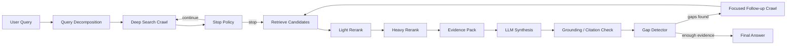


---

## 30) CDP: модель взаимодействия, переиспользование, завершение

### 30.1 Что именно управляется через CDP

CDP-слой должен оперировать сущностями:

- `BrowserEndpoint` — адрес CDP (`ws://.../devtools/browser/<id>`).
- `BrowserConnection` — живое подключение клиента к endpoint.
- `BrowserContext` — изолированный профиль (cookies/storage/proxy/permissions).
- `Page/Target` — вкладка/цель внутри контекста.
- `Session` (наша доменная сущность) — логическая сессия run/agent, привязанная к context/page.

### 30.2 Рекомендуемая модель подключения

1. `CDPConnectionPool.acquire(endpoint_key)`:
  - если есть живое подключение в пуле -> реюз;
  - если нет -> connect и register heartbeat.
2. `ContextFactory.get_or_create(context_signature)`:
  - re-use контекста при совпадении сигнатуры;
  - иначе create context + init scripts + proxy policy.
3. `PageLeaseManager.acquire(context)`:
  - выдача page (new/reused) под task;
  - lock против гонок.
4. После task:
  - `release_page_with_context(page)` и decrement refcount.

### 30.3 Сигнатура контекста для реюза

`context_signature` должен включать только реально влияющие параметры:

- proxy identity/pool;
- auth/storage bucket (`shared_storage_key`);
- stealth tier + init scripts version;
- locale/timezone/user-agent policy;
- permissions profile;
- режим (`interactive | crawl | lite`).

Важно: **не** включать в сигнатуру эфемерные поля (task_id, step_id), иначе не будет реюза.

### 30.4 Когда создавать новый context, а когда переиспользовать

Создаем новый, если:

- сменился прокси/identity policy;
- другой security boundary (другой пользователь/tenant);
- нужно “чистое” состояние после anti-bot эскалации;
- контекст поврежден (frequent target closed / detached).

Переиспользуем, если:

- та же сигнатура;
- healthy state;
- refcount/TTL не превышены.

### 30.5 Завершение и выключение

Три режима выключения:

- **Graceful drain**: запрет на новые lease, дождаться активных задач, закрыть контексты, затем CDP disconnect.
- **Session kill**: завершить конкретную сессию (page/context), не трогая endpoint целиком.
- **Hard terminate**: аварийный stop browser process при критике (утечка памяти/зависание).

Контракт:

```python
class CDPLifecycleManager(Protocol):
    async def drain(self, endpoint_key: str, timeout_sec: int) -> bool: ...
    async def kill_session(self, session_id: str) -> None: ...
    async def disconnect(self, endpoint_key: str) -> None: ...
    async def terminate_browser(self, endpoint_key: str) -> None: ...
```

---

## 31) Хранение сессий и поддержка пауз LLM

### 31.1 Что хранить в SessionStateStore

Минимальный набор для восстановления:

- cookies;
- localStorage/sessionStorage snapshot;
- current URL + history pointer;
- last known DOM snapshot ref;
- active form draft data (по allowlist полей);
- runtime flags (stealth tier/proxy id/user-agent/profile).

Опционально:

- screenshot последнего состояния;
- compressed “agent memory capsule” (краткая сводка, что уже сделано).

### 31.2 Режим паузы LLM (Human-in-the-loop wait)

Когда LLM “ждет человека”:

1. Сессия переводится в `PAUSED`.
2. Выполняется `save_state()` и фиксируется `pause_token`.
3. Ресурсы:
  - вариант A: держим warm context (дороже, быстрее resume);
  - вариант B: освобождаем page/context и остаемся в restore-mode (дешевле).
4. При `resume(pause_token)`:
  - восстановить context/page;
  - выполнить sanity checks (auth still valid, URL reachable);
  - переснять snapshot и diff к “pre-pause” состоянию;
  - продолжить agent loop.

### 31.3 State machine сессии с паузой

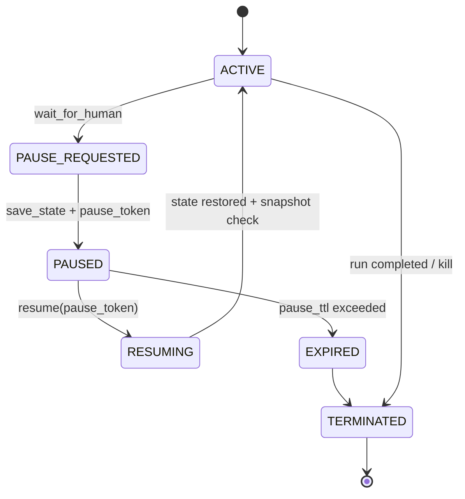


### 31.4 TTL и SLA для паузы

- `pause_ttl_soft`: например 30 минут (предпочтительно warm).
- `pause_ttl_hard`: например 24 часа (после — принудительный restore-only или terminate).
- при превышении soft TTL система может автоматически:
  - выгрузить warm context,
  - оставить только state blob + артефакты.

---

## 32) Артефакт взаимодействия с браузером (человекочитаемый trace)

Нужен отдельный **Browser Trace Artifact**, где видно “что делал агент/краулер” в понятной форме.

### 32.1 Структура артефакта

```text
runs/<run_id>/browser-trace/
  timeline.md
  timeline.ndjson
  sessions/
    <session_id>.json
  steps/
    0001_open_page/
      step.json
      before.snapshot.json
      after.snapshot.json
      dom.diff.json
      screen.before.png
      screen.after.png
      console.json
      network.summary.json
```

### 32.2 Человекочитаемый `timeline.md`

`timeline.md` должен быть “как журнал расследования”, например:

- Step 14 — `click("button: has-text('Next')")`
- URL: `https://site/a?page=2` -> `https://site/a?page=3`
- Изменения:
  - Добавлено 20 карточек товаров
  - Пропал баннер cookie
- Anti-bot:
  - signal: `challenge_js_detected`
  - mitigation: `rotate_proxy + retry`
- Результат: success, latency 1.9s

### 32.3 Нормализованный step-event

```json
{
  "run_id": "r1",
  "session_id": "s3",
  "step_index": 14,
  "actor": "llm_agent",
  "action": {
    "kind": "playwright_code",
    "summary": "click next page button",
    "code_ref": "artifacts://runs/r1/steps/0014/action.py"
  },
  "state_before": {"url":"https://site/a?page=2","snapshot_ref":"..."},
  "state_after": {"url":"https://site/a?page=3","snapshot_ref":"..."},
  "dom_diff_ref": "artifacts://.../dom.diff.json",
  "network_summary": {"requests":35,"failed":1,"status_main":200},
  "anti_bot": {"signals":["js_challenge"],"mitigations":["proxy_rotate"]},
  "result": {"ok":true,"latency_ms":1904}
}
```

### 32.4 Trace уровни детализации

- `human`: короткий timeline + ключевые изменения.
- `debug`: + console/network summary + errors.
- `forensic`: + HAR/CDP low-level logs + raw protocol dumps.

---

## 33) Наблюдение за браузером и ручной ввод агенту

### 33.1 Live observer режим

Нужна возможность подключиться к текущей сессии как наблюдатель:

- read-only stream screenshot/snapshot/timeline;
- live URL/current step/last error;
- метрики (latency, retries, blocks).

### 33.2 Human input channel (agent assist)

Система должна поддерживать события:

- `HUMAN_NOTE`: подсказка агенту (“ищи раздел pricing”).
- `HUMAN_ACTION_REQUIRED`: агент просит действия человека (логин/2FA/captcha).
- `HUMAN_ACTION_DONE`: подтверждение, что человек завершил шаг.

Контракт:

```python
@dataclass
class HumanMessage:
    run_id: str
    session_id: str
    type: str  # note | action_required | action_done | override
    text: str
    attachments: list[str]
    ts: str

class HumanLoopBridge(Protocol):
    async def send_to_agent(self, msg: HumanMessage) -> None: ...
    async def wait_for_human(self, run_id: str, session_id: str, timeout_sec: int) -> HumanMessage | None: ...
```

### 33.3 Режим “подключиться к браузеру и вмешаться”

Практический сценарий:

1. Агент переводит сессию в `WAIT_HUMAN`.
2. Пользователь подключается к этой же сессии (через контролируемый UI/endpoint).
3. Выполняет ручные действия (логин/подтверждение).
4. Нажимает “resume agent”.
5. Агент снимает post-human snapshot/diff и продолжает.

Важно:

- логировать, какие шаги сделаны человеком, а какие агентом;
- не смешивать авторство в trace.

---

## 34) Инструментарий для работы с CDP

### 34.1 Базовые инструменты (рекомендуемый стек)

- `Playwright` как основной client API;
- direct CDP session (`context.new_cdp_session(page)`) для тонкой диагностики;
- optional remote devtools bridge для наблюдения;
- internal `cdp-proxy` сервис для маршрутизации и аудита подключений.

### 34.2 Внутренние утилиты проекта

Рекомендуемые сервисы:

- `CDPRegistry` — учет endpoint’ов, подключений, health.
- `CDPInspector` — команды диагностики:
  - list targets/contexts/pages,
  - dump performance metrics,
  - get network/console summary.
- `CDPRecorder` — сбор protocol-событий в trace.
- `CDPReplayHelper` — подготовка минимального реплея проблемного шага.

### 34.3 Контракт CDP-инспектора

```python
class CDPInspector(Protocol):
    async def list_targets(self, endpoint_key: str) -> list[dict]: ...
    async def get_session_health(self, session_id: str) -> dict: ...
    async def capture_network_summary(self, session_id: str, window_sec: int) -> dict: ...
    async def capture_console_summary(self, session_id: str, window_sec: int) -> dict: ...
    async def get_dom_snapshot_ref(self, session_id: str) -> str: ...
```

### 34.4 Безопасность CDP-доступа

- не отдавать “сырой” CDP endpoint наружу без auth;
- RBAC на команды (`observe`, `inject_note`, `terminate`);
- audit log каждого внешнего подключения к сессии;
- секреты/куки в trace — только в redacted виде.

---

## 35) Схема: CDP control + наблюдение + пауза/resume

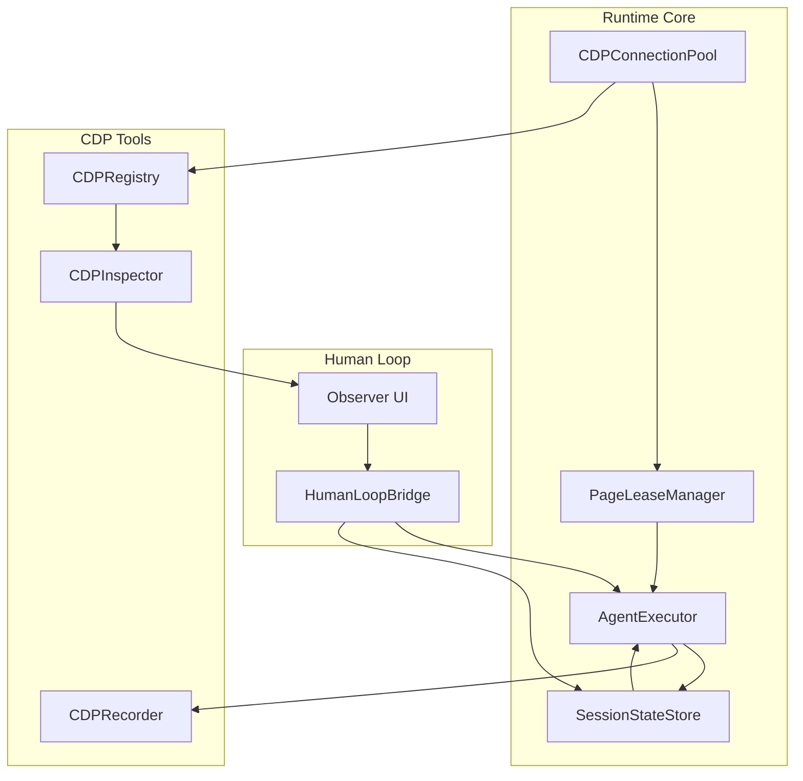


