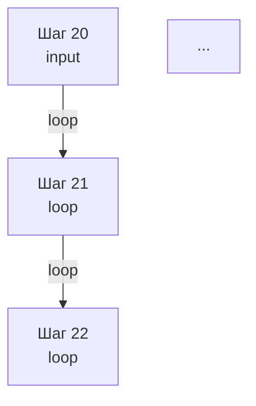

# Инспектор чекпоинтеров LangGraph

Инструмент для анализа и визуализации чекпоинтеров LangGraph, позволяющий:
- Получать визуальное отображение связей чекпоинтеров
- Просматривать историю состояний по thread_id
- Анализировать переходы между состояниями
- **Отслеживать вызовы инструментов в каждом шаге выполнения**
- **Показывать переменные состояния (store)**
- **Генерировать timeline диаграммы выполнения агента**

## Установка и запуск

```bash
cd /path/to/agent-lab
uv run python checkpoint_inspector.py [опции]
```

## Основные команды

### Просмотр списка доступных потоков
```bash
uv run python checkpoint_inspector.py --list-threads [--limit N]
```

Пример вывода:
```
Найдено потоков: 10

Доступные потоки:
  1. web:user_cf0e49258baf:app.flows.faq_flow.faq_flow_config:5ff5d7c8-0bf5-4781-8dc9-b215745b4b4d
  2. web:user_cf0e49258baf:app.flows.lawyer_flow.lawyer_flow:dccd861d-df11-440e-b3f6-cd05d6eb2360
  ...
```

### Анализ конкретного потока

#### Текстовое представление
```bash
uv run python checkpoint_inspector.py --thread-id "web:user_cf0e49258baf:app.flows.faq_flow.faq_flow_config:5ff5d7c8-0bf5-4781-8dc9-b215745b4b4d" --format text
```

Выводит:
- Общую статистику (количество чекпоинтеров, связей, типов переходов)
- Хронологическую цепочку чекпоинтеров с указанием типа перехода и времени
- **Информацию о вызовах инструментов в каждом шаге**

#### Mermaid диаграмма
```bash
uv run python checkpoint_inspector.py --thread-id "web:user_cf0e49258baf:app.flows.faq_flow.faq_flow_config:5ff5d7c8-0bf5-4781-8dc9-b215745b4b4d" --format mermaid
```

Генерирует код Mermaid диаграммы для визуализации графа чекпоинтеров:



#### JSON данные
```bash
uv run python checkpoint_inspector.py --thread-id "THREAD_ID" --format json
```

Возвращает детальную информацию о чекпоинтерах в формате JSON.

### Опции командной строки

- `--thread-id`: ID потока для анализа (обязательно для анализа)
- `--list-threads`: Показать список доступных потоков
- `--format`: Формат вывода (`text`, `mermaid`, `json`) - по умолчанию `text`
- `--include-values`: Включать значения состояния в диаграмму (только для mermaid)
- `--limit`: Максимальное количество потоков для отображения - по умолчанию 10

## Примеры использования

### Полная цепочка анализа
```bash
# 1. Посмотреть доступные потоки
uv run python checkpoint_inspector.py --list-threads

# 2. Проанализировать конкретный поток в текстовом формате
uv run python checkpoint_inspector.py --thread-id "web:user_cf0e49258baf:app.flows.faq_flow.faq_flow_config:5ff5d7c8-0bf5-4781-8dc9-b215745b4b4d"

# 3. Получить Mermaid диаграмму для визуализации
uv run python checkpoint_inspector.py --thread-id "web:user_cf0e49258baf:app.flows.faq_flow.faq_flow_config:5ff5d7c8-0bf5-4781-8dc9-b215745b4b4d" --format mermaid > checkpoints.mmd

# 4. Получить детальные JSON данные
uv run python checkpoint_inspector.py --thread-id "web:user_cf0e49258baf:app.flows.faq_flow.faq_flow_config:5ff5d7c8-0bf5-4781-8dc9-b215745b4b4d" --format json > checkpoints.json
```

### Timeline формат - полная история выполнения

```bash
# Текстовая timeline диаграмма
uv run python checkpoint_inspector.py --thread-id "THREAD_ID" --format timeline

# Mermaid timeline диаграмма для визуализации
uv run python checkpoint_inspector.py --thread-id "THREAD_ID" --format timeline-mermaid
```

#### Пример timeline вывода:

```
🕐 TIMELINE ВЫПОЛНЕНИЯ АГЕНТА
Поток: web:user_cf0e49258baf:app.flows.faq_flow.faq_flow_config:5ff5d7c8-0bf5-4781-8dc9-b215745b4b4d
================================================================================

[ 1] ШАГ 22 | 2025-10-29T13:08:58.944915+00:00
     Тип: loop
     🔧 Инструменты: не вызывались
     📦 Переменные: отсутствуют

[ 9] ШАГ 14 | 2025-10-29T12:58:27.210911+00:00
     Тип: loop
     🔧 Вызовы инструментов:
        • search_knowledge_base()
     📦 Переменные: отсутствуют

[10] ШАГ 9 | 2025-10-29T12:57:50.483661+00:00
     Тип: loop
     🔧 Вызовы инструментов:
        • list_documents_in_knowledge_base()
     📦 Переменные: отсутствуют

================================================================================
📊 СВОДКА ВЫПОЛНЕНИЯ:
   Всего шагов: 24
   Всего переходов: 23
   Типы переходов: loop(18), input(5)
   Вызовы инструментов: search_knowledge_base(1), list_documents_in_knowledge_base(2)
```

#### Mermaid Timeline диаграмма:

```mermaid
timeline
    title Timeline выполнения агента
    Поток: web:user_cf0e49258ba...

    section Шаг 22 (loop)
        13:08:58 : Начало шага
        13:08:58 : 🔧 Инструменты не вызывались
    section Шаг 14 (loop)
        12:58:27 : Начало шага
        12:58:27 : 🔧 search_knowledge_base()
    section Шаг 9 (loop)
        12:57:50 : 🔧 list_documents_in_knowledge_base()
```

### Визуализация в Mermaid

Mermaid диаграмму можно визуализировать:
1. В онлайн-редакторе: https://mermaid.live/
2. В VS Code с расширением Mermaid
3. В Jupyter Notebook
4. На GitHub (поддерживает Mermaid)

## Структура данных чекпоинтеров

Каждый чекпоинтер содержит:
- `thread_id`: ID потока выполнения
- `checkpoint_id`: Уникальный ID чекпоинтера (короткий ID для диаграмм)
- `parent_checkpoint_id`: ID родительского чекпоинтера
- `timestamp`: Время создания чекпоинтера
- `step`: Номер шага в потоке
- `source`: Тип источника (`loop`, `input`, `update` и др.)
- `next_nodes`: Следующие узлы для выполнения
- `values`: Значения состояния (messages, store и др.)
- `metadata`: Дополнительная информация о чекпоинтере

## Типы переходов

- `loop`: Обычное выполнение в цикле графа
- `input`: Ввод данных от пользователя
- `update`: Обновление состояния
- `interrupt`: Прерывание выполнения для запроса данных

## Интеграция с кодом

```python
from checkpoint_inspector import CheckpointInspector

# Создать инспектор
inspector = CheckpointInspector()

# Получить историю чекпоинтеров
checkpoints = await inspector.get_checkpoint_history("thread_id")

# Получить связи чекпоинтеров
connections = await inspector.get_checkpoint_connections("thread_id")

# Сгенерировать визуализацию
mermaid_graph = await inspector.get_visualization("thread_id", "mermaid")
```

## Использование в отладке

Инспектор чекпоинтеров полезен для:
- Отслеживания пути выполнения агентов
- Поиска проблемных мест в графах
- Анализа поведения агентов в реальном времени
- Визуализации сложных multi-agent взаимодействий

## Сравнение со стандартными утилитами LangGraph

LangGraph предоставляет базовые методы для работы с чекпоинтерами:

### Стандартные методы LangGraph:
```python
# Получение истории состояний
history = graph.get_state_history(config)

# Получение списка чекпоинтеров
checkpoints = list(checkpointer.alist(config))

# Визуализация графа (только структуры, без чекпоинтеров)
graph.get_graph().draw_mermaid_png()
```

### Преимущества инспектора чекпоинтеров:
- ✅ **Анализ вызовов инструментов** - показывает какие инструменты вызывались в каждом шаге
- ✅ **Визуализация связей чекпоинтеров** - Mermaid диаграммы с историей выполнения
- ✅ **Статистика переходов** - анализ паттернов выполнения
- ✅ **Хронологическая цепочка** - понятное отображение последовательности шагов
- ✅ **Множественные форматы вывода** - text, mermaid, json

### Когда использовать стандартные методы:
- Для программного доступа к чекпоинтерам в коде
- Для базовой навигации по истории состояний
- Для визуализации структуры графа (не чекпоинтеров)

### Когда использовать инспектор:
- Для отладки и анализа поведения агентов
- Для понимания последовательности вызовов инструментов
- Для визуального анализа сложных multi-step взаимодействий
- Для мониторинга и логирования выполнения

## Технические детали

- Работает с PostgreSQL чекпоинтером LangGraph
- Использует асинхронные методы для высокой производительности
- Поддерживает большие объемы данных (тысячи чекпоинтеров)
- Оптимизирован для анализа в реальном времени
