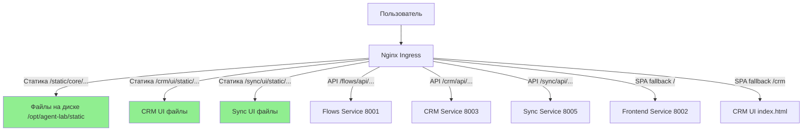

# Исправление раздачи статических файлов через ingress

## Проблема

Ранее FastAPI сервисы (flows, frontend, crm, rag, sync, office) отдавали статические файлы через `StaticFiles`:
- `/static/core` — общая библиотека `core/frontend/static`
- `/crm/ui/static`, `/sync/ui/static`, `/rag/ui/static`, `/documents/ui/static`, `/flows/static` — UI сервисов
- `/static/frontend` — frontend UI

Это создавало избыточную нагрузку на Python/FastAPI и не позволяло nginx кэшировать статику.

## Решение

### 1. Скрипт подготовки статики (`deploy/prepare-static.sh`)

Копирует UI файлы из `apps/*/ui/` в единую структуру `static/` на сервере:

```bash
# Структура после выполнения:
/opt/agent-lab/static/
├── core/              # core/frontend/static/
├── crm/
│   └── ui/
│       ├── vendor/    # 3d-force-graph и three.js из node_modules
│       └── ...
├── sync/ui/
├── rag/ui/
├── documents/ui/
├── flows/ui/
└── frontend/
```

Скрипт вызывается автоматически при запуске `deploy/ingress.sh`.

### 2. Location blocks в nginx ingress

В `deploy/ingress.sh` добавлены location blocks для раздачи статики напрямую:

```nginx
location /static/core/ {
  alias /opt/agent-lab/static/core/;
  add_header Cache-Control "public, max-age=31536000, immutable";
  add_header Access-Control-Allow-Origin "*" always;
}

location /crm/ui/static/ {
  alias /opt/agent-lab/static/crm/ui/;
  add_header Cache-Control "public, max-age=31536000, immutable";
  ...
}
```

### 3. SPA fallback для роутинга

Для корректной работы SPA при refresh страниц добавлены fallback location:

```nginx
location / {
  alias /opt/agent-lab/static/frontend/;
  try_files $uri $uri/ @proxy_frontend;
}
location @proxy_frontend {
  proxy_pass http://frontend-svc:8002;
  ...
}
```

Если файл не найден (например, `/crm/dashboard`), nginx проксирует запрос на FastAPI, который отдаёт `index.html`.

## Архитектура



## Преимущества

1. **Производительность**: nginx отдаёт статику в 10-100 раз быстрее FastAPI
2. **Кэширование**: заголовки `Cache-Control: max-age=31536000, immutable` для долгосрочного кэширования
3. **Снижение нагрузки**: Python/FastAPI не тратит ресурсы на отдачу файлов
4. **Масштабируемость**: статика не требует репликации сервисов

## Развёртывание

### Автоматически (через GitHub Actions)

При деплое через `.github/workflows/deploy.yml` всё происходит автоматически:

```bash
# Просто запускаем workflow в GitHub Actions
# После деплоя Docker containers ingress настроится автоматически
```

### Автоматически (через ingress.sh)

Для ручной настройки ingress на сервере:

```bash
bash deploy/ingress.sh
```

Скрипт автоматически:
1. Выполнит `prepare-static.sh` на сервере
2. Скопирует статику в `/opt/agent-lab/static/`
3. Настроит nginx ingress location blocks
4. Проверит сертификаты Let's Encrypt
5. Настроит LiveKit и OnlyOffice subdomains

### Вручную (если нужно только подготовить статику)

Например, для отладки или если обновили UI без полного деплоя:

```bash
# На сервере
cd /opt/agent-lab
bash deploy/prepare-static.sh

# Перезагружаем ingress контроллер (опционально)
microk8s kubectl -n ingress rollout restart daemonset nginx-ingress-microk8s-controller
```

### Проверка после обновления

```bash
# Проверка структуры статики
ls -la /opt/agent-lab/static/

# Проверка ingress конфигурации
microk8s kubectl get ingress humanitec-ingress -o yaml

# Проверка DaemonSet ingress контроллера
microk8s kubectl -n ingress get daemonset nginx-ingress-microk8s-controller -o yaml
```

## Локальная разработка

В локальном режиме (`make app`) FastAPI продолжает отдавать статику через `StaticFiles` как раньше. Изменения касаются только production окружения на сервере с ingress.

## Проверка

После применения изменений:

1. Откройте DevTools в браузере (Network tab)
2. Обновите страницу
3. Проверьте статические файлы (JS, CSS) — в заголовках должен быть `x-powered-by: Express` (от nginx) вместо FastAPI
4. Проверьте заголовки `Cache-Control: public, max-age=31536000, immutable`

## Важные замечания

### Vendor файлы (3d-force-graph, three.js)

CRM используетvendor библиотеки из `node_modules`. Скрипт `prepare-static.sh` копирует только нужные директории:
- `node_modules/3d-force-graph/dist/` → `static/crm/ui/vendor/3d-force-graph/`
- `node_modules/three/build/` → `static/crm/ui/vendor/three/`

### SPA роутинг

Для работы client-side роутинга (Lit Router, React Router и т.д.) при refresh страниц используется `try_files` с fallback на proxy:

```nginx
try_files $uri $uri/ @proxy_service;
```

Если файл не найден, nginx проксирует на FastAPI, который отдаёт `index.html`.

### Обновление UI

При обновлении UI файлы в `/opt/agent-lab/static/` перезаписываются (old удаляется перед копированием). Браузеры получат новые версии благодаря:
- Изменённому содержимому файлов (хэши в именах, если используются)
- Принудительной перезагрузке при необходимости (Ctrl+Shift+R)

## CI/CD интеграция

### GitHub Actions workflow

В `.github/workflows/deploy.yml` настройка ingress происходит **автоматически** после деплоя:

```yaml
- name: Deploy on server
  uses: appleboy/ssh-action@v1
  # ... env vars ...
  with:
    script: |
      # ... docker compose commands ...
      
      # Настройка ingress: статика + nginx location blocks
      if [ -f /opt/agent-lab/conf.local.json ]; then
        cd /opt/agent-lab
        bash deploy/ingress.sh
      fi
```

**Что происходит при деплое:**
1. Docker images pull и запуск через `docker-compose-prod.yaml`
2. **Автоматический вызов** `deploy/ingress.sh`:
   - Копирование статики через `prepare-static.sh`
   - Настройка nginx location blocks
   - Монтирование i18n volume (если нужно)

### Требования

Для работы ingress необходим файл `conf.local.json` на сервере с настройками:

```json
{
  "selectel": {
    "ip": "your.server.ip",
    "login": "username",
    "ssh_port": "22",
    "remote_dir": "/opt/agent-lab"
  },
  "ingress": {
    "domain": "humanitec.ru",
    "email": "admin@humanitec.ru",
    "services": [
      {"name": "frontend", "port": 8002, "path": "/", "websocket": false},
      {"name": "agents", "port": 8001, "path": "/flows", "websocket": false},
      {"name": "crm", "port": 8003, "path": "/crm", "websocket": false},
      {"name": "rag", "port": 8004, "path": "/rag", "websocket": false},
      {"name": "sync", "port": 8005, "path": "/sync", "websocket": true},
      {"name": "office", "port": 8008, "path": "/documents", "websocket": false}
    ],
    "onlyoffice_port": 8088
  }
}
```

Если `conf.local.json` отсутствует, workflow выведет предупреждение и пропустит настройку ingress.
