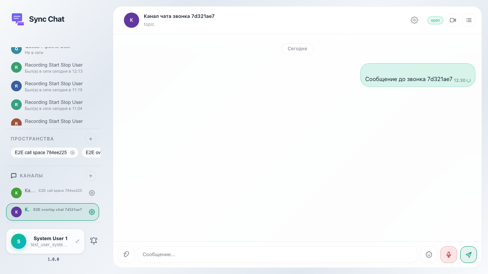

# Sync: чат в оверлее звонка синхронизирован с каналом

Сообщение из основного чата видно в call-overlay, а сообщение из call-overlay после завершения звонка отображается в ленте канала.

## Шаг 1. Сообщение из основного чата отправлено

