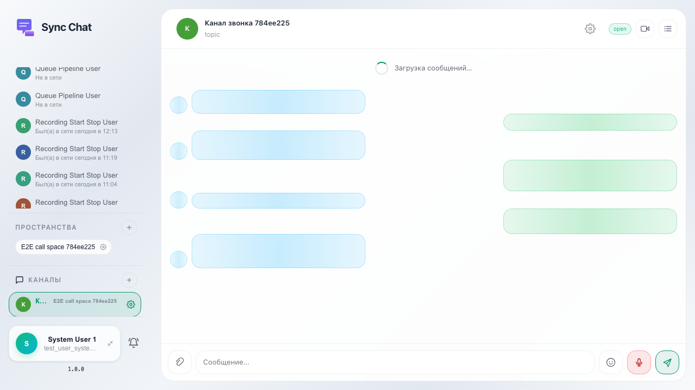
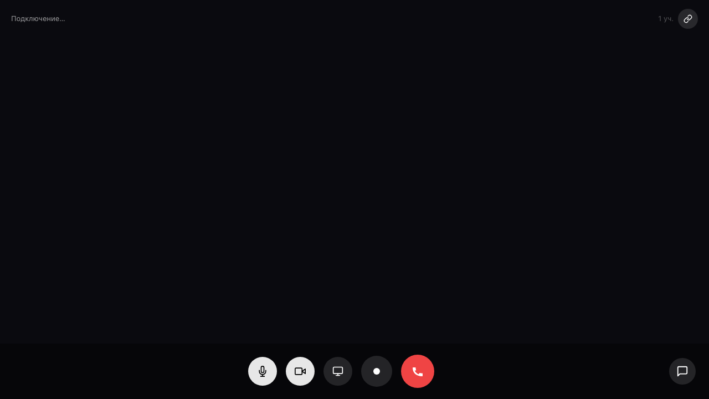

# Sync: старт звонка из шапки канала

В topic-канале пользователь нажимает «Звонок в этом канале»; после ответа сервера отображается оверлей звонка (атрибут data-call-active на sync-app).

## Шаг 1. Открыт topic-канал

## Шаг 2. Отображается оверлей звонка

