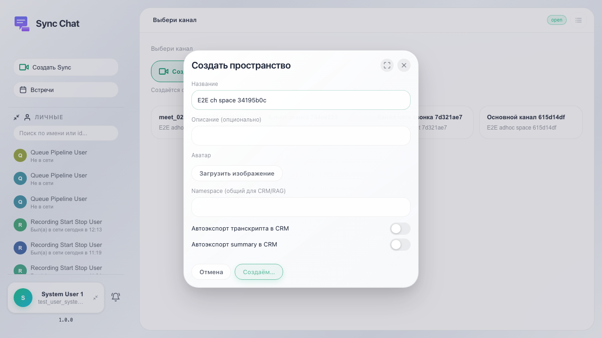
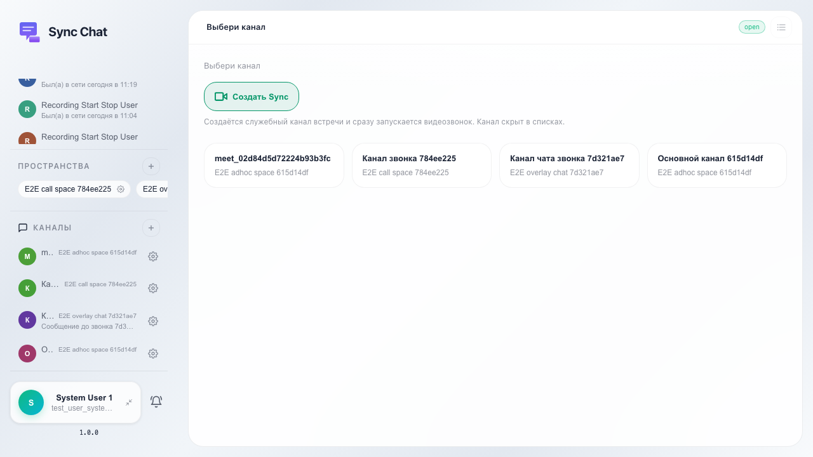
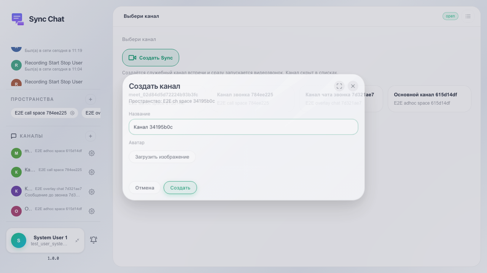
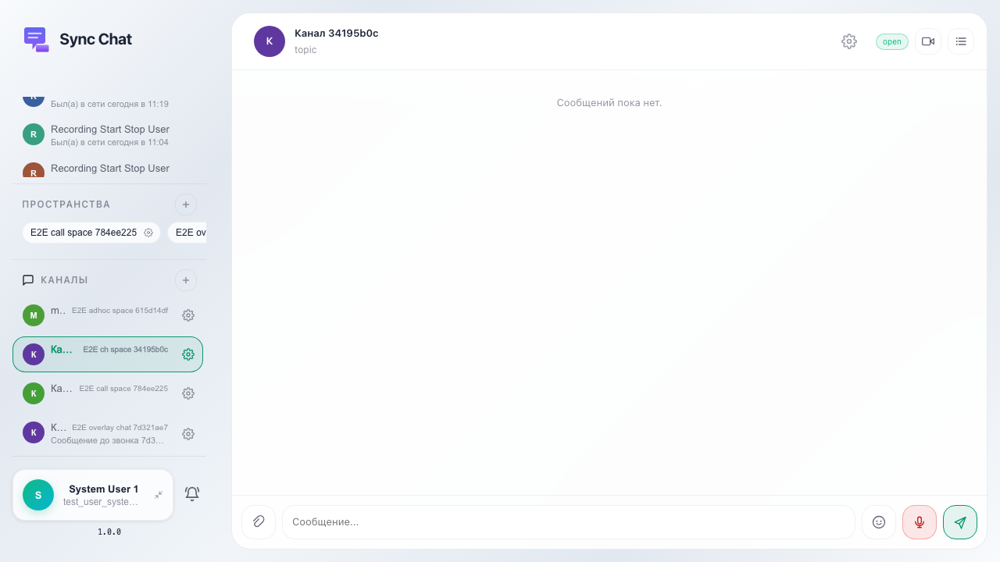

# Sync: создание канала в пространстве

После создания пространства пользователь создаёт topic-канал через «+» у раздела «Каналы» и подтверждает создание.

## Шаг 1. Пространство создано

## Шаг 2. Открыто создание канала

## Шаг 3. Введено название канала

## Шаг 4. Канал появился в сайдбаре

