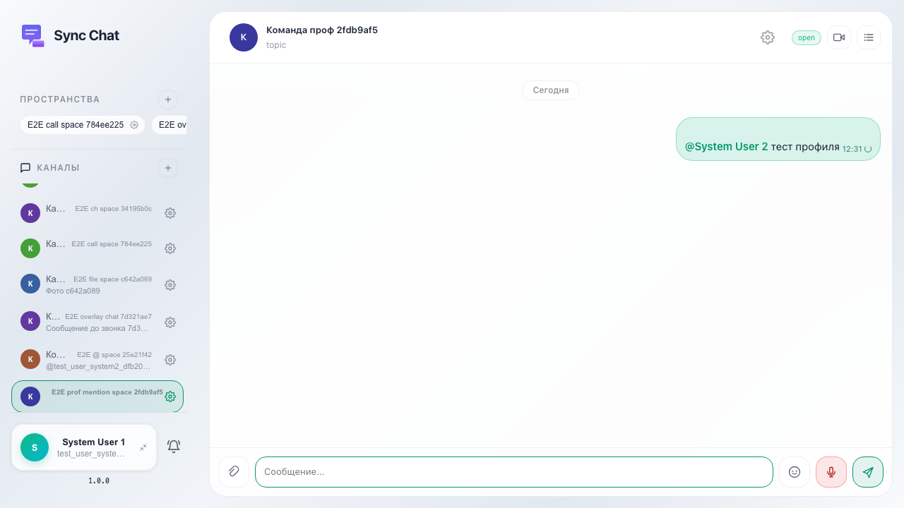
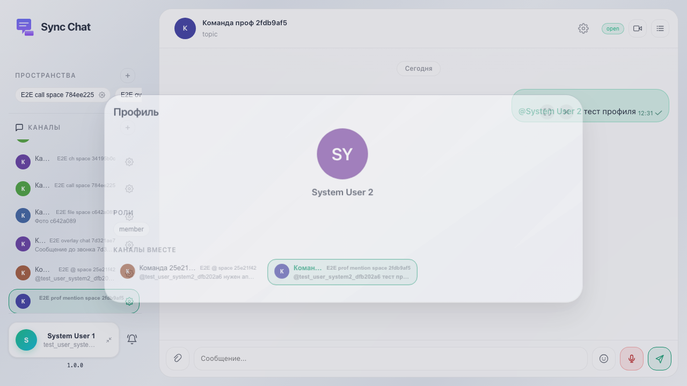
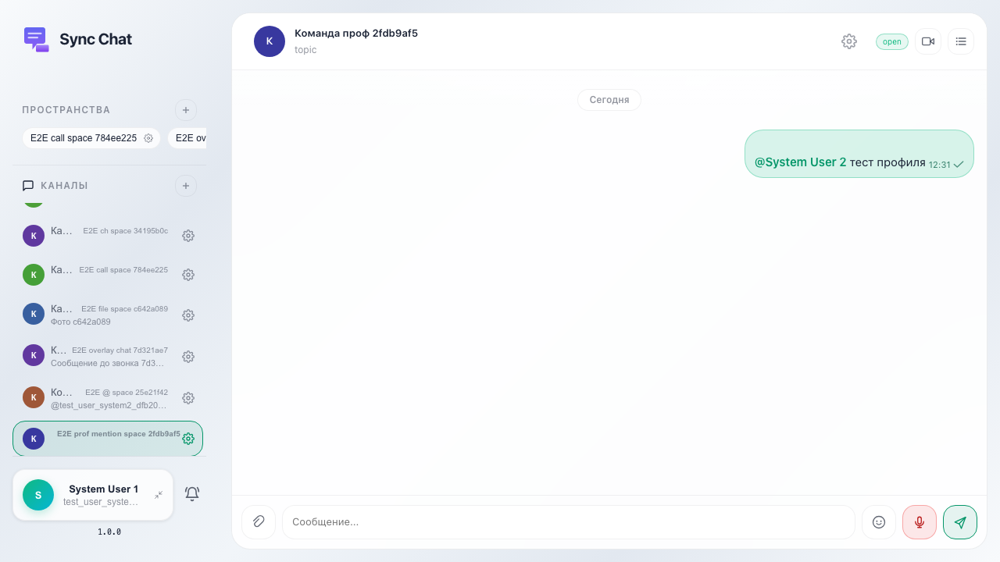

# Sync: клик по @mention открывает карточку профиля

После отправки сообщения с упоминанием клик по подсвеченному имени открывает user-info-modal; видны имя, блок каналов вместе; в сетке есть строка канала как в сайдбаре.

## Шаг 1. Упоминание в ленте

## Шаг 2. Модалка профиля: общий канал в сетке

## Шаг 3. Переход в канал из карточки профиля

