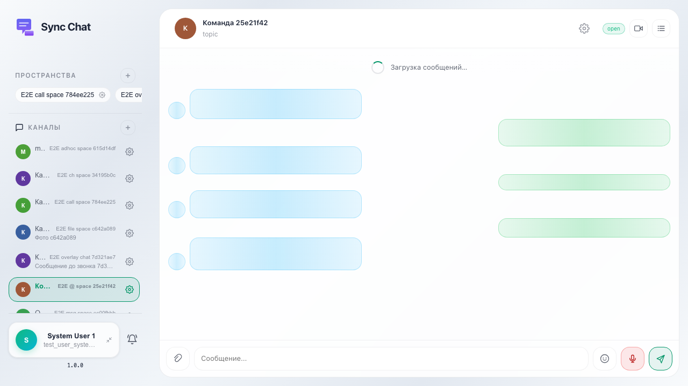
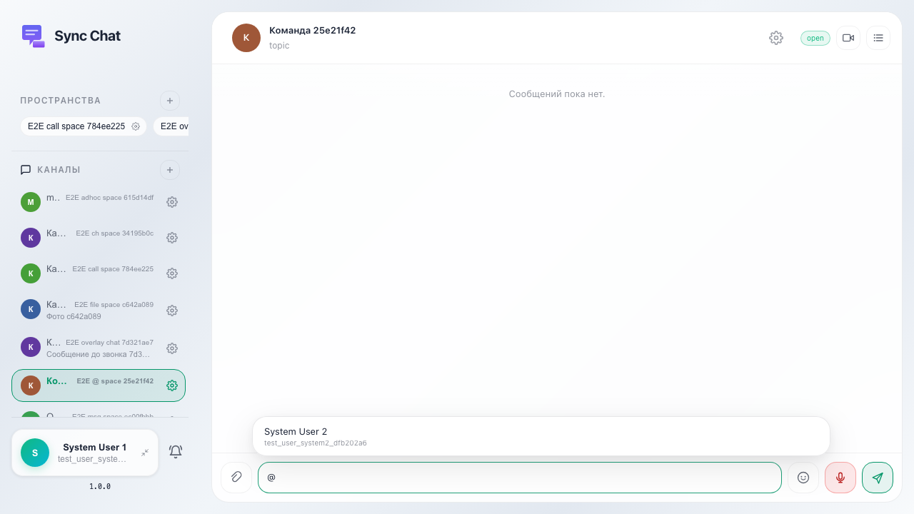
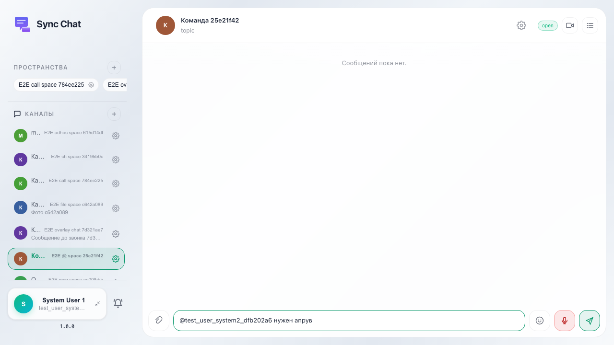
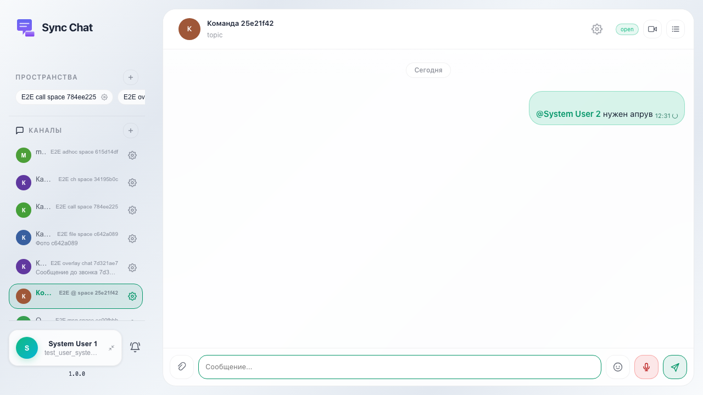

Создаётся канал, второй участник компании добавлен в канал через API. В композере после «@» открывается список участников; выбор вставляет @user_id; в пузырьке .msg-mention показывает имя из company members, не сырой id.

## Шаг 1. Канал с двумя участниками открыт

## Шаг 2. Попап со списком участников

## Шаг 3. Выбран участник, текст дописан

## Шаг 4. Сообщение с упоминанием в ленте

