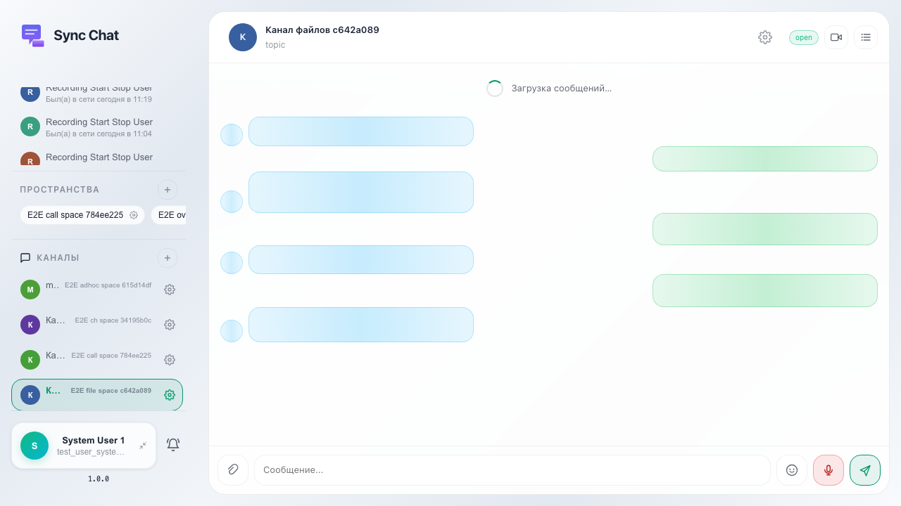
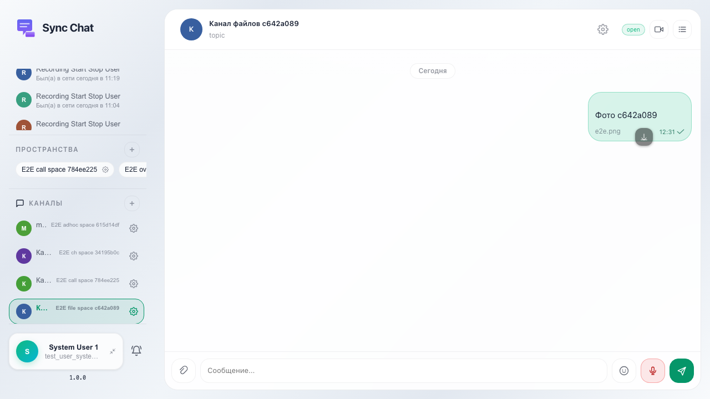

# Sync: отправка сообщения с изображением

Пользователь прикрепляет изображение к сообщению; после отправки в ленту попадает блок с картинкой.

## Шаг 1. Канал открыт

## Шаг 2. Сообщение с превью изображения в ленте

