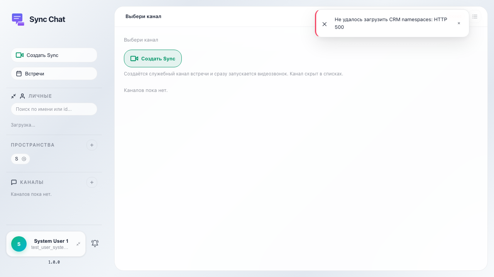

# Sync: загрузка оболочки чата

После входа под системным пользователем открывается SPA Sync; на экране отображается корневой элемент приложения (sync-app).

## Шаг 1. Приложение Sync открыто по URL SPA

## Шаг 2. Оболочка sync-app отображается

