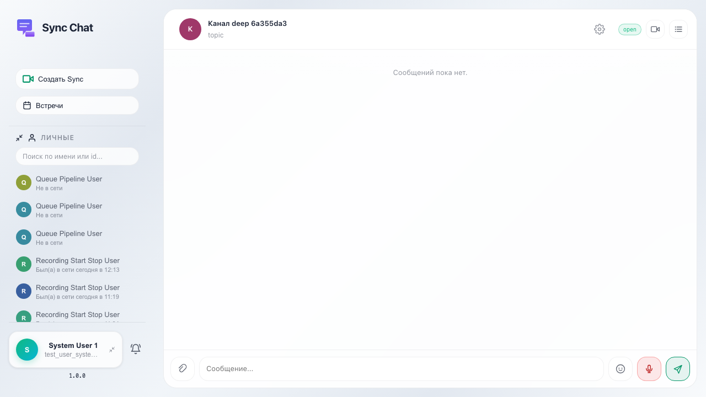
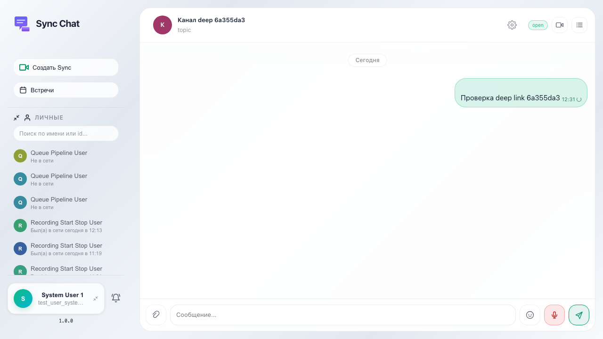

# Sync: переход по ссылке с параметром channel

После создания канала в UI тест получает id канала через API и открывает Sync с `?channel=` — выбранный канал и чат подгружаются автоматически.

## Шаг 1. Повторное открытие Sync с ?channel=

## Шаг 2. Сообщение уходит в канал, выбранный из URL

