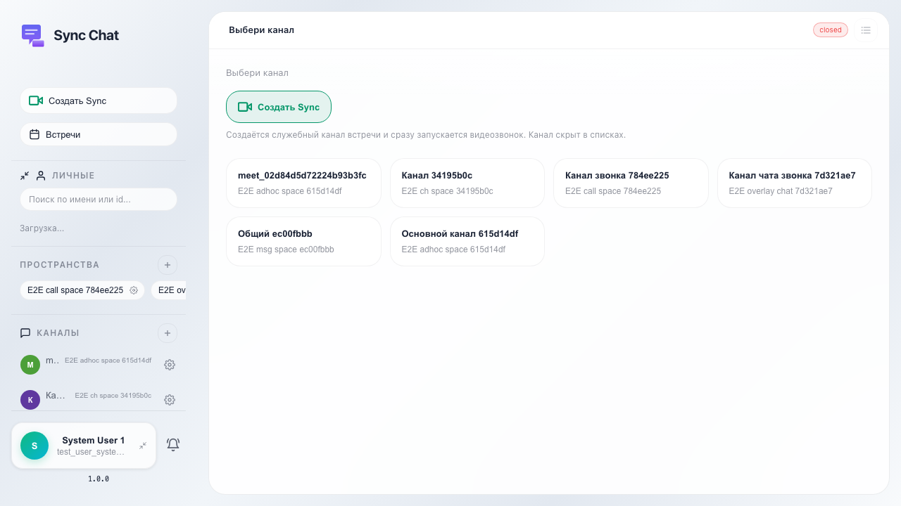
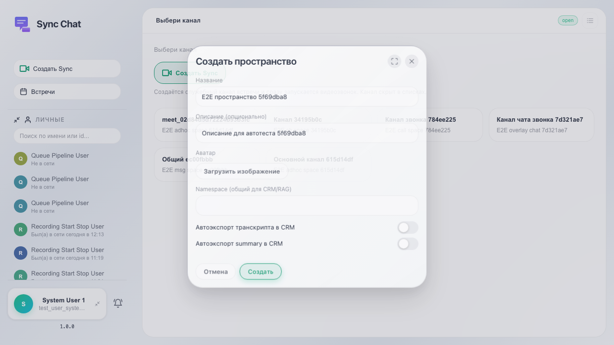
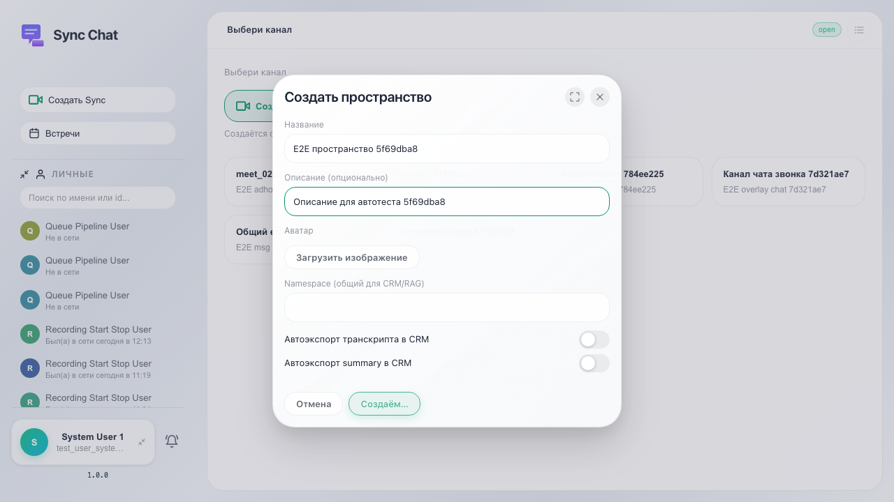

# Sync: создание пространства

Пользователь открывает Sync, нажимает «+» у раздела «Пространства», вводит название и описание и подтверждает создание.

## Шаг 1. Открыт Sync, видна оболочка

## Шаг 2. Открыто модальное окно создания пространства

## Шаг 3. Заполнены название и описание

## Шаг 4. Пространство появилось в списке

