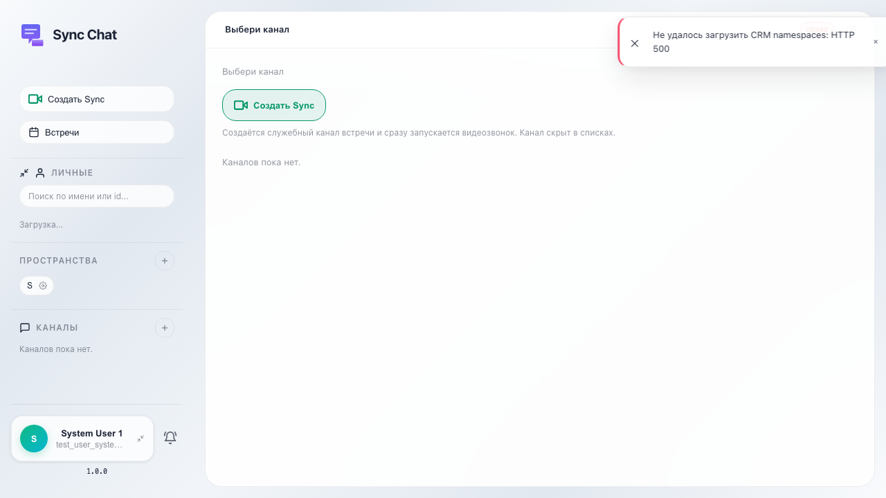
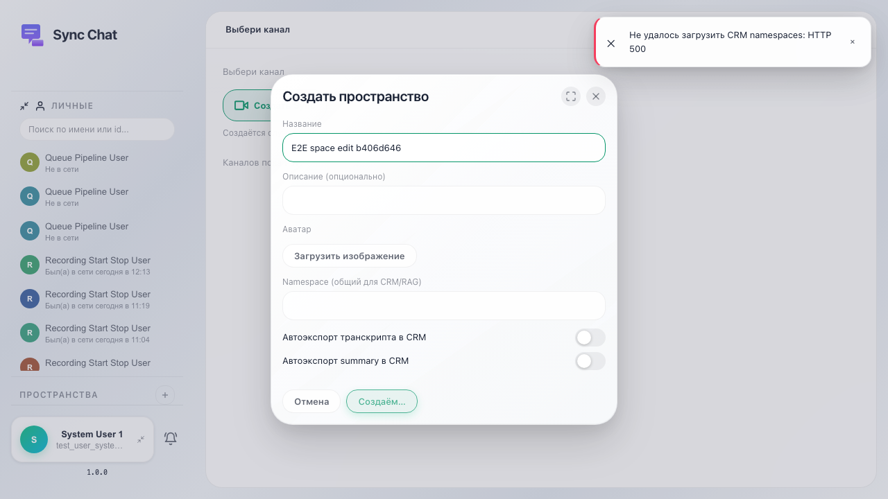
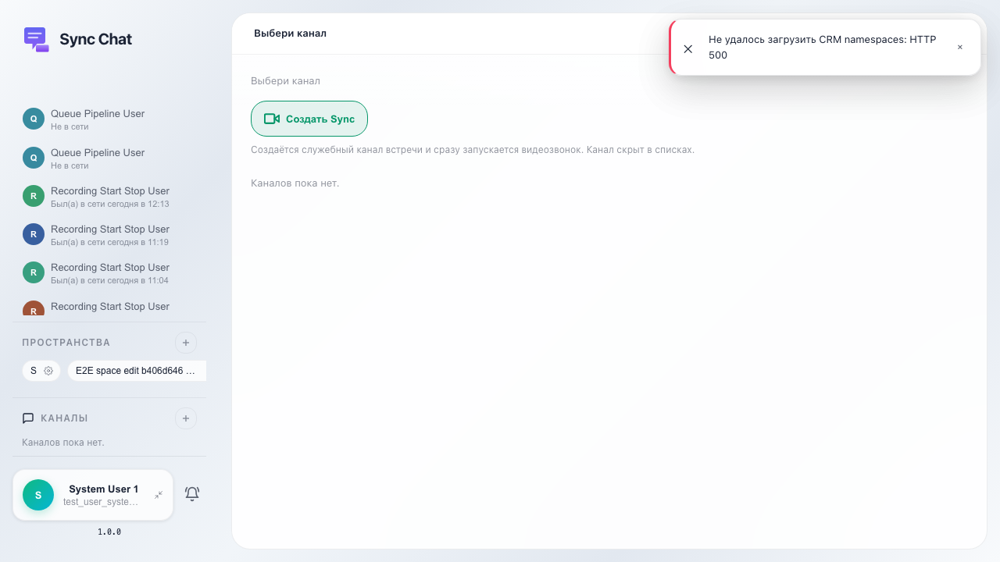

# Sync: редактирование пространства

Пользователь открывает настройки существующего пространства через иконку шестерёнки, меняет название и сохраняет.

## Шаг 1. Sync открыт

## Шаг 2. Создано пространство для последующего редактирования

## Шаг 3. Открыты настройки пространства

## Шаг 4. Название пространства обновлено в списке

