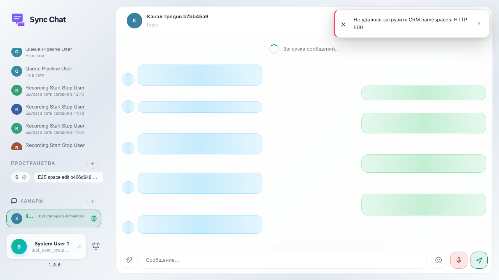
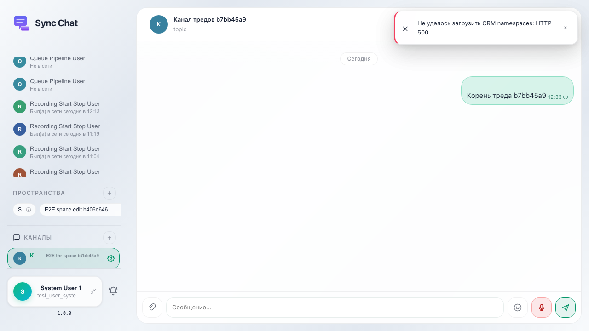
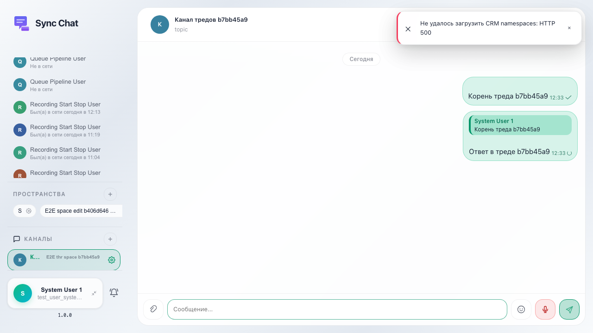
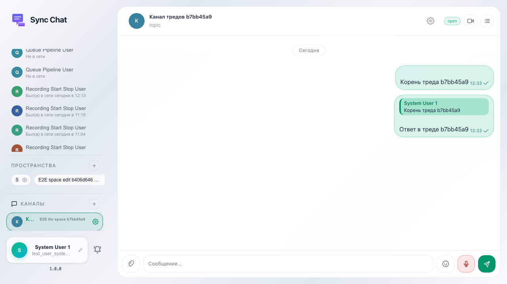

Пользователь отвечает на сообщение в основной ленте и открывает панель «Треды»: заголовок и область списка отображаются (список может быть пустым, если thread_id ещё не задан у сообщений в ленте).

## Шаг 1. Созданы пространство и канал

## Шаг 2. Отправлено корневое сообщение

## Шаг 3. Отправлен ответ (reply)

## Шаг 4. Открыта панель тредов

