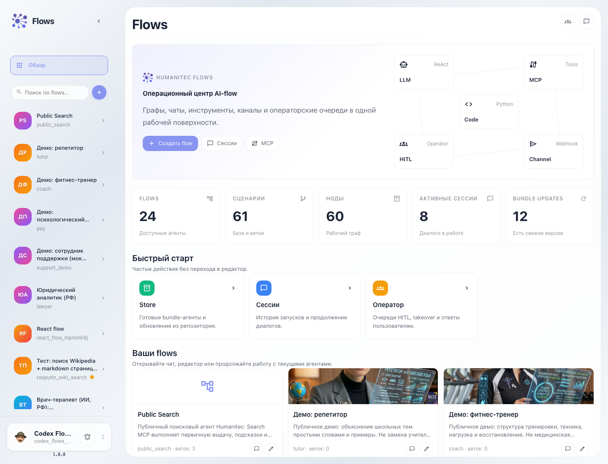

  
Документация Humanitec

  
Документация для платформы ИИ-агентов, Flows, Sync, NetWorkle и RAG. Здесь есть быстрый старт, публичные API и автособранные E2E-инструкции с реальными скриншотами интерфейса.

  

    <a class="docs-button docs-button-primary" href="quickstart/">Начать интеграцию</a>
    <a class="docs-button" href="api/">Открыть API</a>
  

  

    

      
    

    

      POST
      <code>/flows/api/v1/{flow_id}</code>
      
JSON-RPC вызовы для отправки сообщений агенту, streaming-ответов и управления задачами.

    

  

## Разделы

  <a class="docs-card docs-card-primary" href="quickstart/">
    Старт
    <h2>Быстрый старт</h2>
    
Минимальный путь до первого запроса к агенту через A2A JSON-RPC.

  </a>
  <a class="docs-card" href="scenarios/platform/">
    Основы
    <h2>Основные инструкции</h2>
    
Вход на сайт, Dashboard, список сервисов и меню пользователя простым языком.

  </a>
  <a class="docs-card" href="api/">
    API
    <h2>API</h2>
    
Автогенерация из OpenAPI: Flows, Frontend и другие публичные сервисы.

  </a>
  <a class="docs-card" href="scenarios/">
    E2E
    <h2>Инструкции</h2>
    
UI-проверки, шаги и скриншоты, которые попадают в документацию из тестов.

  </a>
  <a class="docs-card" href="start-here/">
    Старт
    <h2>Начни отсюда</h2>
    
Готовые маршруты для нового пользователя, разработчика и команды в Sync.

  </a>

## Как устроена сборка

  

    <strong>1. OpenAPI</strong>
    
Схемы из <code>docs/openapi</code> превращаются в Markdown-страницы API.

  

  

    <strong>2. Инструкции</strong>
    
<code>README.md</code> и скриншоты из <code>docs/scenarios</code> собираются в разделы продукта.

  

  

    <strong>3. Production</strong>
    
Zensical собирает статический портал в <code>documentation-dist</code>, который попадает в full Docker image.

  

