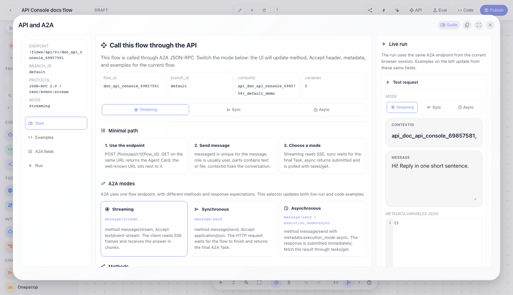
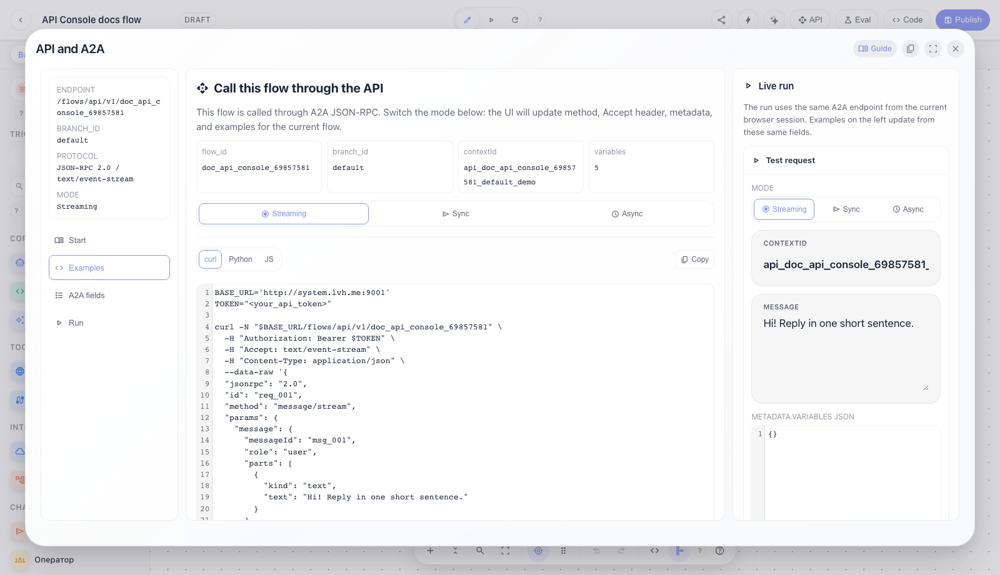
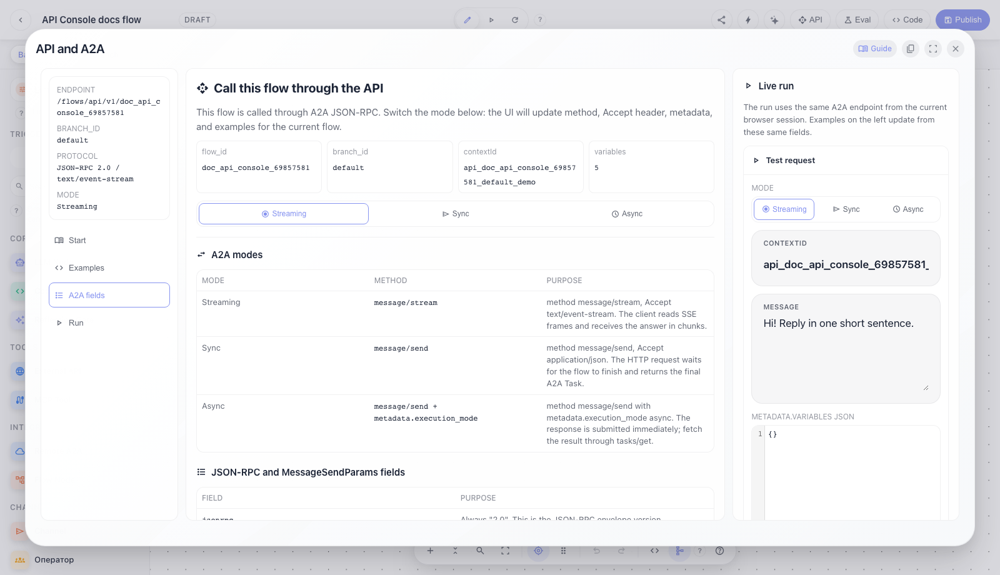
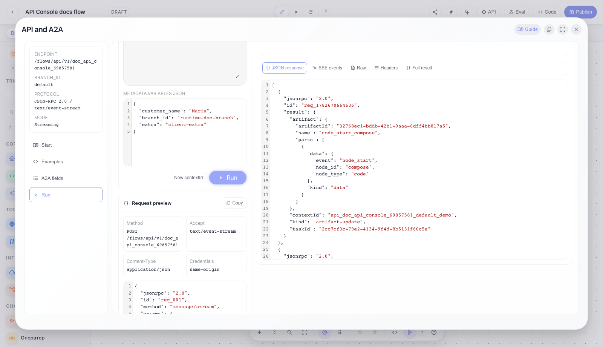
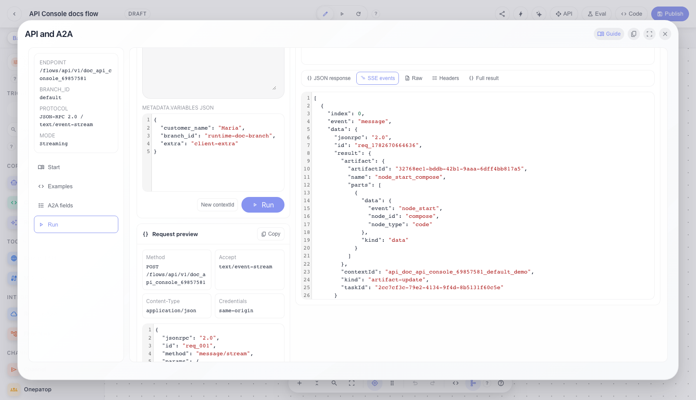
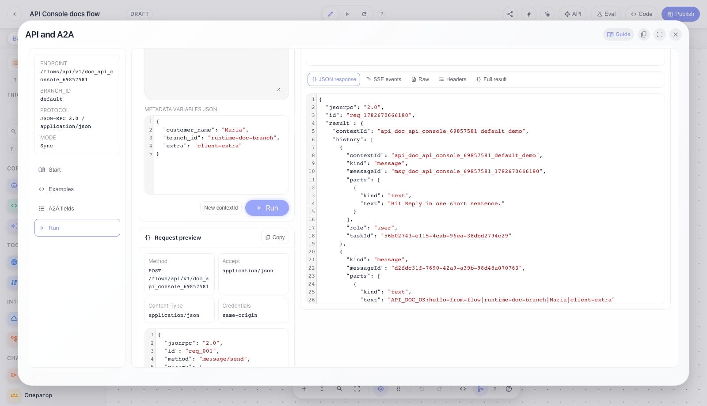
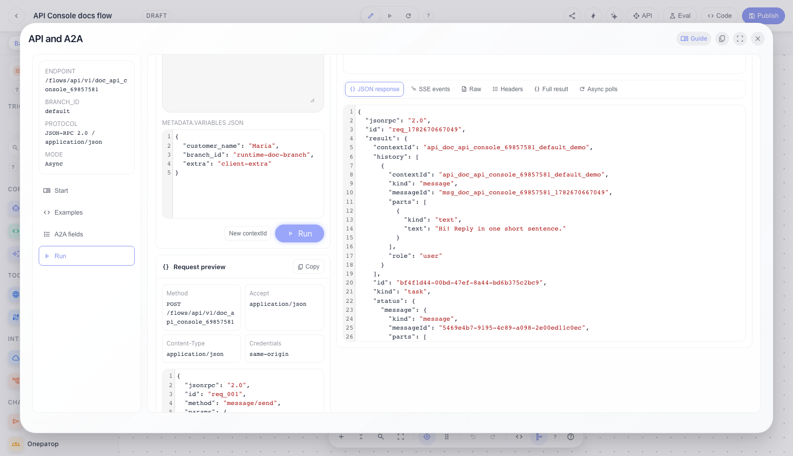

# Flows: API Console and A2A run

Complete guide for the API Console modal in the Flows editor: where to get the endpoint, how to read the A2A JSON-RPC body, how to run Streaming/Sync/Async, and how to inspect real API responses.

## Step 1. Open API Console from the flow editor

API Console opens from the flow editor through the `API` button in the top bar. It is not a detached
static sample: the modal builds endpoint, branch, JSON body, headers, and code samples from the
current `flow_id`, active branch, and current flow variables.

Header buttons:

- `Guide` opens this documentation page at `/documentation/scenarios/flows/api-console/`.
- `Copy JSON body` copies the current A2A JSON-RPC body for the selected mode.
- `Fullscreen` expands the modal when you need to inspect large JSON/SSE responses.
- `Close` returns to the editor.

The left column is persistent navigation: the endpoint card shows where to send POST requests,
which `branch_id` is selected, which protocol is used, and which mode is active. The tabs are:
`Start`, `Examples`, `A2A fields`, and `Run`.

## Step 2. Read the Start tab and A2A modes

The `Start` tab answers "what should I send first".

Top metrics:

- `flow_id` is the exact agent id from the URL and endpoint.
- `branch_id` is the execution branch. The base branch is exposed as `default`.
- `contextId` is a sample conversation id. Reuse the same `contextId` to continue a conversation;
  generate a new one for a clean session.
- the variables counter shows how many flow variables exist in the active branch.

The mode selector updates the whole example:

- `Streaming` uses `method: "message/stream"` and `Accept: text/event-stream`.
- `Sync` uses `method: "message/send"` and `Accept: application/json`.
- `Async` uses `method: "message/send"` plus `metadata.execution_mode: "async"`.

The cards and method table explain A2A methods. Most integrations need `message/stream`,
`message/send`, and `tasks/get`; the other methods cover cancel, resubscribe, Agent Card, and
push notification config.

## Step 3. Use ready curl, Python, and JS examples

The `Examples` tab provides ready-to-use external client snippets.

It contains:

- `curl`, `Python`, and `JS` tabs; switching tabs changes code syntax, not the request meaning;
- a `Copy` button that copies the current example;
- `Current JSON body`, which is the same payload used by live-run;
- `Files`, which shows an A2A `file` part. URI files include `name` and `mimeType`; the backend
  normalizes them into `state.files`. Audio files also go through STT when voice runtime is configured.

Minimal JSON-RPC body:

- `jsonrpc: "2.0"` is fixed.
- `id` lets the client match response to request.
- `method` depends on the selected mode.
- `params.message.messageId` is unique for this input message.
- `params.message.role` is usually `user`.
- `params.message.parts` contains `text`, `file`, or `data`.
- `params.message.contextId` ties messages into one conversation.
- `params.metadata.branch` selects the execution branch.
- `params.metadata.variables` sends runtime variables for this run only.

## Step 4. Check every A2A field and variables rule

The `A2A fields` tab explains why each field exists.

Important details:

- `metadata.branch` selects the graph branch. When the UI is on base, the API receives `default`.
- `metadata.variables.branch_id` does not select the branch. It is a normal runtime variable; the
  backend only copies it to `target_branch_id` when `target_branch_id` is absent.
- `metadata.version` selects a flow version, but query `?v=...` wins.
- `metadata.execution_mode` on `message/send`, with `async` or `background`, enables asynchronous run.
- `metadata.breakpoints` and `metadata.triggers` are for editor/debug/trigger runtime; most public
  clients do not need them.

Variables:

- `metadata.variables` override flow variables only for this run.
- Values can be primitives, objects, or arrays.
- Strings containing `@var:key` resolve through the company VariablesService; nested JSON and
  recursive references are supported, for example `@var:api_endpoint` whose stored value contains
  `@var:base_url`.
- If you pass a flow-variable object (`value`, `secret`, `public`, `title`, `description`), runtime
  uses `value`; the other fields are for UI/docs.
- `secret` masks the value in UI, but does not change runtime behavior.
- `public` exposes the variable in the Agent Card as a parameter external clients should fill.

System variables (`user_id`, `company_id`, `active_namespace`, and others) are appended by the backend
from the authorized HTTP context after client variables, so external clients cannot spoof user or
company identity through `metadata.variables`.

## Step 5. Run Streaming and inspect the real API response

The `Run` tab is the real API testing workbench.

Left column:

- `Mode` selects Streaming/Sync/Async and immediately updates method, Accept header, and JSON body.
- `contextId` sets the conversation. Keep it to continue, or click `New contextId` for a clean session.
- `Message` becomes `params.message.parts[0].text`.
- `metadata.variables JSON` becomes `params.metadata.variables`.
- `Run` sends a real request to the current `/flows/api/v1/{flow_id}` using the browser session.
- `Request preview` shows HTTP method, Accept, Content-Type, credentials, and the full body.

For Streaming the UI sends `message/stream`, reads real SSE frames, and assembles the agent response
from those events. This is the default chat UX mode: the user sees generation progress, while the
developer can inspect every event.

## Step 6. Open the response inspector: JSON, SSE, headers, raw, and full result

The response inspector shows more than the final text: it exposes the whole API response.

Status strip:

- `HTTP status` and `Content-Type` come from the real HTTP response.
- `task_id` is created by the backend and is used by `tasks/get`, `tasks/cancel`, and `tasks/resubscribe`.
- `context_id` confirms which conversation handled the request.
- `A2A state` shows task states such as `submitted`, `working`, `input-required`, `completed`, and
  `failed`.
- `SSE events` shows the number of stream frames.

Inspector tabs:

- `JSON response` is the normalized JSON body for the current mode.
- `SSE events` is the array of real stream events: status updates, artifact updates, final states.
- `Headers` are HTTP response headers.
- `Raw` is the unnormalized response text.
- `Async polls` shows `tasks/get` request/response pairs performed after async submit.
- `Full result` is the complete frontend resource result: request envelope, response envelope, parsed
  body, raw text, frames, polls, extracted text, and errors.

## Step 7. Test synchronous message/send mode

Sync is for clients that want one HTTP response without reading SSE.

The UI sends:

- `method: "message/send"`;
- `Accept: application/json`;
- no `metadata.execution_mode: "async"`.

The HTTP request waits for the flow to finish and returns a JSON-RPC response with the final A2A Task.
This is simpler for backend-to-backend calls, cron jobs, and short deterministic flows. If the flow can
take a long time, use Streaming or Async instead of keeping the HTTP request open.

## Step 8. Test async submit and subsequent tasks/get polls

Async is for long-running and background tasks.

The UI sends:

- `method: "message/send"`;
- `Accept: application/json`;
- `metadata.execution_mode: "async"`.

The first response should return quickly with state `submitted` and `task_id`. Then fetch the result
through `tasks/get` using `task_id` or `contextId`. In this modal, `Async polls` shows which
`tasks/get` requests were made and what final Task was returned.

Typical scenarios:

- First request: create a new `contextId`, fill the message, and click `Run`.
- Continue conversation: keep the same `contextId` and send the next message.
- Branch: change branch in the editor; the API uses `metadata.branch`.
- Runtime variables: fill `metadata.variables JSON`, for example `{"customer_name":"Anna"}`.
- Secret variables: send `@var:secret_key` when the value is stored in VariablesService.
- `failed` error: inspect `JSON response`, `Raw`, and `Full result`.
- `input-required`: the task waits for user input; send the next message with the same `contextId`.

