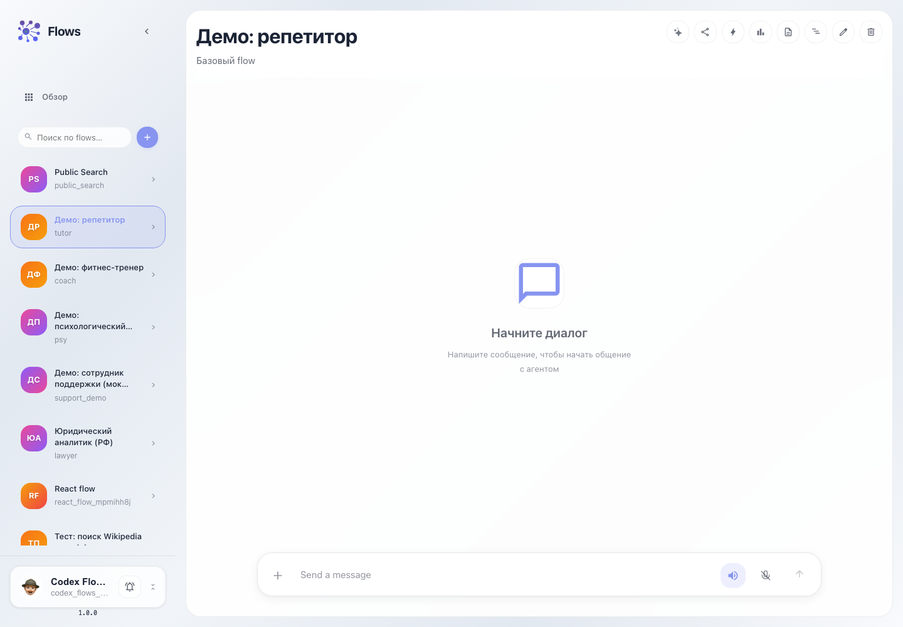

# Flows: запуск агента в чате

Чат `/flows/<flow_id>` — пользовательская поверхность flow. Здесь проверяют published-поведение агента без входа в редактор: текст, файлы, voice/TTS, trace, logs и durable history.

## Шаг 1. Открываем чат flow

На главной Flows выберите flow или нажмите кнопку чата на карточке. Откроется route вида `/flows/tutor`.

## Шаг 2. Отправляем сообщение

Введите запрос в composer и нажмите отправку. UI добавит сообщение пользователя сразу, затем будет получать A2A/SSE-события ответа агента и раскладывать их в transcript.

## Шаг 3. Используем действия в header

В верхней панели чата доступны основные операции:

- **Lara** — открыть AI-помощника по текущему flow.
- **Share preview** — создать одноразовую гостевую ссылку на preview.
- **Triggers** — открыть настройки внешних входов: Telegram, cron, webhook, email, Redis.
- **Traces** — открыть trace по текущей сессии или task.
- **Logs** — открыть логи по session/task.
- **Durable history** — открыть ledger выполнения, state projection и действия fork/rewind/retry.
- **Editor** — перейти к графу flow.
- **Clear** — очистить текущую локальную сессию чата.

## Шаг 4. Работаем с файлами и голосом

Кнопка `+` в composer добавляет файлы к сообщению. Кнопки voice/TTS включают голосовой ввод или озвучивание ответа, если в окружении настроен voice runtime.

## Что покрывает сценарий

- пользовательский запуск flow;
- продолжение и очистка chat session;
- загрузка файлов;
- переходы к observability: traces, logs, durable history;
- preview-share и triggers без входа в editor;
- возврат к editor для изменения графа.
