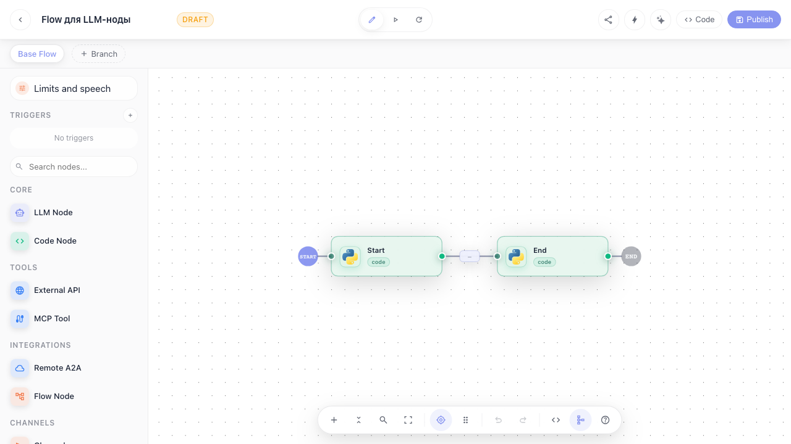
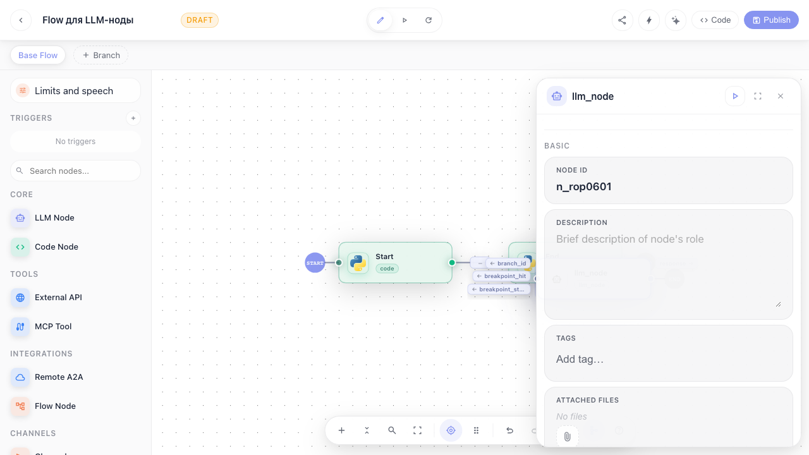
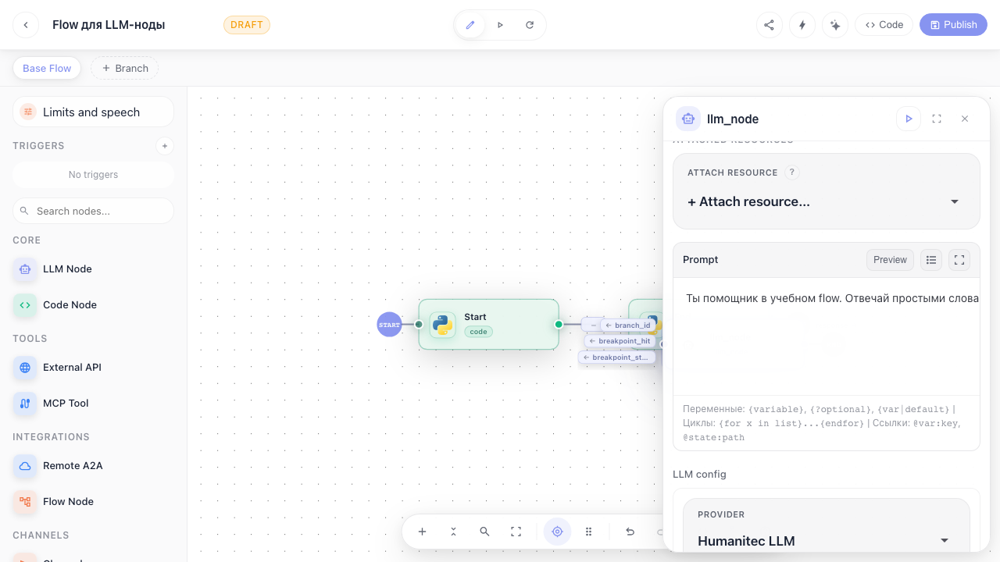
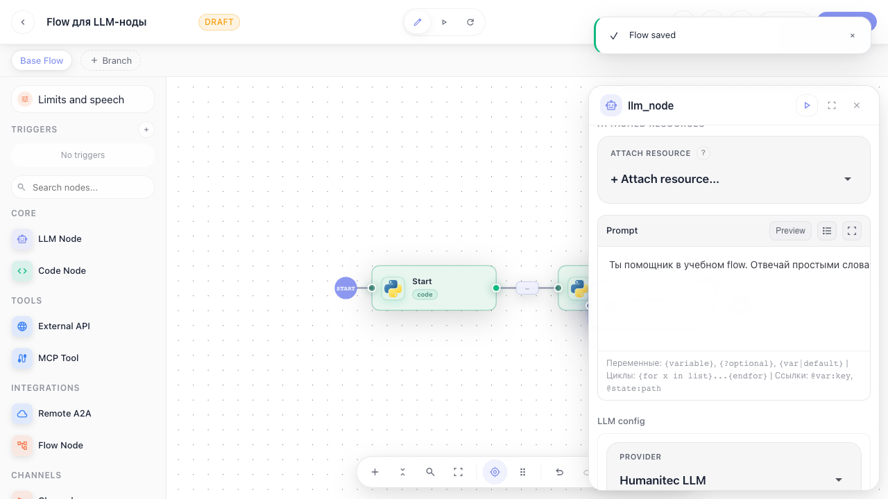

# Flows: добавление LLM-ноды

Инструкция показывает, как добавить LLM Node на канву, открыть настройки ноды, заполнить промпт и выбрать LLM-профиль.

## Шаг 1. Открываем редактор flow. Слева находится палитра нод, в центре находится канва.

## Шаг 2. Перетаскиваем LLM Node из палитры на канву. Справа открываются настройки выбранной ноды.

## Шаг 3. Заполняем промпт и LLM-настройки. Промпт говорит агенту, как вести себя с пользователем.

## Шаг 4. Нажимаем Publish. Так черновик сохраняется, и flow можно запускать или продолжать редактировать позже.

