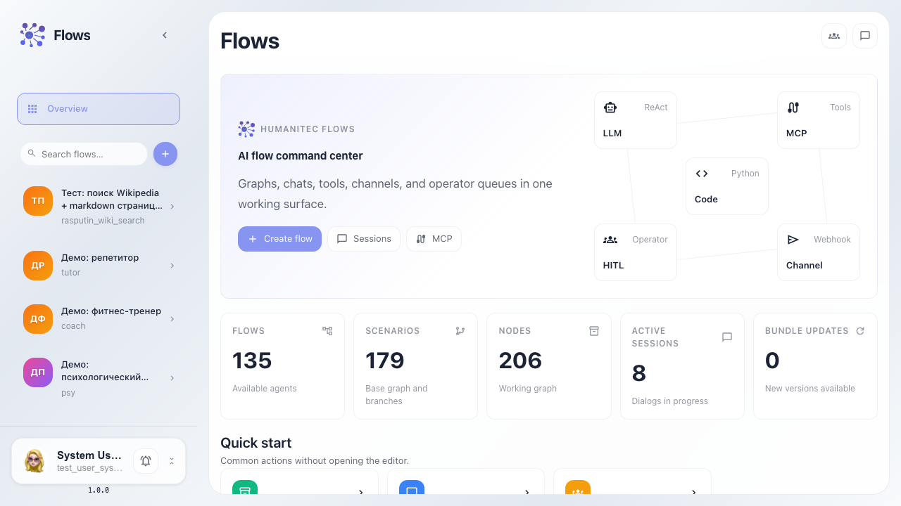
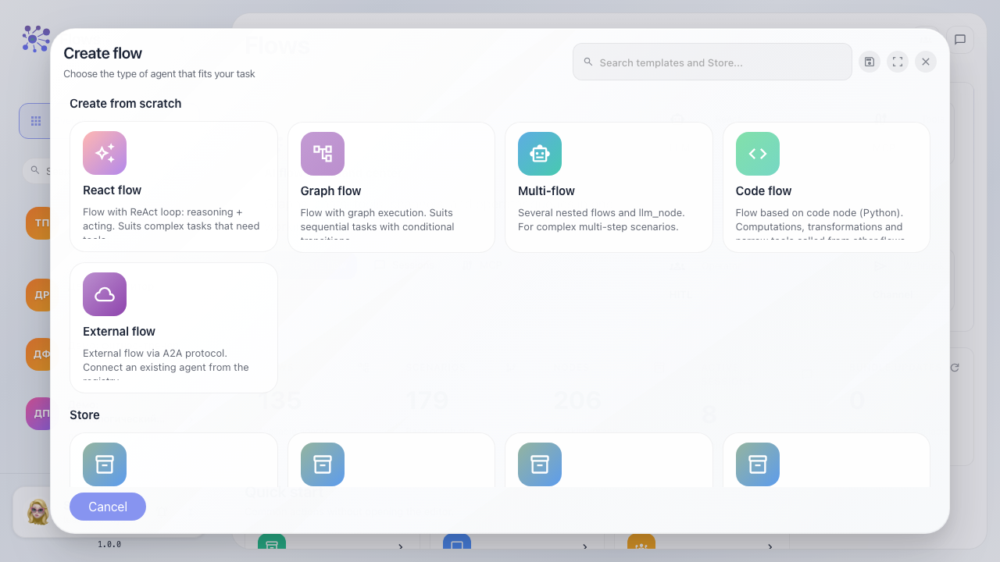
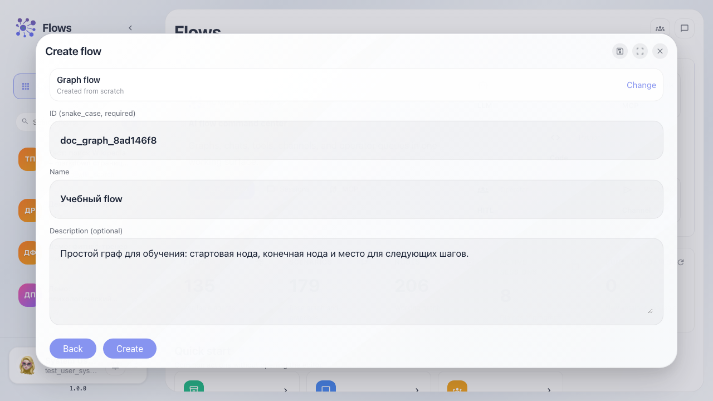
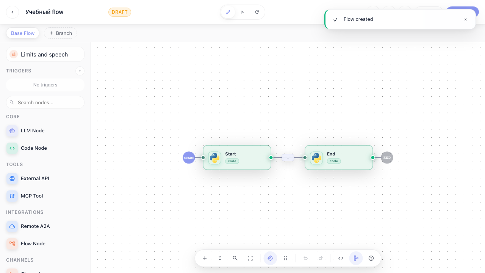

# Flows: создание flow

Пошаговая инструкция для обычного пользователя: открыть Flows, выбрать шаблон, заполнить понятные поля и попасть в редактор с готовой канвой.

## Шаг 1. Открываем Flows. Это список ваших flow: здесь можно найти готового агента или создать нового.

## Шаг 2. Нажимаем плюс. Открывается мастер создания: сначала выбираем тип будущего flow.

## Шаг 3. Заполняем ID, название и описание. ID нужен системе, а название и описание видит человек.

## Шаг 4. После создания мы сразу попадаем в редактор. На канве уже есть две ноды: Start и End.

