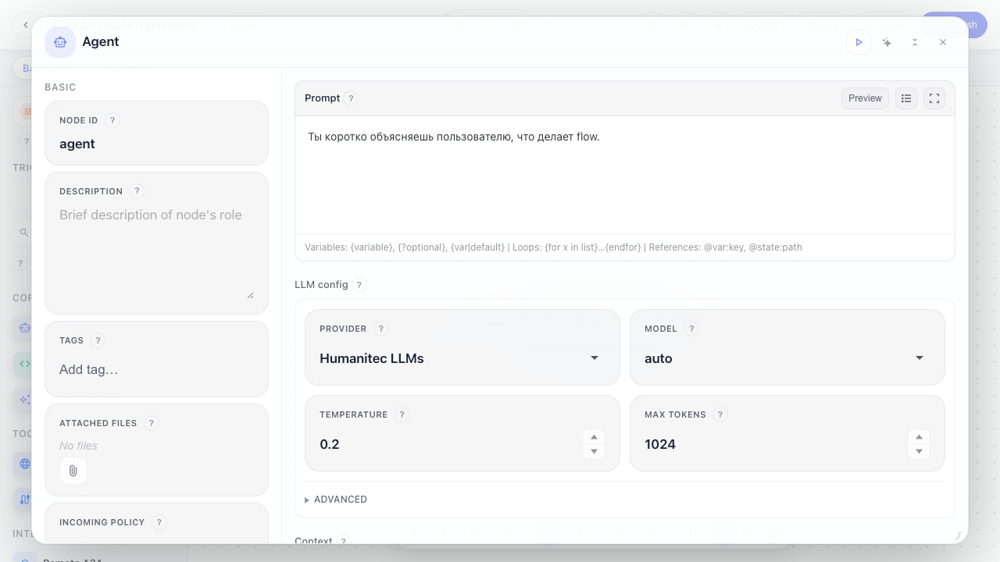
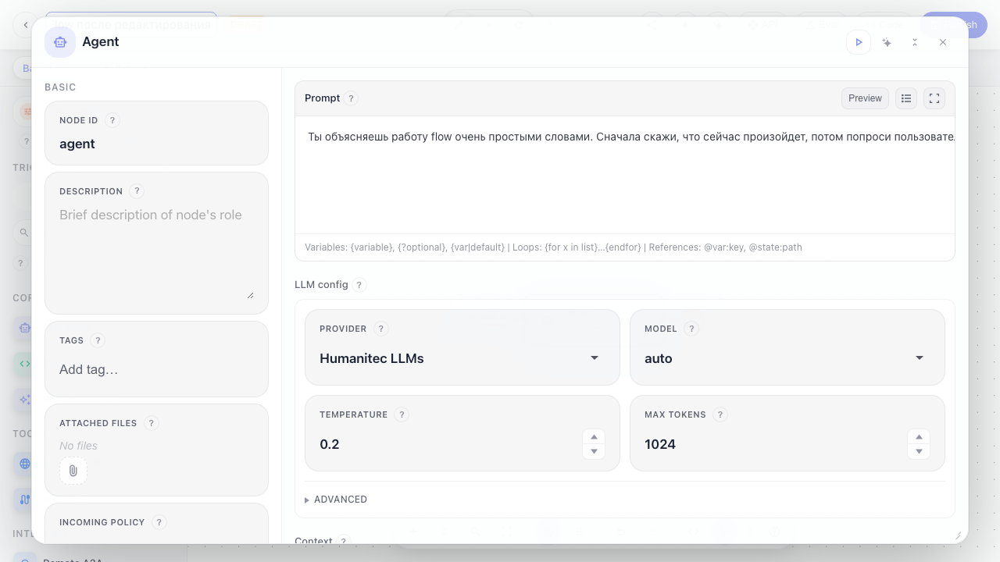
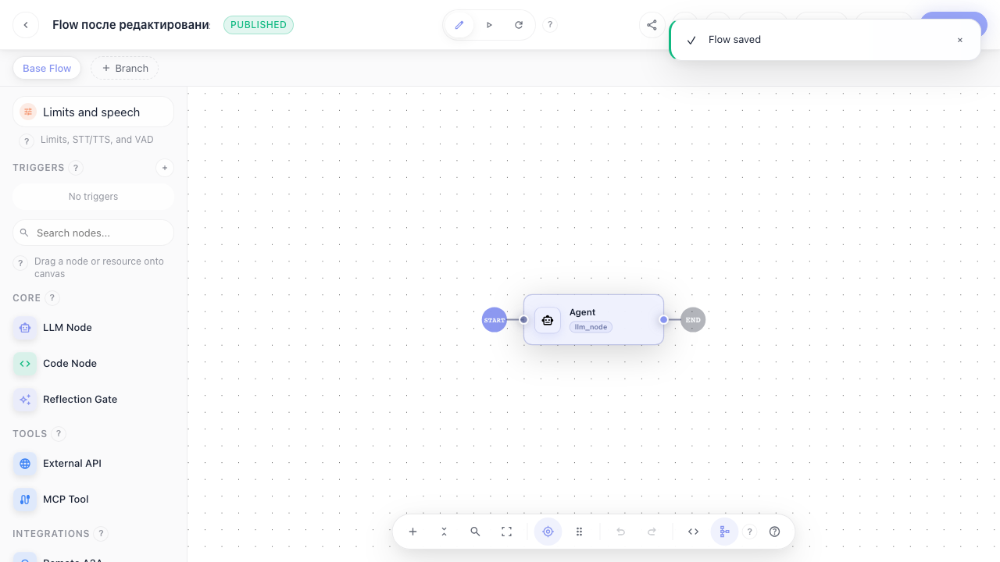

# Flows: редактирование flow

Инструкция для повторного редактирования: открыть готовый flow, изменить название, обновить промпт LLM-ноды и сохранить изменения.

## Step 1. Открываем уже готовый flow и кликаем по LLM-ноду. Справа снова видны ее настройки.

## Step 2. Меняем название flow и переписываем промпт. Это обычное редактирование: как переименовать файл и исправить текст.

## Step 3. Сохраняем изменения через Publish. После этого новое название и промпт лежат в сохраненной версии flow.

