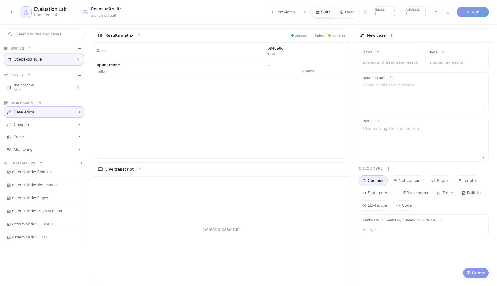
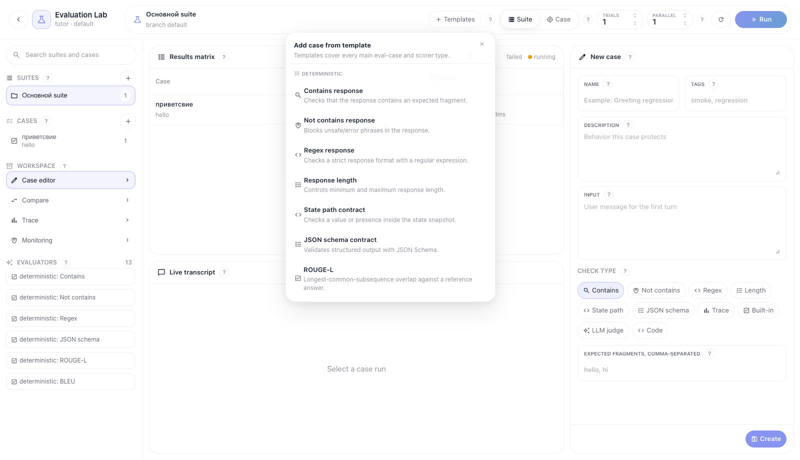
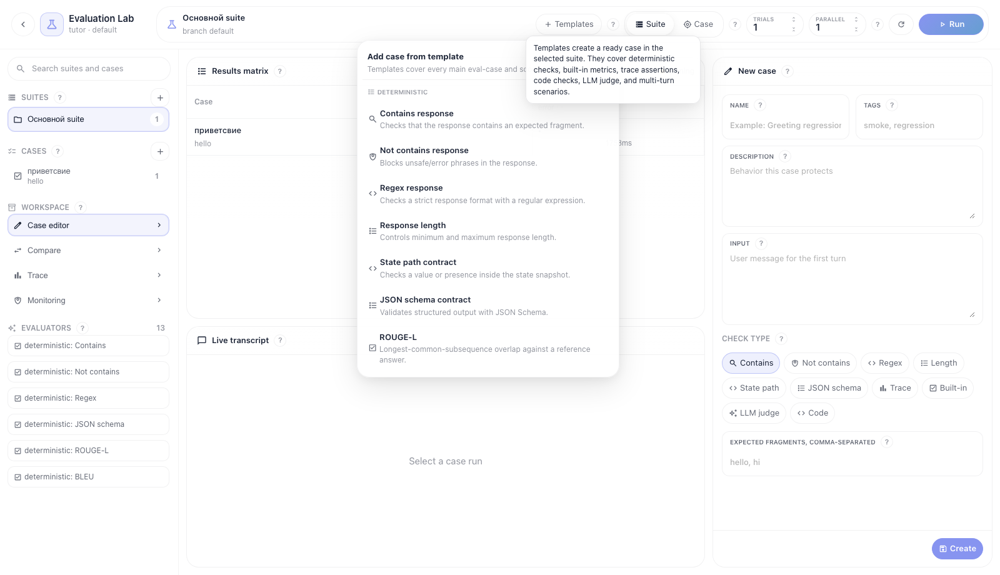

# Evaluation Lab: создание и изменение test cases

Evaluation Lab — полноэкранная рабочая зона для проверки flow. Базовый цикл такой: выбрать suite, добавить case из шаблона или вручную, запустить suite/case, открыть результат в матрице, посмотреть live transcript и trace, затем сравнить run с baseline.

Все скриншоты ниже сняты в светлой теме.

## Шаг 1. Открываем Evaluation Lab

Откройте flow и перейдите по route вида `/flows/<flow_id>/evaluation/<branch_id>`. Кнопка возврата слева ведет обратно в редактор flow. В центре всегда остаются Results matrix и Live transcript, справа открывается активная рабочая панель.

Что важно на экране:

- **Suites** — наборы test cases для flow.
- **Cases** — отдельные сценарии проверки.
- **Templates** — быстрый способ создать case по проверенному паттерну.
- **Suite / Case** — область запуска: весь suite или только выбранный case.
- **Trials** — число повторов одного case для недетерминированных агентов.
- **Parallel** — конкурентность case-run внутри durable TaskIQ job.

## Шаг 2. Создаем case из шаблона

Нажмите **Шаблоны** в header. Меню сгруппировано по типам проверок: детерминированные, качество/LLM, безопасность, трассировка и продвинутые. Шаблоны покрывают основные backend check-типы: `contains`, `not_contains`, `regex`, `length`, `state_path`, `json_schema`, `trace_assertion` (`tool_called`, `node_completed`, `node_failed`), `builtin_metric`, `llm_judge`, `code`, а также многошаговый диалог.

Рекомендуемый порядок:

1. Для первого smoke-test выберите **Smoke-регрессионный набор**.
2. Для проверки tool-use выберите **Вызов инструмента в трассировке**.
3. Для RAG/knowledge ответа выберите **Обоснованность** или **Релевантность ответа**.
4. Для safety-регрессии выберите **Безопасность** или **Токсичность**.
5. Для строгого structured output выберите **Контракт JSON Schema**.

После выбора шаблона case создается в выбранном suite и открывается в Case editor.

## Шаг 3. Создаем или редактируем case вручную

Если нужен ручной case, нажмите `+` рядом с **Cases**. В Case editor заполните название, теги, описание и input. Затем выберите check type.

Назначение check type:

- **Contains** — ответ должен содержать один из ожидаемых фрагментов.
- **Not contains** — ответ не должен содержать запрещенные фразы.
- **Regex** — ответ должен совпасть со строгим регулярным выражением.
- **Length** — ответ должен попасть в min/max длину.
- **State path** — state snapshot должен содержать нужное поле или значение.
- **JSON schema** — structured output в state должен пройти JSON Schema.
- **Trace** — workflow history должен содержать tool call или завершенную node.
- **Built-in** — готовые evaluator metrics: ROUGE-L, BLEU, toxicity, safety, groundedness, answer relevance, tool accuracy.
- **LLM judge** — оценка по versioned rubric через structured output.
- **Code** — isolated code scorer через runner.

Сохранение обновляет case в выбранном suite. Для multi-turn шаблонов редактор меняет первый turn, но сохраняет последующие turns, чтобы сценарий не разваливался при правке первого сообщения.

## Шаг 4. Используем подсказки

Рядом с ключевыми зонами есть `?`-подсказки. Они объясняют, что делает section, какие данные ожидает поле и как это связано с backend evaluation contract.

Подсказки есть у:

- Templates;
- run scope и run options;
- Suites, Cases, Workspace, Evaluators;
- Case editor и field labels;
- Results matrix;
- Live transcript;
- Compare;
- Trace;
- Monitoring.

## Шаг 5. Запускаем evaluation

Выберите scope:

- **Suite** — запускает все enabled cases выбранного suite.
- **Case** — запускает только выбранный case.

Задайте **Trials** и **Parallel**, затем нажмите **Run**. Запуск уходит в backend как durable TaskIQ job. UI не запускает evaluation синхронно и не держит HTTP request.

Во время выполнения:

- Results matrix показывает состояние case-run по ячейкам.
- Live transcript показывает диалог и append-only run events.
- Trace panel открывается кликом по ячейке матрицы.

## Шаг 6. Сравниваем с baseline

Откройте **Compare**, выберите левый run и текущий run. Нажмите **Compare**. Для branch можно зафиксировать baseline через **Set baseline**. Если нужно сравнение качества двух ответов, используйте human pairwise кнопки или **LLM pairwise**.

## Шаг 7. Меняем существующий case

Выберите case в левом списке. Case editor загрузит его первый turn и check. Измените input, tags или check fields и нажмите **Сохранить**. После изменения запустите suite или выбранный case еще раз, чтобы получить новый run и сравнить его с baseline.
