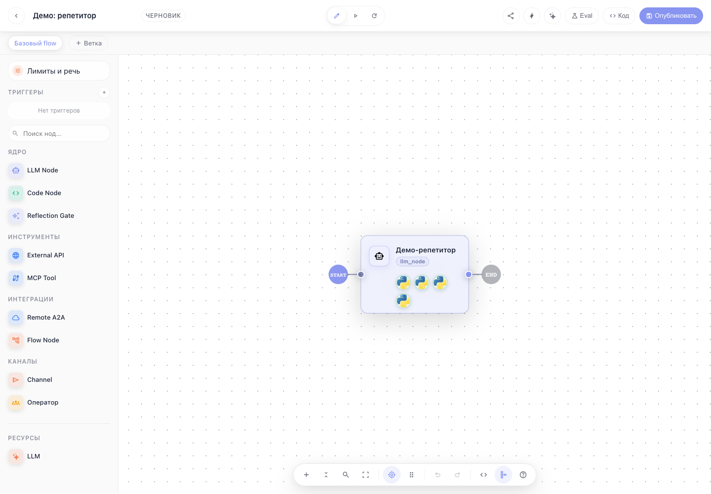

# Flows: операционный контур published flow

После сборки flow разработчику нужно не только редактировать граф, но и выпускать, тестировать, открывать наблюдаемость, настраивать входы и переходить в Evaluation Lab. Этот сценарий показывает, где эти действия находятся в editor.

## Шаг 1. Открываем редактор flow

Откройте route вида `/flows/<flow_id>/editor`. В header видны статус черновика, запуск, reload, preview-share, triggers, Lara, Evaluation Lab, Code и Publish.

## Шаг 2. Публикуем изменения

После изменения графа нажмите **Опубликовать**. Published-версия будет использоваться пользовательским чатом, preview-share, внешними triggers и evaluation runs.

## Шаг 3. Проверяем runtime до выпуска

Перед публикацией используйте:

- **Run** — быстрый запуск текущего графа.
- **Share preview** — гостевой preview для ручной проверки без доступа к консоли.
- **Triggers** — входящие каналы: Telegram, cron, webhook, email, Redis.
- **Code** — открыть кодовую поверхность flow.
- **Lara** — попросить AI-помощника объяснить ноду, граф или ошибку.

## Шаг 4. Переходим в Evaluation Lab

Кнопка **Eval** открывает полноэкранный route-backed Evaluation Lab для текущего flow/branch. Там создаются suites/cases, запускаются TaskIQ evaluation runs, смотрятся matrix/transcript/trace и сравнение с baseline.

## Шаг 5. Диагностируем поведение

Из чата или trace modal открывайте:

- **Traces** — spans, tool calls и task-level trace.
- **Logs** — server-side логи по session, trace, request, span или user.
- **Durable history** — append-only ledger, state projection, fork, rewind, retry и patch-state.

## Что было не покрыто раньше

До этого в документации были сценарии создания flow, добавления LLM-ноды, редактирования и Evaluation Lab. Не хватало операционного сценария, который связывает publish, preview, triggers, observability, durable history и evaluation в один ежедневный рабочий цикл.
