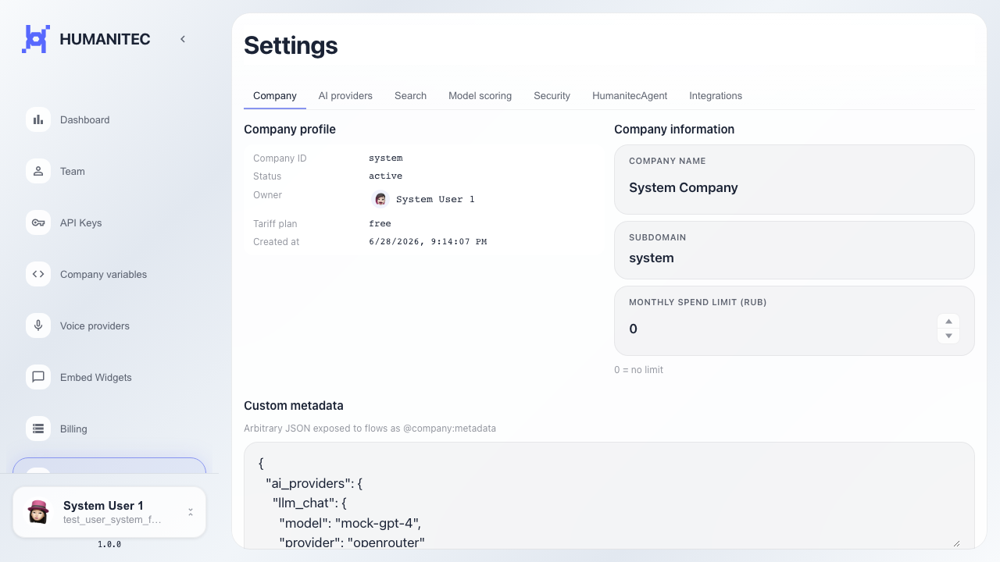
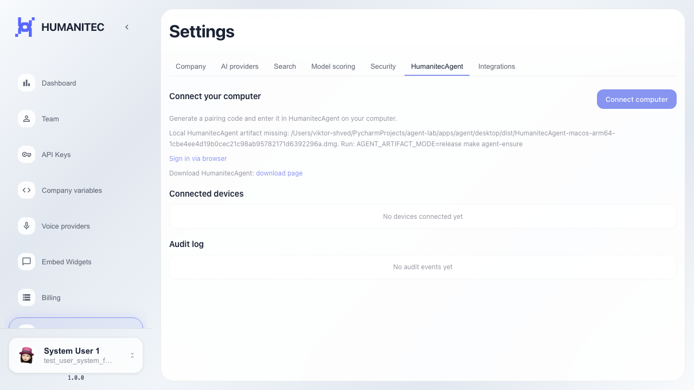

# Frontend: пустой audit HumanitecAgent

На вкладке HumanitecAgent показывается пустой audit log.

## Шаг 1. Открыта страница настроек платформы

## Шаг 2. Открыта вкладка HumanitecAgent

## Шаг 3. Пустой audit log отображается

