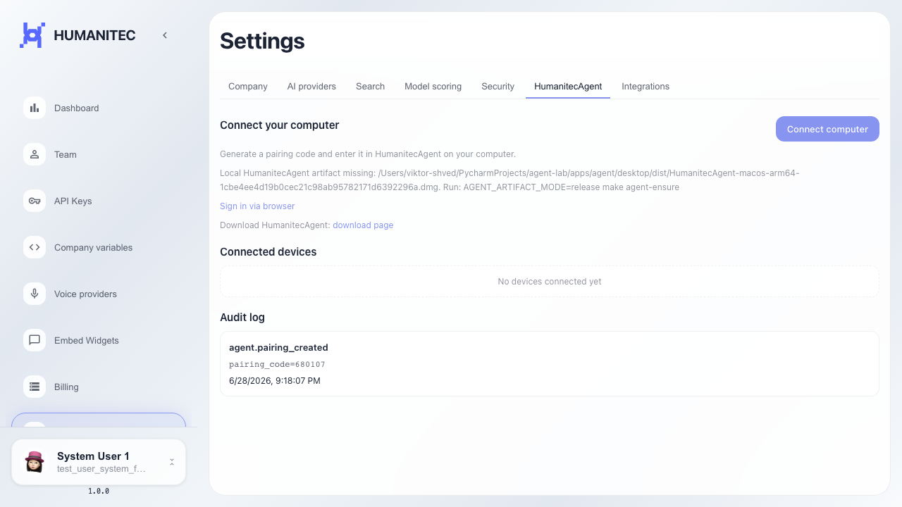

# Frontend: HumanitecAgent pairing help text

The HumanitecAgent tab shows help text about the pairing code.

## Step 1. Platform settings page opened

## Step 2. HumanitecAgent settings tab opened

## Step 3. Pairing help text is visible

