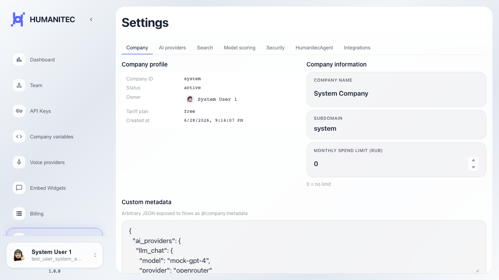
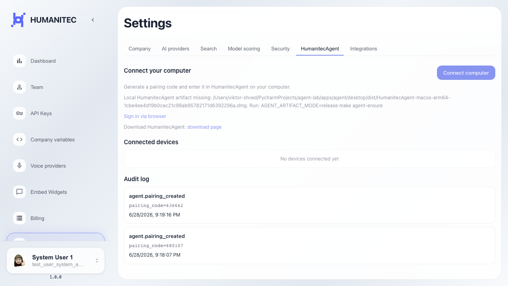
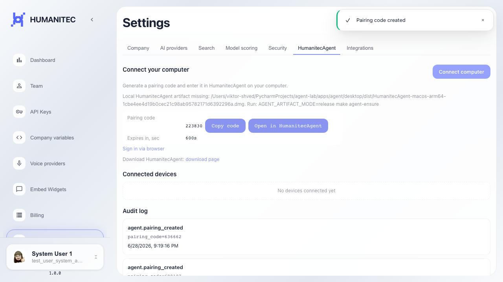

# Frontend: create HumanitecAgent pairing code

The connect button creates a pairing code on the HumanitecAgent tab.

## Step 1. Platform settings page opened

## Step 2. HumanitecAgent tab opened

## Step 3. Pairing code is created and visible

