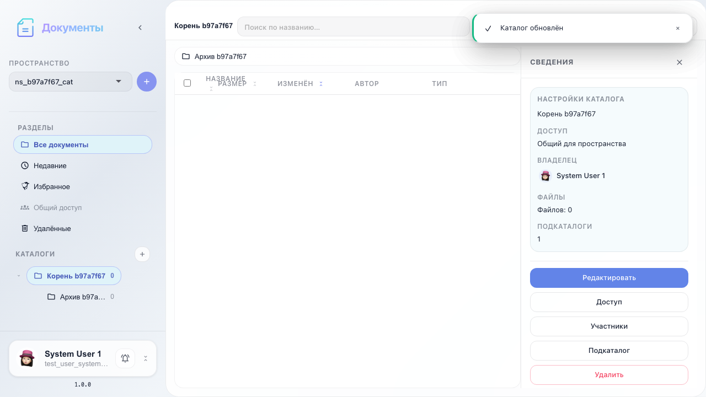

# Office: workspace and catalogs

Select workspace, create root and nested catalogs, edit settings, and navigate the tree.

## Step 1. Workspace selected

## Step 2. Root catalog created

## Step 3. Nested catalog created

## Step 4. Catalog renamed

## Step 5. Catalog tree and breadcrumbs

