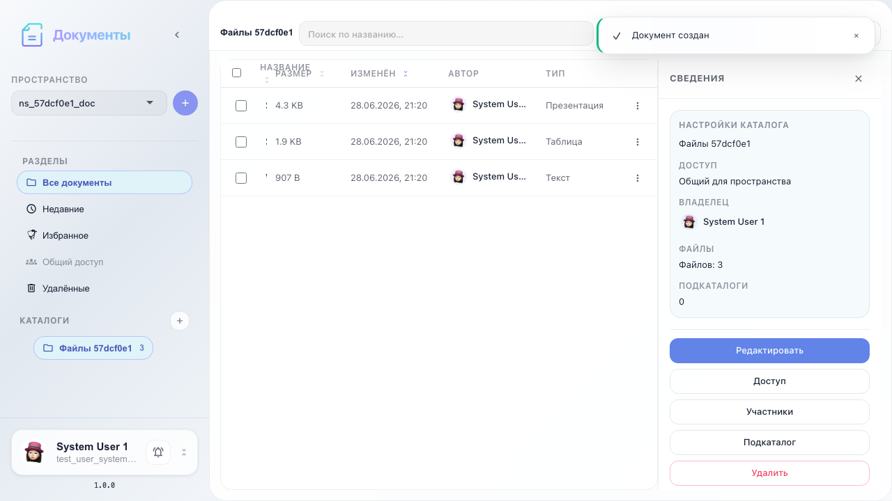
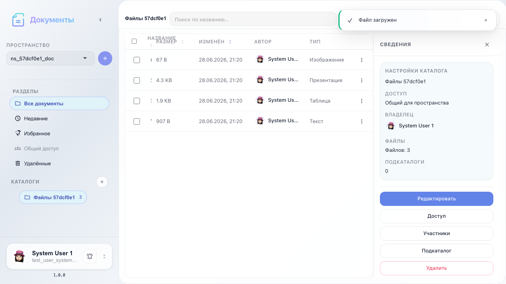

# Office: создание и загрузка документов

Пустые документы Word/Sheet/Slide, загрузка через модалку и drag-and-drop зона.

## Шаг 1. Каталог выбран для документов

## Шаг 2. Форма создания пустого документа

## Шаг 3. Созданы документы Word, Sheet и Slide

## Шаг 4. Модалка загрузки с drag-and-drop

## Шаг 5. Загруженный файл в списке

## Шаг 6. Панель действий над списком документов

