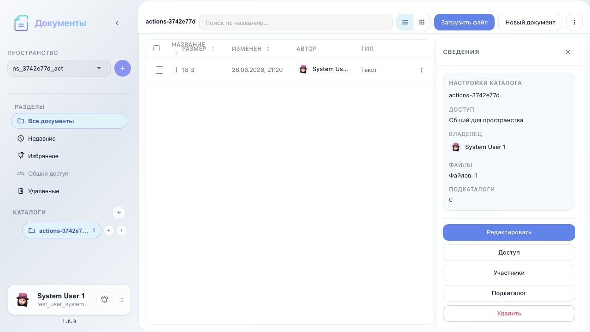
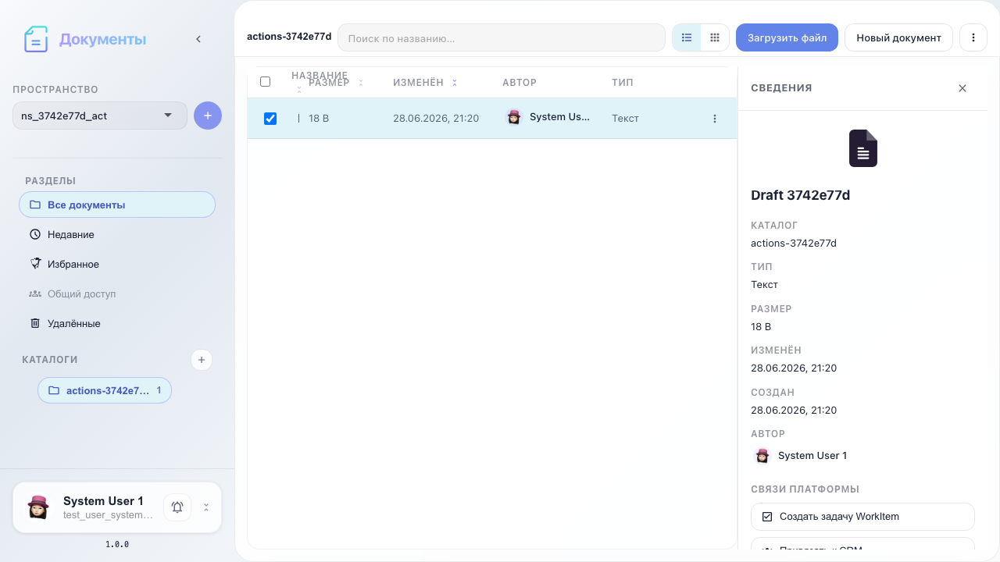
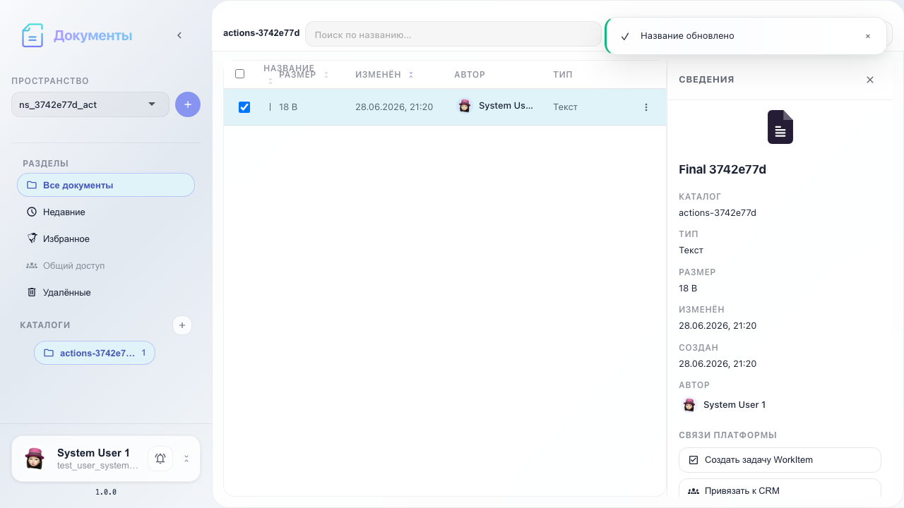
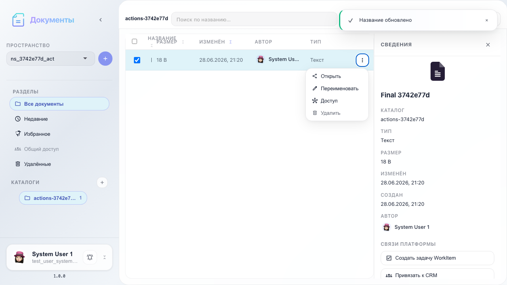
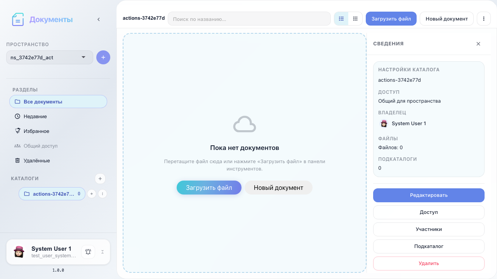

# Office: document actions

Open, rename, context menu, and delete a document.

## Step 1. Document in catalog

## Step 2. Document opened and closed

## Step 3. Document renamed

## Step 4. File actions menu

## Step 5. Document deleted

