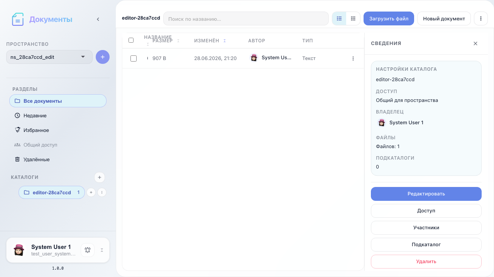
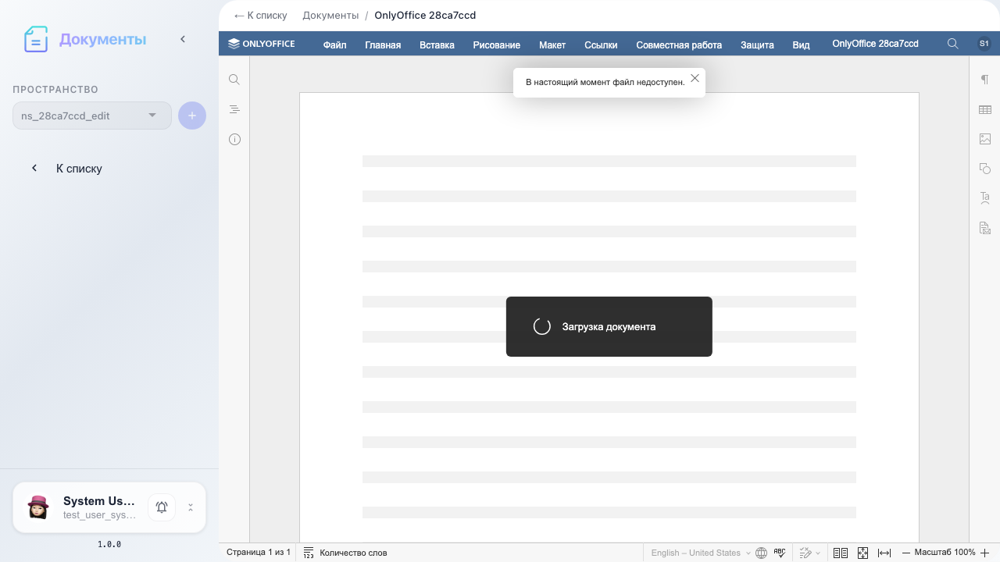
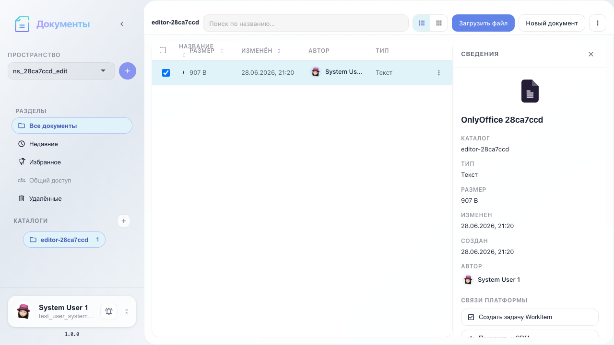

# Office: edit in OnlyOffice

Open docx in OnlyOffice, return to explorer, and reopen.

## Step 1. Word document in catalog

## Step 2. OnlyOffice editor opened

## Step 3. Back to document list

## Step 4. Same document reopened

## Step 5. Document Server integration active

