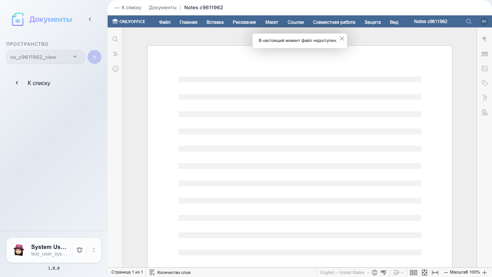

# Office: view text and other file types

Inline text preview and return to document list.

## Step 1. Text file in catalog

## Step 2. Text viewer opened

## Step 3. Back to explorer

## Step 4. Document list after preview

