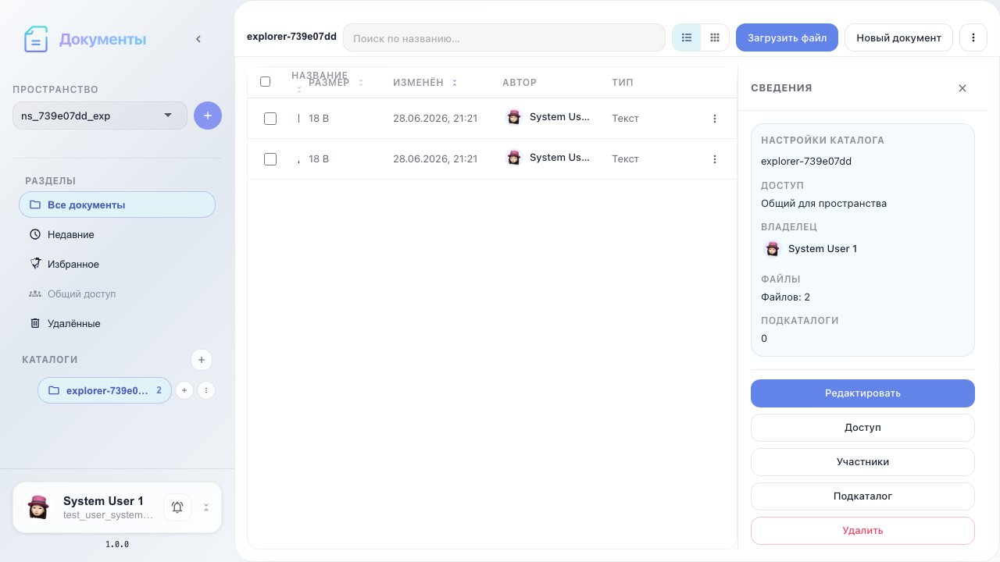
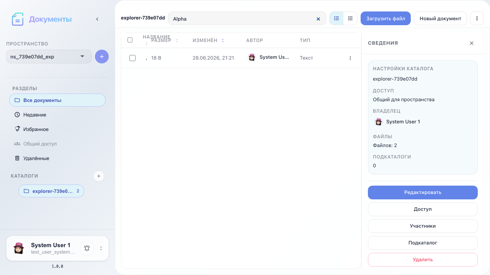
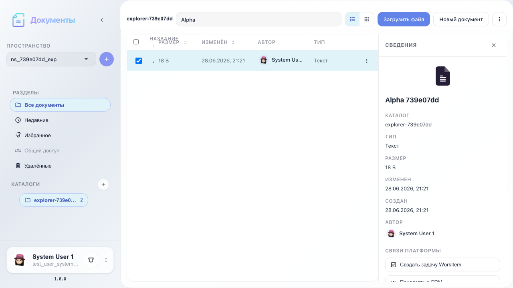
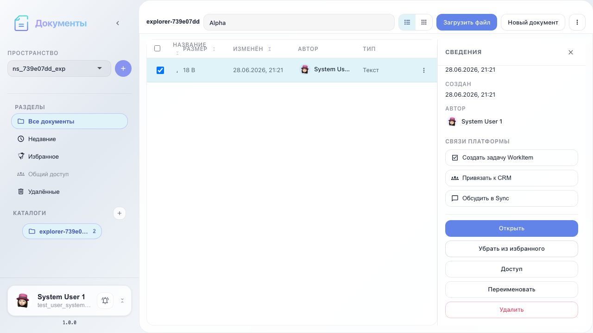
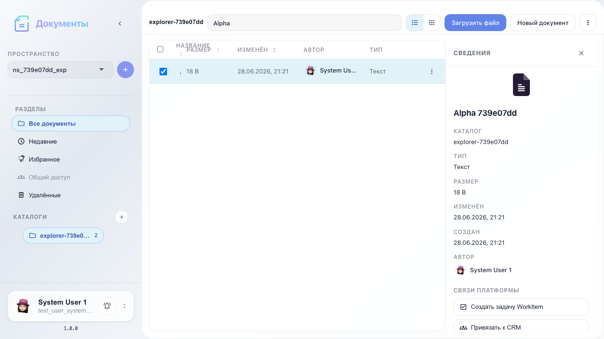

# Office: проводник — поиск и организация

Список и сетка, поиск, выбор файла, избранное и обновление списка.

## Шаг 1. Список документов в каталоге

## Шаг 2. Переключение списка и сетки

## Шаг 3. Поиск по названию

## Шаг 4. Панель сведений о файле

## Шаг 5. Документ добавлен в избранное

## Шаг 6. Список обновлён

