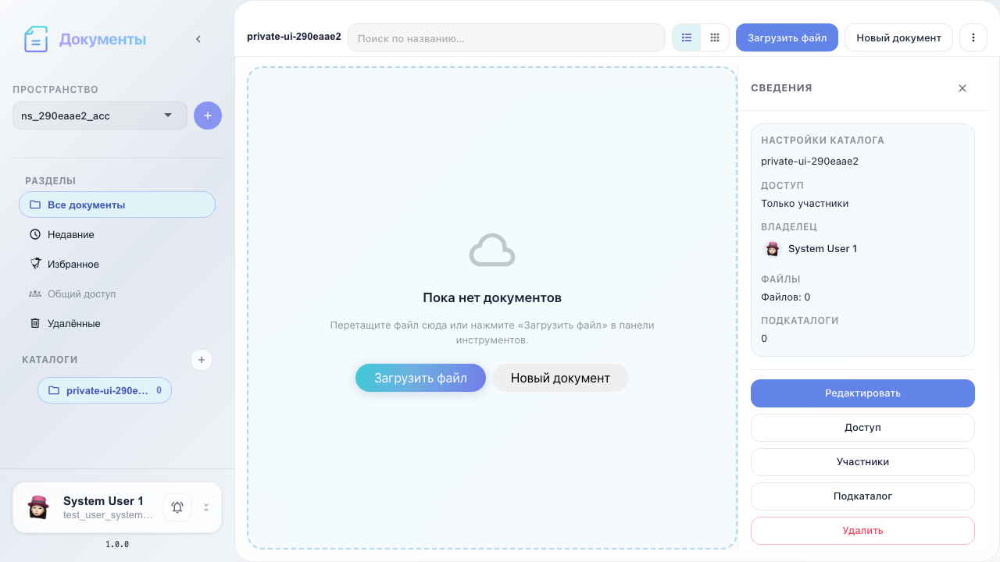
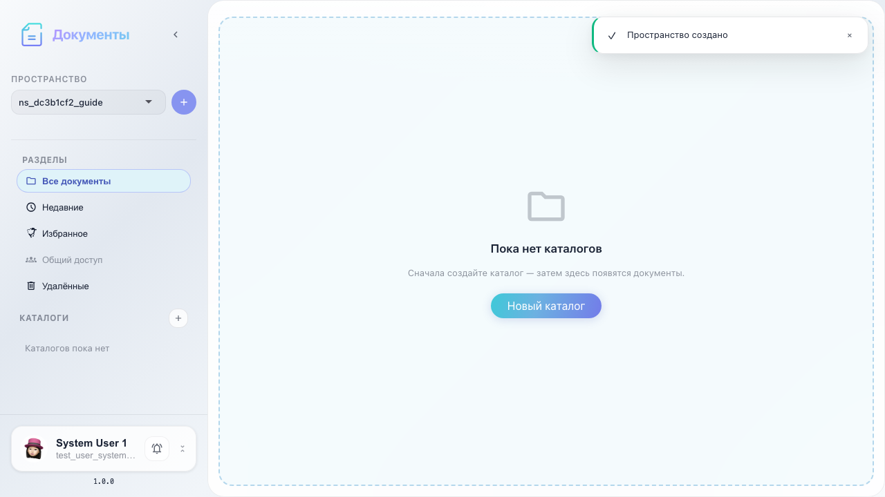
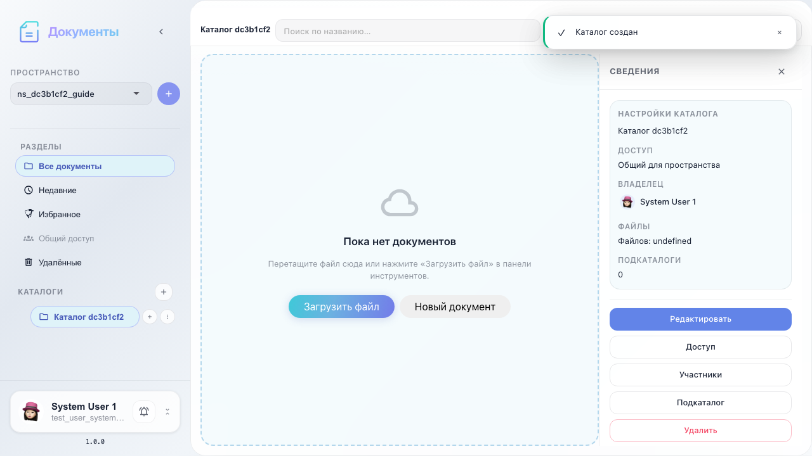
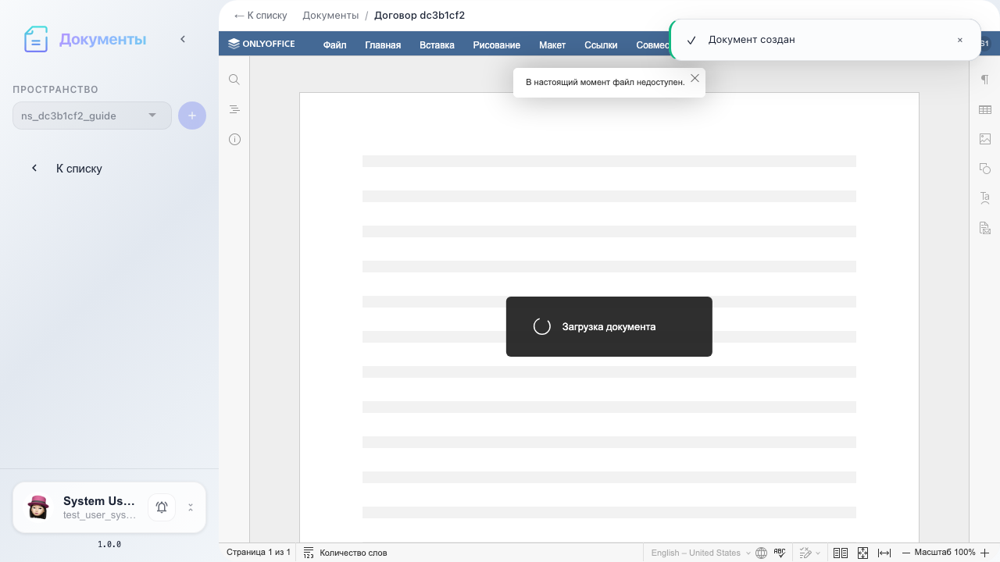
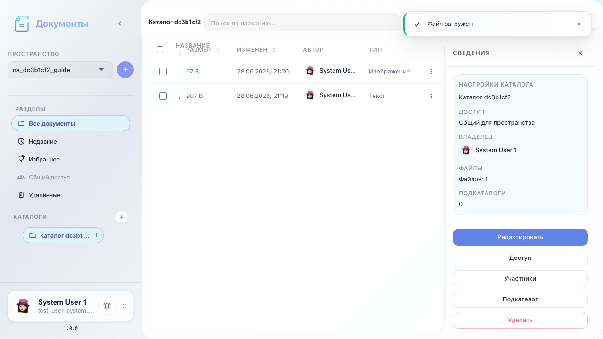

# Office: полная инструкция по сервису

Полный рабочий маршрут Documents: пространство, каталог, создание документа, загрузка файла и открытие в редакторе OnlyOffice.

## Шаг 1. Открыт сервис Документы

## Шаг 2. Создано рабочее пространство

## Шаг 3. Создан каталог документов

## Шаг 4. Создан пустой документ Word

## Шаг 5. Файл загружен в каталог

## Шаг 6. Документ открыт в редакторе

## Шаг 7. Редактор и интеграция OnlyOffice готовы

