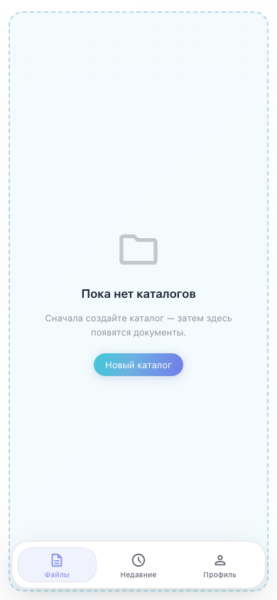

# Office: мобильный интерфейс документов

Bottom nav, выбор пространства и каталога, редактор без нижней навигации.

## Шаг 1. Мобильная нижняя навигация

## Шаг 2. Переключение Files / Recent

## Шаг 3. Выбор каталога на мобильном

