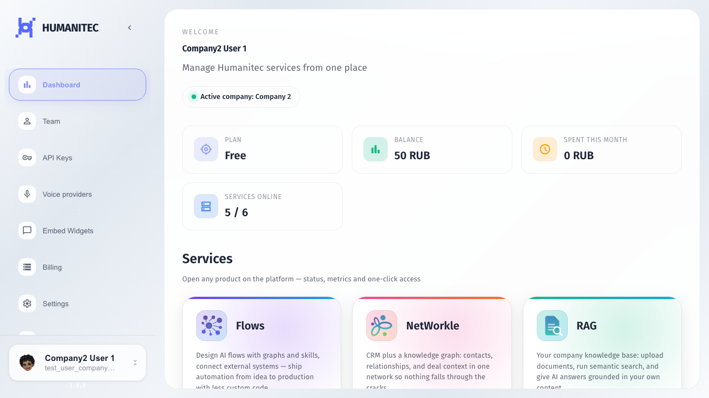
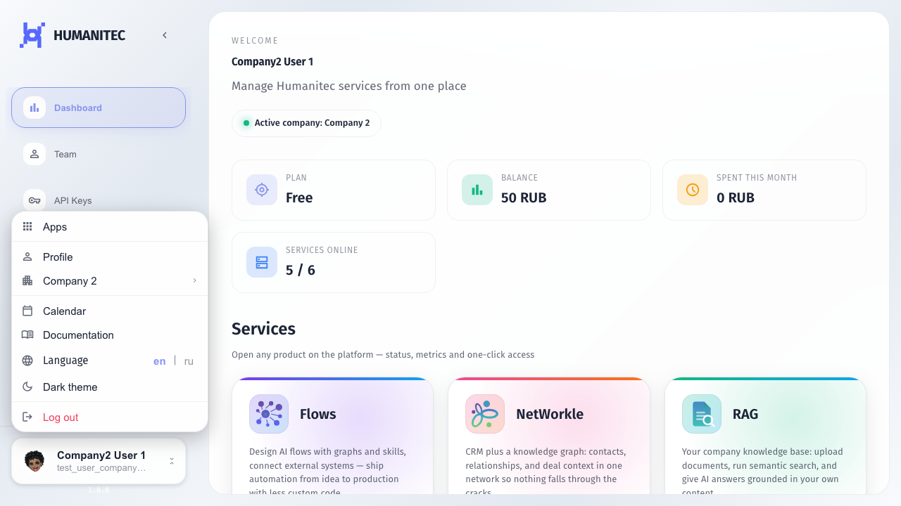
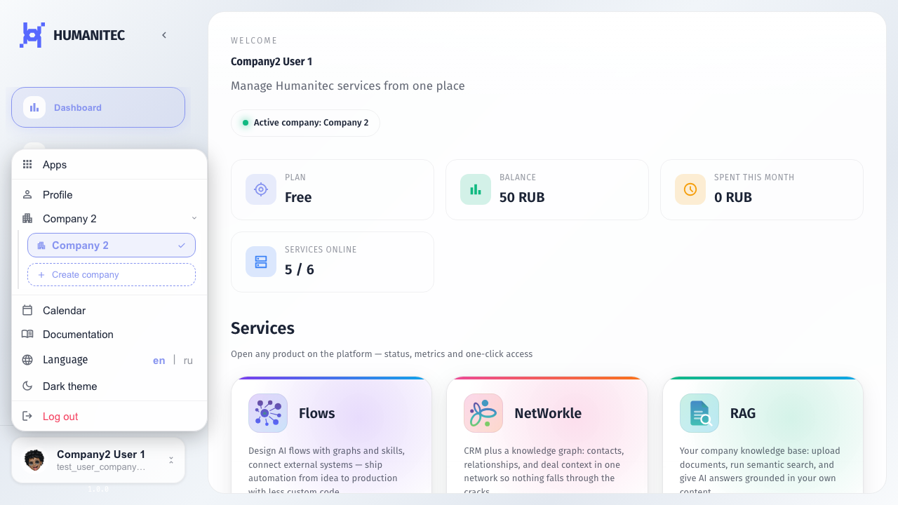
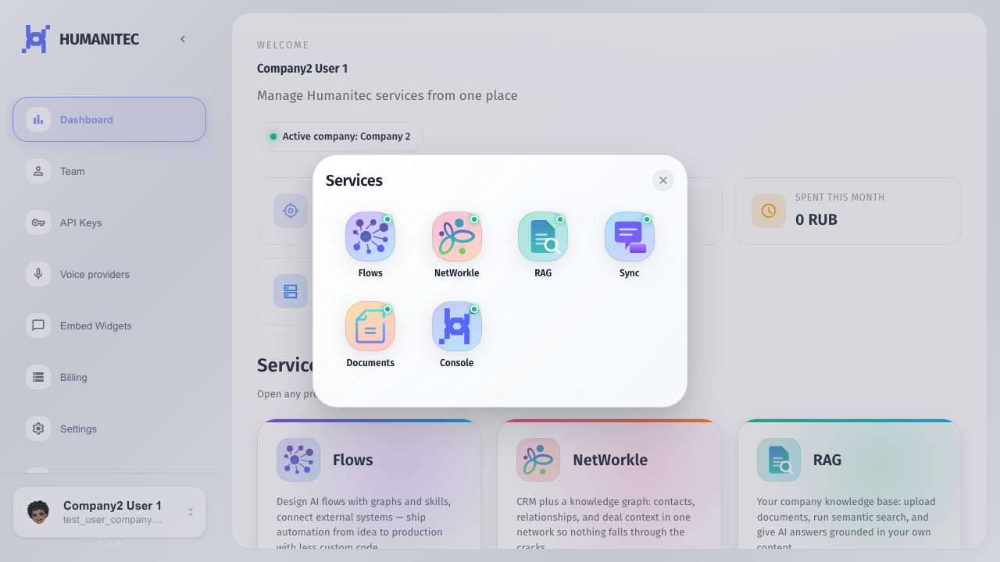
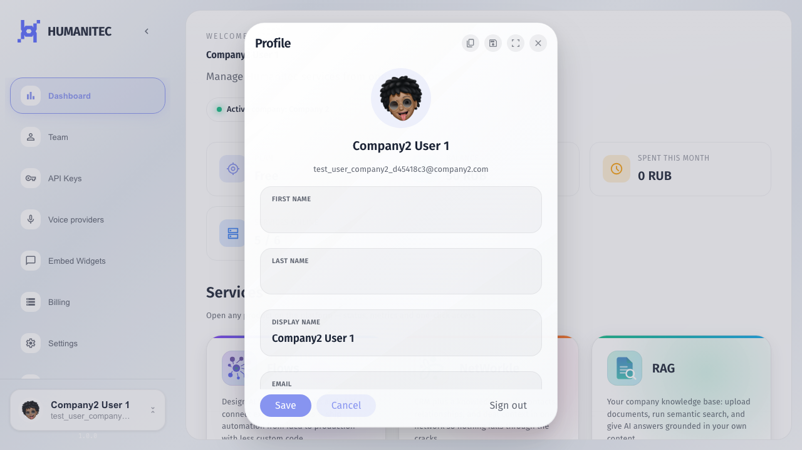
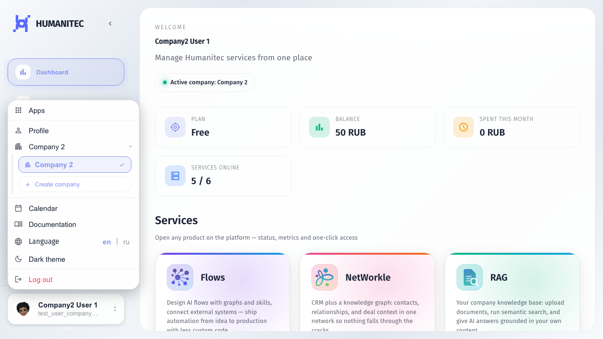
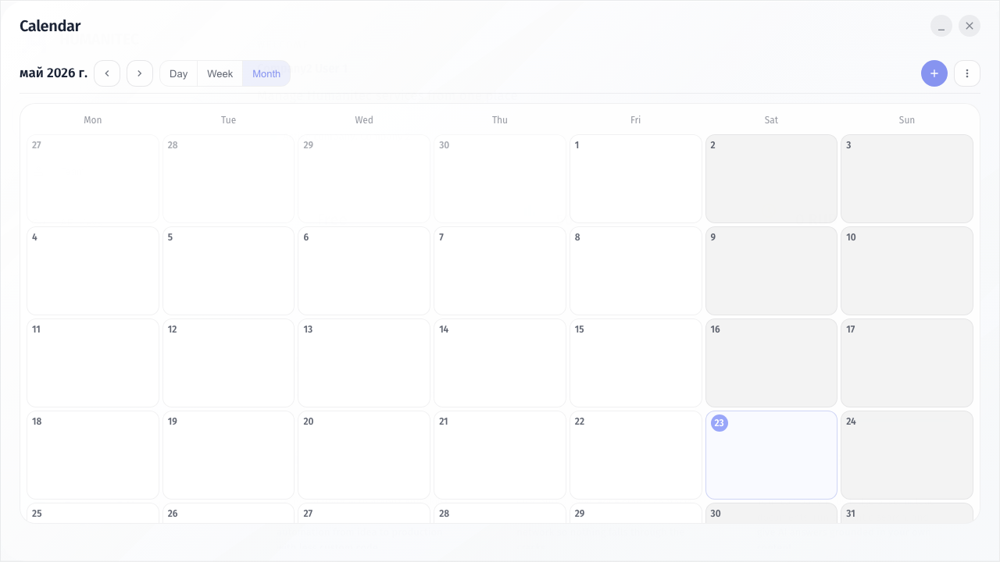

# Основные инструкции: вход, Dashboard и меню пользователя

Базовый маршрут для нового пользователя: открыть сайт, перейти в Dashboard, понять список сервисов и разобраться с пунктами меню пользователя.

## Шаг 1. Открываем главный сайт. Если пользователь уже вошел, в шапке есть кнопка Dashboard.

## Шаг 2. Dashboard показывает основные сервисы компании. Системные сервисы здесь не показываются обычной компании.

## Шаг 3. Открываем меню пользователя. Здесь находятся сервисы, профиль, компания, календарь, документация, язык, тема и выход.

## Шаг 4. Пункт с названием компании раскрывает список компаний. Галочка показывает текущую компанию, а Create company создает новую компанию.

## Шаг 5. Пункт Apps открывает витрину сервисов. Это быстрый способ перейти в Flows, NetWorkle, RAG, Sync или Documents.

## Шаг 6. Пункт Profile открывает карточку пользователя: имя, email, роли и действия с аккаунтом.

## Шаг 7. Нижние пункты меню: Documentation открывает справку, Language меняет язык, Theme переключает тему, Logout выходит из аккаунта.

## Шаг 8. Пункт Calendar открывает календарь на весь экран. Модалка не уезжает за край окна и готова к работе.

