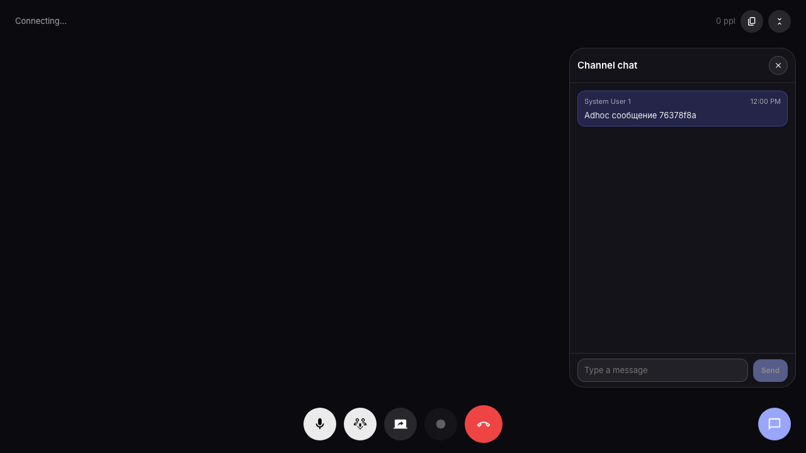
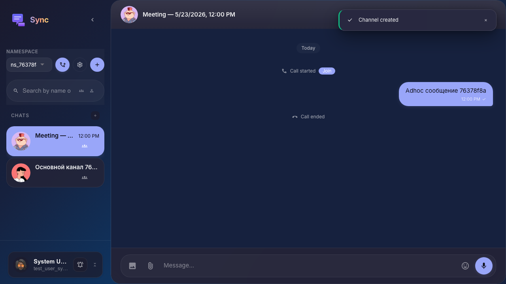

# Sync: ad-hoc звонок использует обычный видимый канал

Кнопка «Создать Sync» создаёт канал встречи с читаемым именем (дата и время), чат в оверлее работает, а после переключения каналов сообщения встречи сохраняются в этом канале.

## Шаг 1. Ad-hoc встреча создала видимый канал с именем по дате/времени

## Шаг 2. После переключения каналов сообщения ad-hoc канала сохранены

