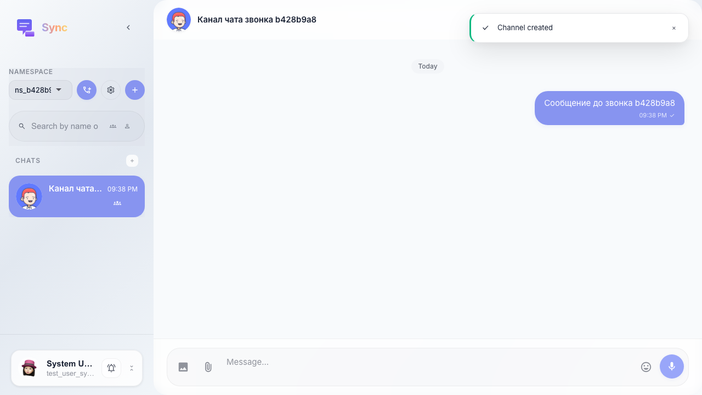
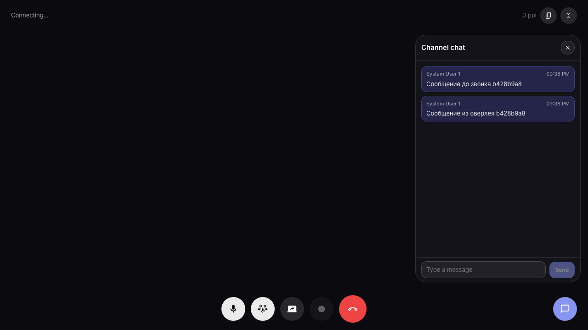
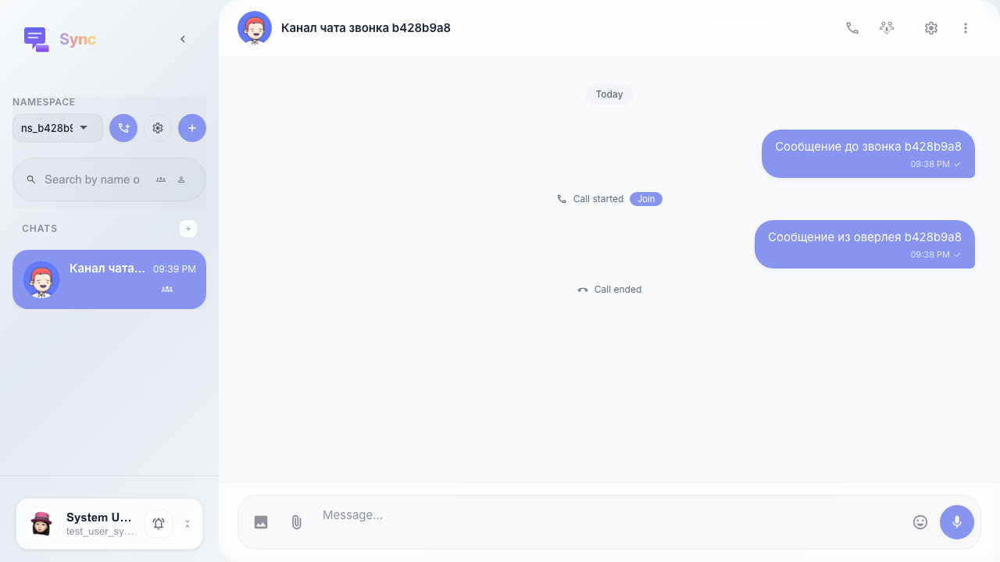

# Sync: чат в оверлее звонка синхронизирован с каналом

Сообщение из основного чата видно в call-overlay, а сообщение из call-overlay после завершения звонка отображается в ленте канала.

## Step 1. Сообщение из основного чата отправлено

## Step 2. Чат в оверлее принимает и отправляет сообщения

## Step 3. Сообщение из оверлея видно в основном чате канала

