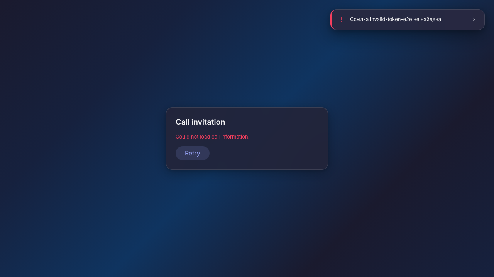
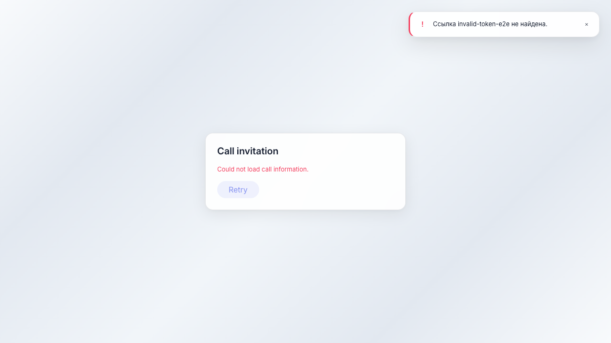

# Sync: страница входа по недействительной ссылке

Публичная страница /sync/join/{token} показывает сообщение об ошибке для несуществующего токена.

## Шаг 1. Открыта страница входа по ссылке звонка

## Шаг 2. Сообщение об ошибке для неверной ссылки

