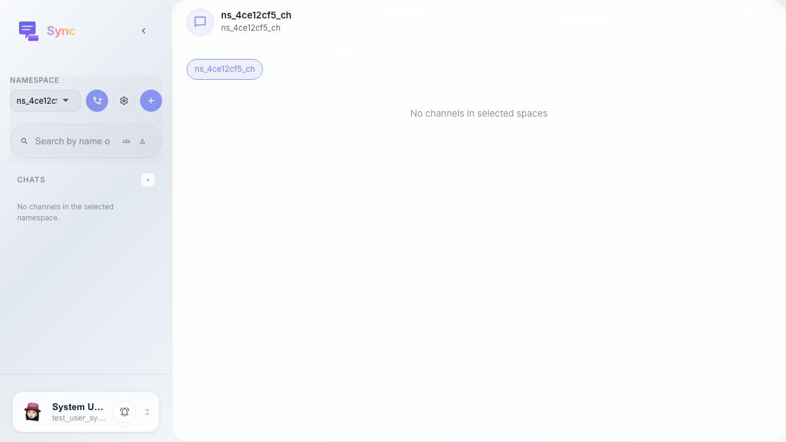
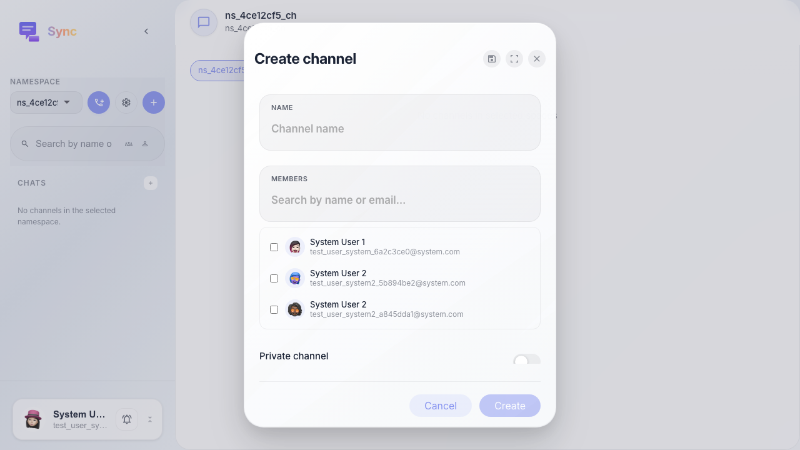
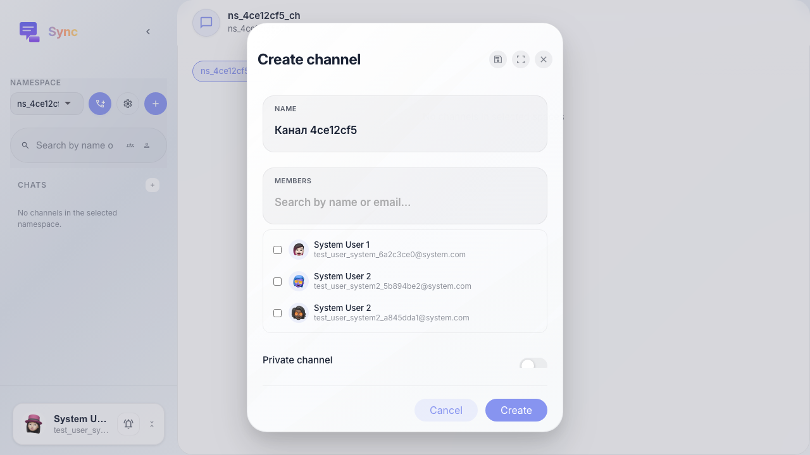
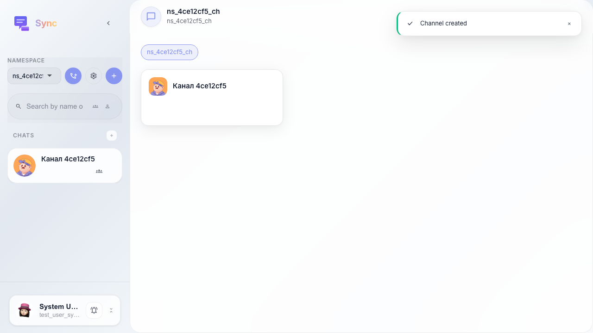

# Sync: создание канала в пространстве

После создания пространства пользователь создаёт topic-канал через «+» у раздела «Каналы» и подтверждает создание.

## Step 1. Выбрано пространство Sync

## Step 2. Открыто создание канала

## Step 3. Введено название канала

## Step 4. Канал появился в сайдбаре

