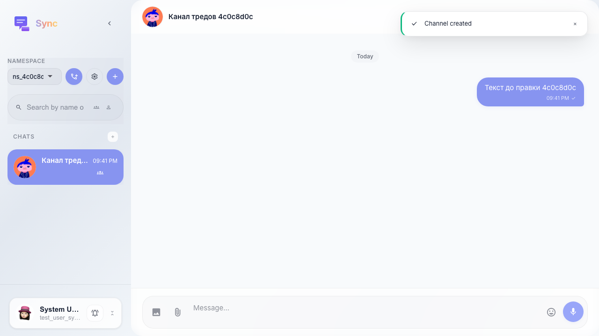
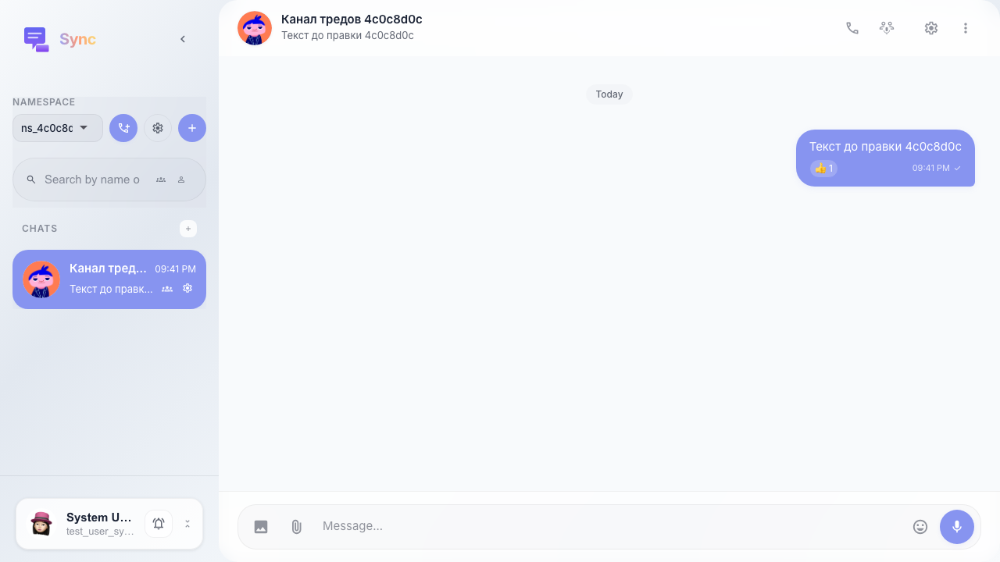
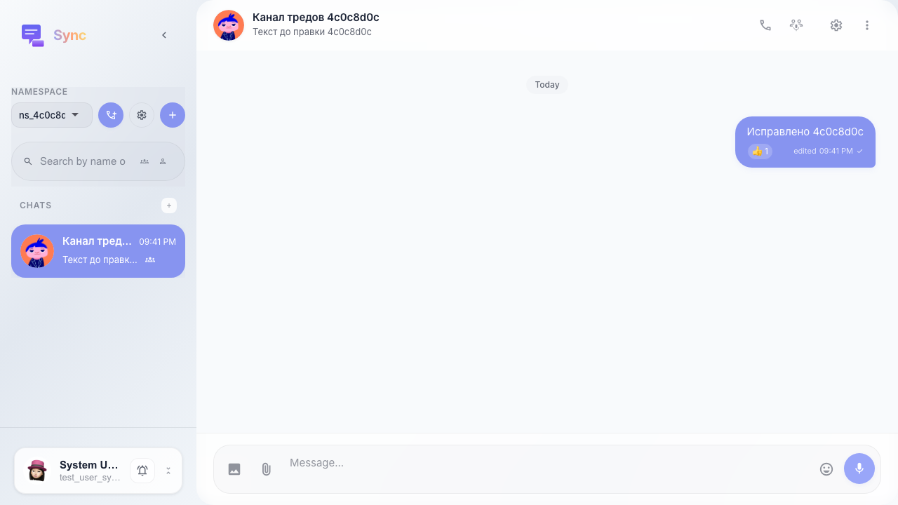

# Sync: реакция и редактирование своего сообщения

Сообщение отправляется из UI; реакция ставится через API; после перезагрузки видна метка реакции; редактирование текста выполняется в UI.

## Step 1. Сообщение отправлено

## Step 2. Поставлена реакция

## Step 3. Текст сообщения изменён

