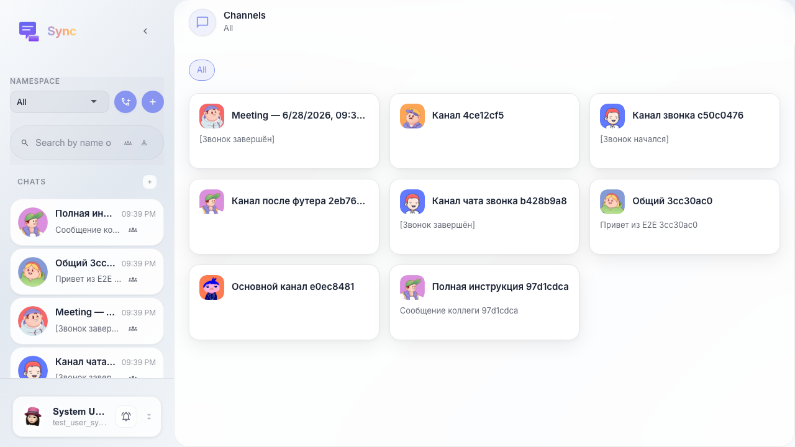
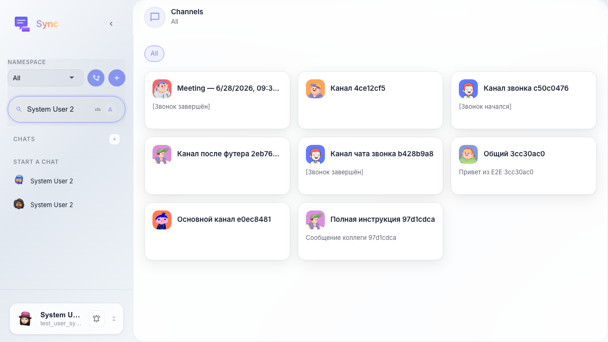
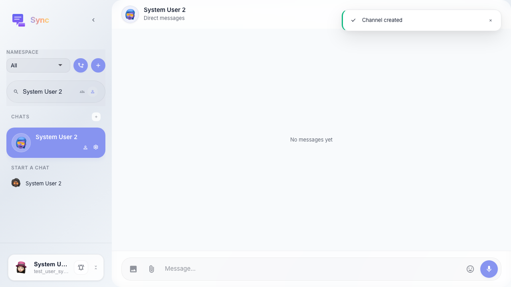

# Sync: открытие чата с участником компании

В разделе «Личные» пользователь находит коллегу по имени и открывает с ним диалог.

## Step 1. Sync открыт, раздел «Личные» доступен

## Step 2. Поиск по имени участника

## Step 3. Открыт чат с выбранным участником

