# Sync: полная инструкция по сервису

Длинная инструкция по основному рабочему маршруту Sync: пространство, канал, сообщения, упоминания, вложения, меню сообщения, закрепы, треды, настройки канала, профиль участника и реальные realtime-обновления.

## Шаг 1. Открыт Sync в выбранном пространстве

На первом экране важно проверить три зоны интерфейса:

- слева находится список чатов, поиск и переключатель области поиска;
- сверху у списка выбранное пространство, карандаш настроек и кнопка встречи;
- в центре показаны карточки каналов выбранного пространства.

Пространство в Sync — это платформенный namespace. Оно общее для сервисов платформы, а Sync хранит в нём только свои настройки: авто-расшифровку голосовых и режим «речь звонка в ленту».

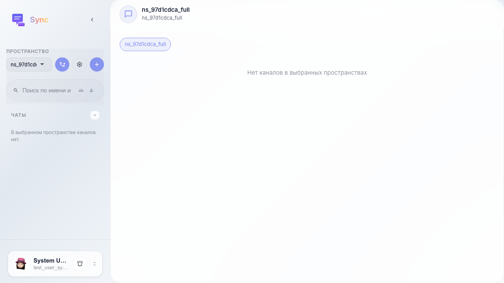

## Шаг 2. Открыты Sync-настройки пространства

Карандаш рядом с пространством не создаёт и не переименовывает namespace. Он открывает именно Sync-настройки выбранного пространства.

- «Авто-транскрипция голосовых» включает STT для новых голосовых сообщений в каналах этого пространства.
- «Речь звонка в ленту» публикует сегменты речи участников звонка в ленту канала, когда backend и LiveKit egress настроены.

Эти значения работают как дефолты пространства; у конкретного канала их можно переопределить в настройках канала.

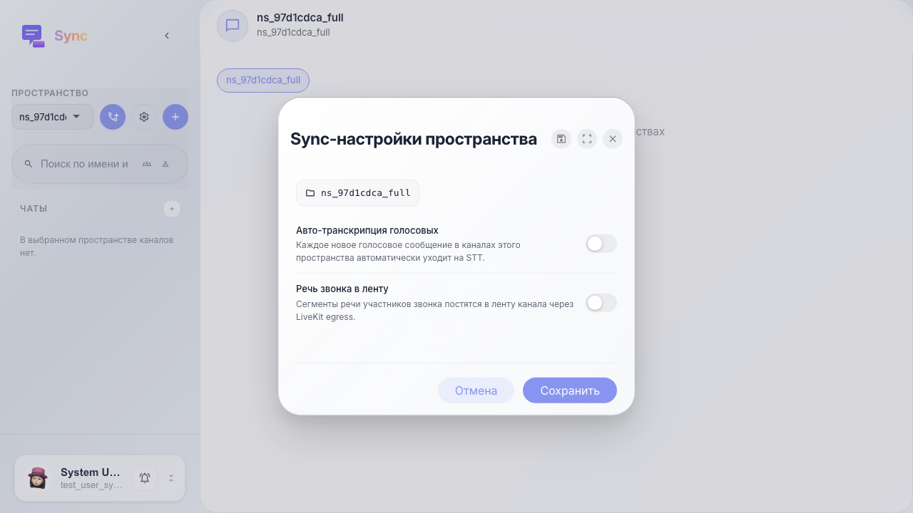

## Шаг 3. Открыта форма создания канала

Канал — основная рабочая единица Sync. В форме есть:

- «Название» — человекочитаемое имя канала в сайдбаре и карточках;
- «Участники» — коллеги, которых можно сразу добавить в канал;
- «Приватный канал» — доступ только приглашённым пользователям;
- «Авто-расшифровка голосовых» — STT для голосовых сообщений этого канала;
- «Речь звонка в ленту» — публикация речи из звонка прямо в чат.

Если флаги включены и на пространстве, и на канале, итоговое поведение канала видно пользователю без обращения к API.

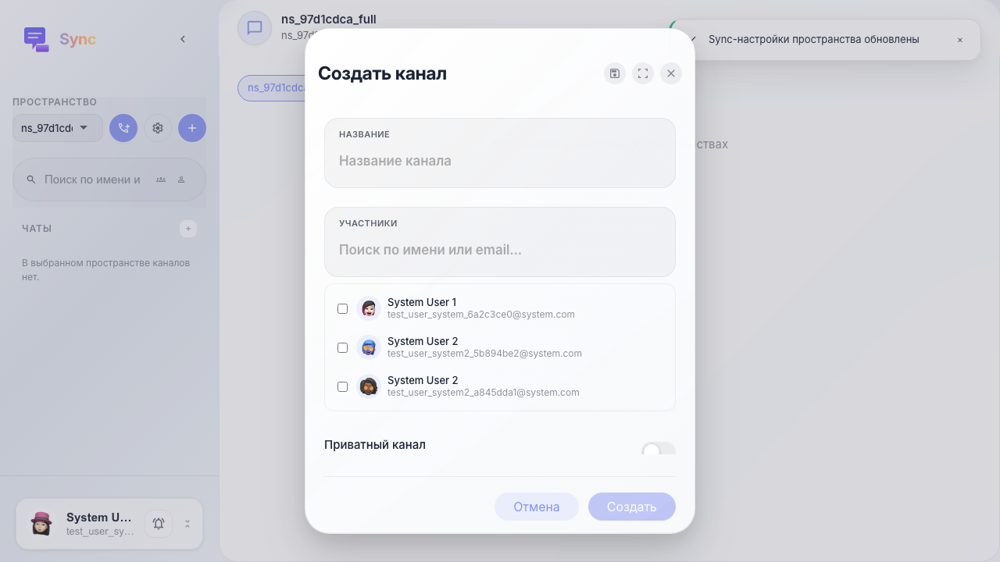

## Шаг 4. Заполнены название и параметры канала

Перед созданием канала полезно сразу включить нужные флаги. Так команда не будет искать эти настройки после первого звонка или после первого голосового сообщения.

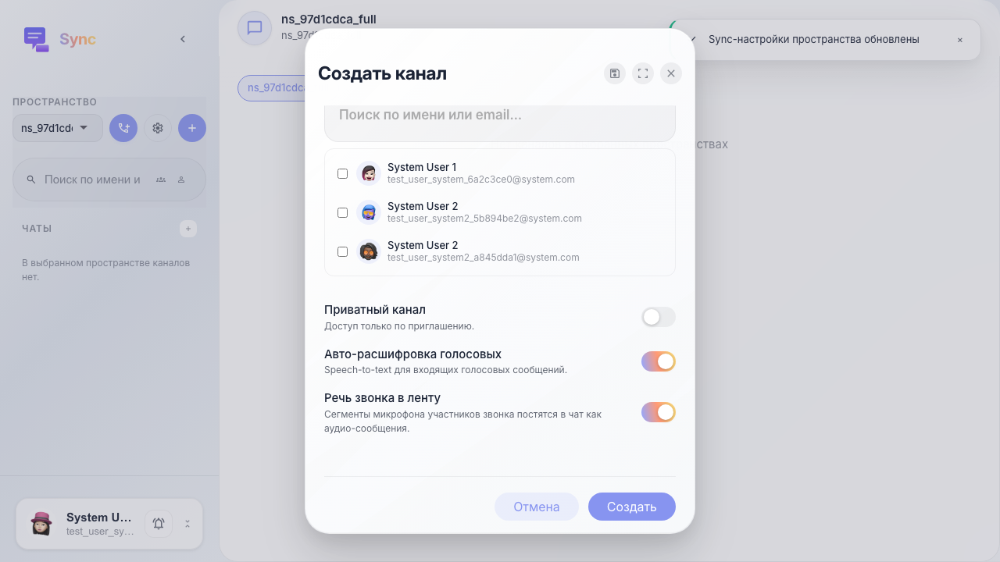

## Шаг 5. Канал создан и открыт

Открытый канал состоит из шапки, ленты и композера.

- В шапке видны аватар, название, подзаголовок, кнопки звонка, видео, настроек и меню дополнительных действий.
- Лента показывает сообщения, даты, статусы доставки, реакции и закрепы.
- Композер снизу отправляет текст, файлы, голосовые, упоминания и ответы в тред.

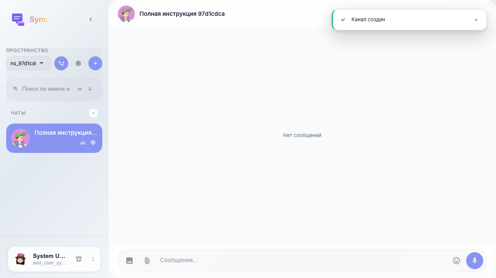

## Шаг 6. Отправлено первое сообщение

Текстовое сообщение уходит через realtime-команду Sync и сразу появляется в ленте. Для пользователя это обычный чат, но технически событие также обновляет превью канала, дату последнего сообщения и unread-состояние у других участников.

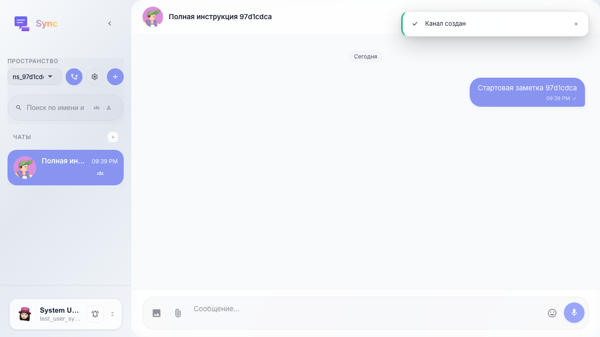

## Шаг 7. Открыт popup упоминаний

Упоминание начинается с символа `@`. Popup ищет участников компании, а после выбора вставляет технический user_id. В ленте пользователь видит нормальное имя, потому что Sync преобразует id через список участников компании.

Упоминание важно не только визуально: backend валидирует участника канала и отправляет отдельное mention-уведомление.

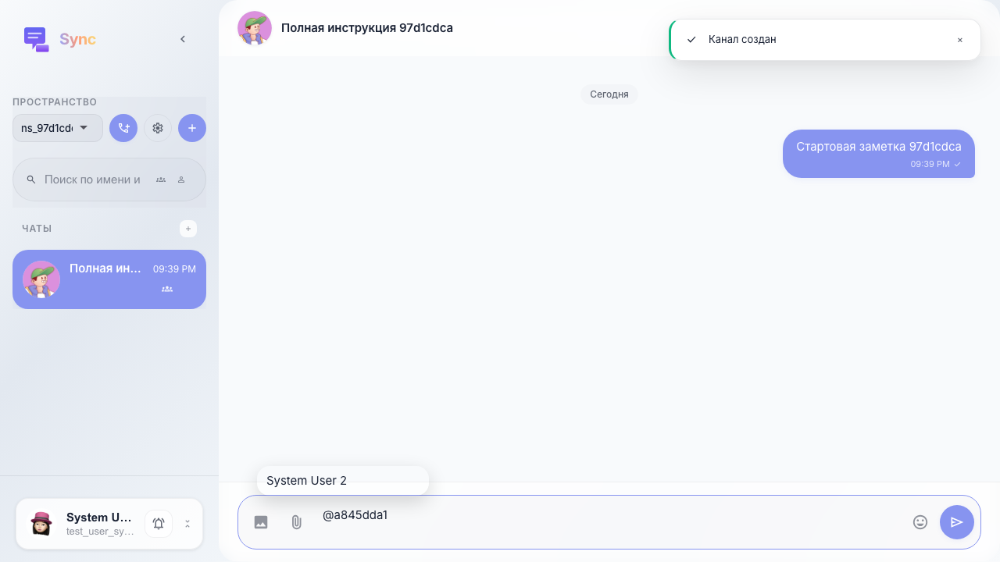

## Шаг 8. Сообщение с упоминанием появилось в ленте

После отправки упоминание выглядит как имя человека, а не как `@user_id`. По клику на такое имя открывается карточка профиля и общие каналы.

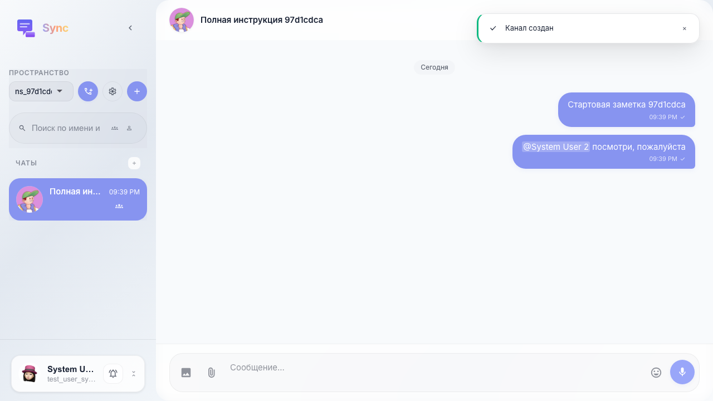

## Шаг 9. Отправлено сообщение с изображением

Кнопка вложения загружает файл в файловый backend и добавляет его в сообщение как контент-блок. Для изображений Sync показывает превью, для документов — строку файла со скачиванием. Подпись сообщения остаётся обычным текстовым блоком.

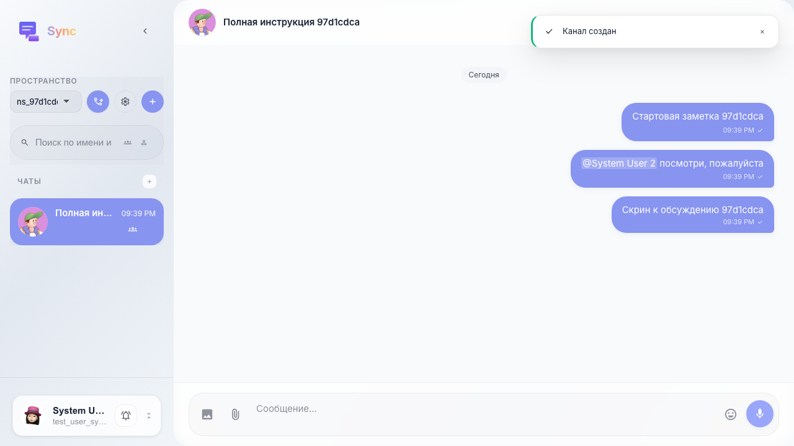

## Шаг 10. Открыто меню сообщения

Контекстное меню открывается правым кликом по сообщению. В нём есть быстрые реакции и действия:

- «Ответить» — включает режим ответа в композере;
- «Открыть тред» — создаёт или открывает ветку обсуждения;
- «Редактировать» — доступно для своих текстовых сообщений;
- «Скопировать» — копирует текст;
- «Переслать» — открывает выбор канала назначения;
- «Закрепить» — добавляет сообщение в верхнюю полоску закрепов;
- «Удалить» — доступно для своих сообщений.

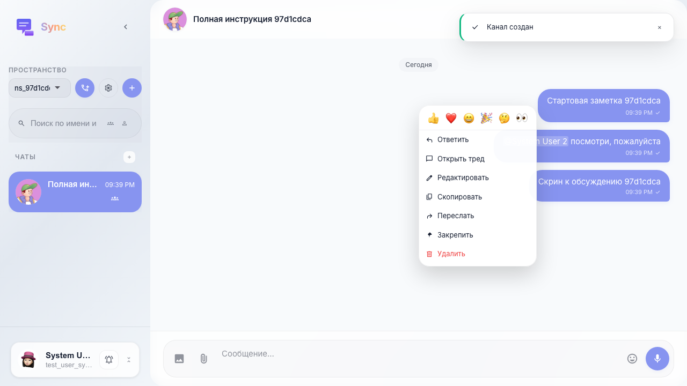

## Шаг 11. Сообщение закреплено

Закрепы хранятся на канале. Полоска сверху показывает превью текущего закреплённого сообщения и счётчик. Клик по полоске прокручивает ленту к закрепу; если закрепов несколько, переход идёт по кругу.

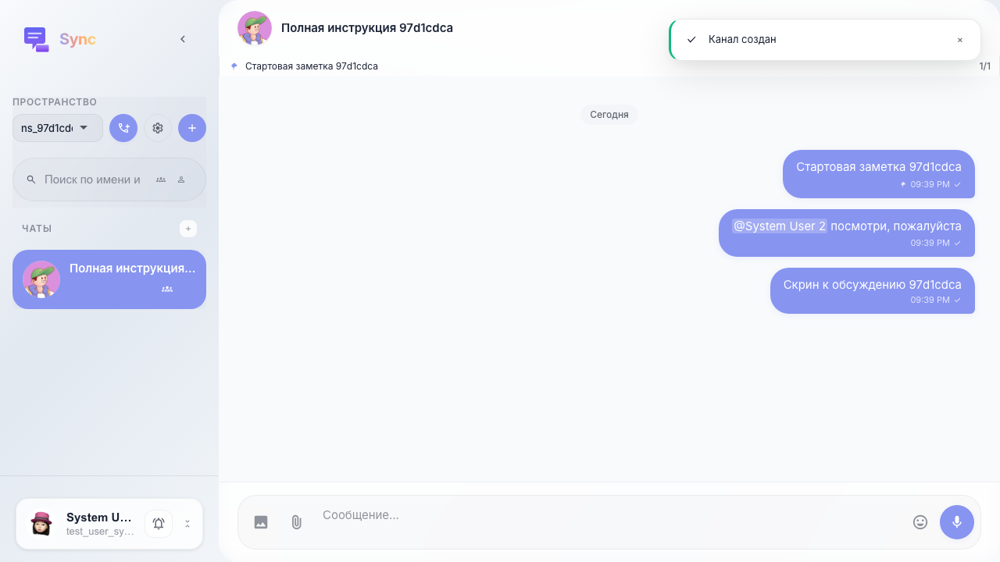

## Шаг 12. Открыт тред и отправлен ответ

Тред — боковая панель справа от основной ленты. Он нужен, когда обсуждение не должно засорять общий канал. Ответы внутри треда связаны с корневым сообщением, но основной чат остаётся доступен.

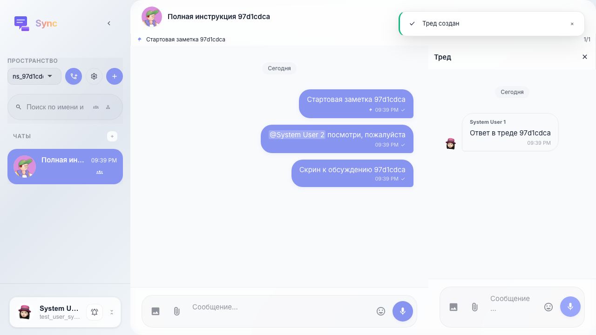

## Шаг 13. Открыты настройки канала

Настройки канала отличаются от настроек пространства. Здесь меняются локальные параметры конкретного канала:

- имя и аватар;
- «Не беспокоить» для уведомлений;
- авто-транскрипция голосовых именно в этом канале;
- «речь звонка в ленту» именно для этого канала;
- список участников и кнопка добавления новых участников.

Если пользователь не видит канал в сайдбаре, первым делом проверьте, добавлен ли он в участники канала.

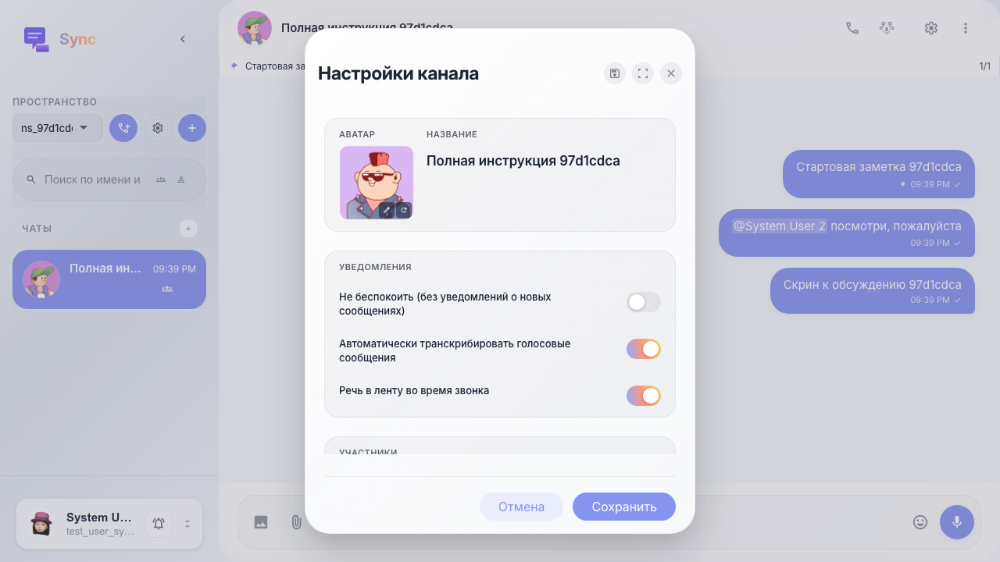
