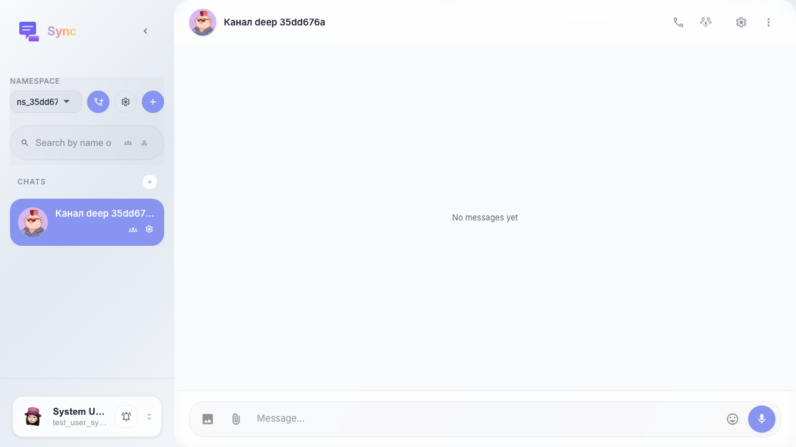
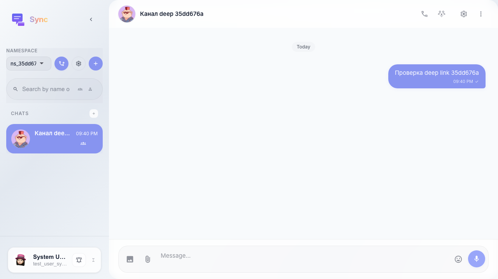

# Sync: переход по прямой ссылке на канал

После создания канала в UI тест получает id канала через API и открывает Sync по `/sync/c/{channel_id}` — выбранный канал и чат подгружаются автоматически.

## Step 1. Повторное открытие Sync по прямой ссылке канала

## Step 2. Сообщение уходит в канал, выбранный из URL

