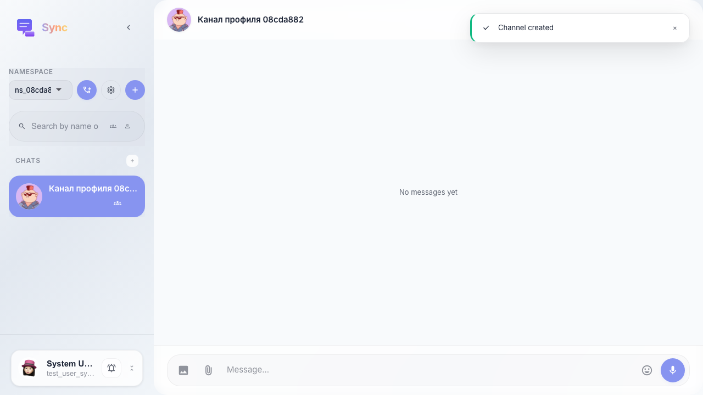
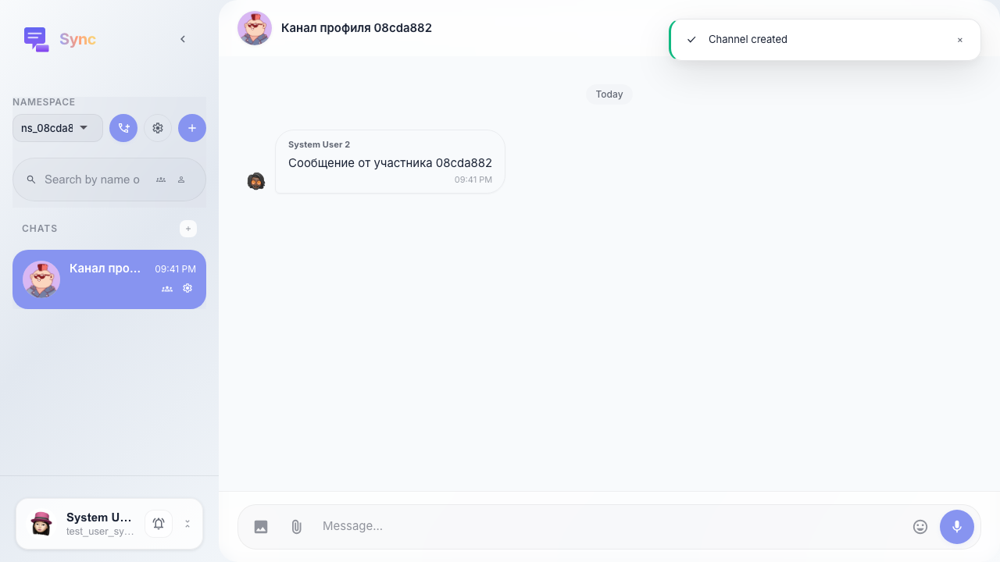

# Sync: профиль отправителя из сообщения

В канал добавлен участник; его сообщение создаётся через API; владелец открывает профиль по кнопке на аватаре в пузырьке чужого сообщения.

## Шаг 1. В канал добавлен второй участник

## Шаг 2. Сообщение от второго участника отправлено через API

