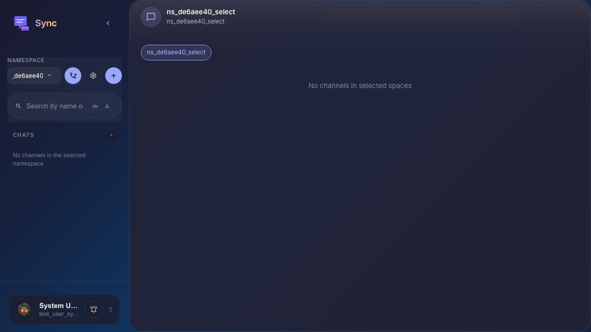

# Sync: selecting a space

The user opens Sync and selects an existing platform namespace from the sidebar selector.

## Step 1. Sync is open with all spaces selected

## Step 2. Space is selected in the sidebar

