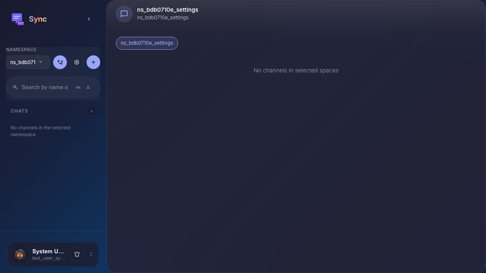
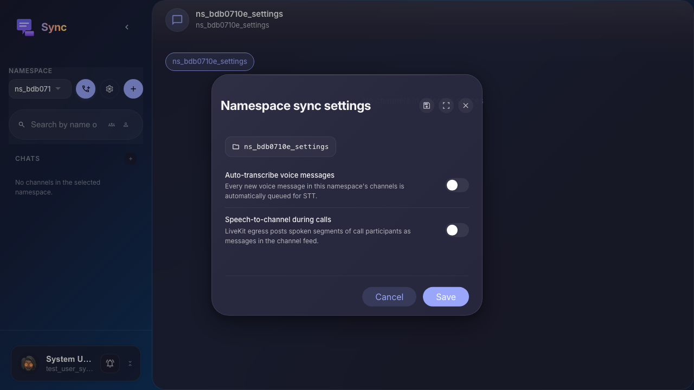
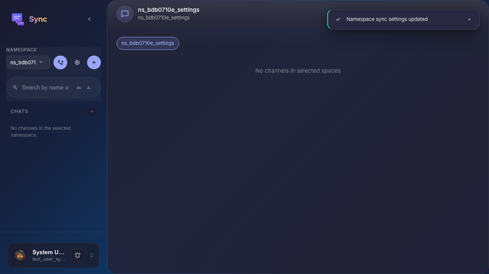

# Sync: настройки пространства

Пользователь открывает Sync-настройки выбранного платформенного пространства и включает опцию транскрибации голосовых сообщений.

## Шаг 1. Sync открыт

## Шаг 2. Открыты настройки пространства

## Шаг 3. Настройки пространства сохранены

