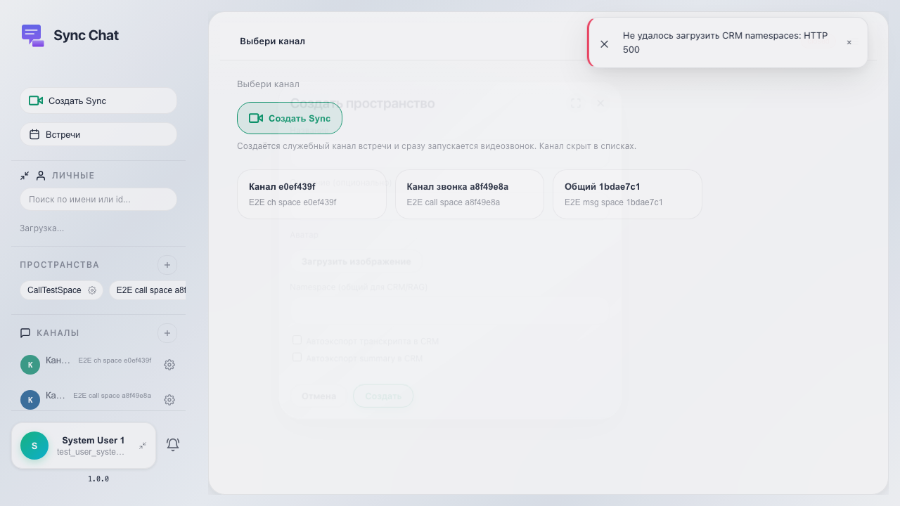

# Sync: creating a space

The user opens Sync, clicks «+» next to «Spaces», enters a name and description, and confirms creation.

## Step 1. Sync is open, shell is visible

## Step 2. Create space modal is open

